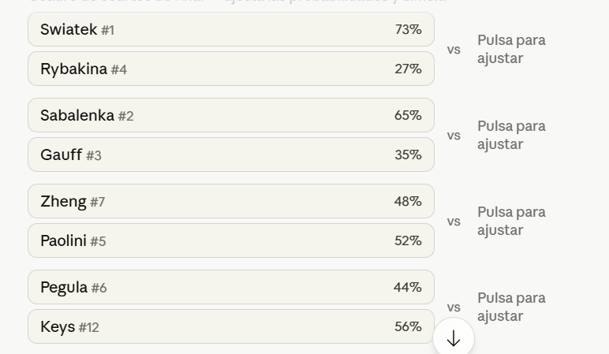
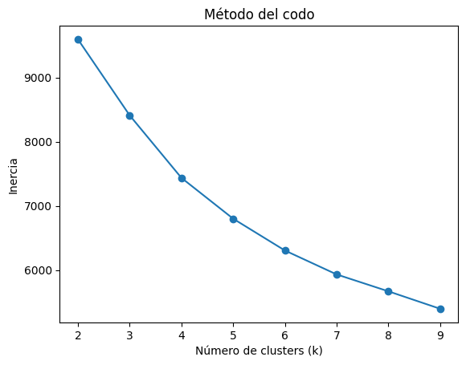
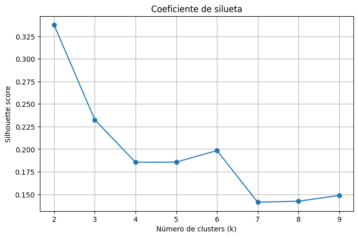
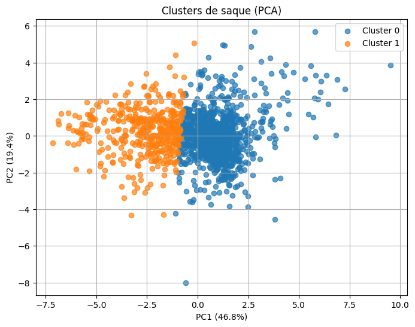
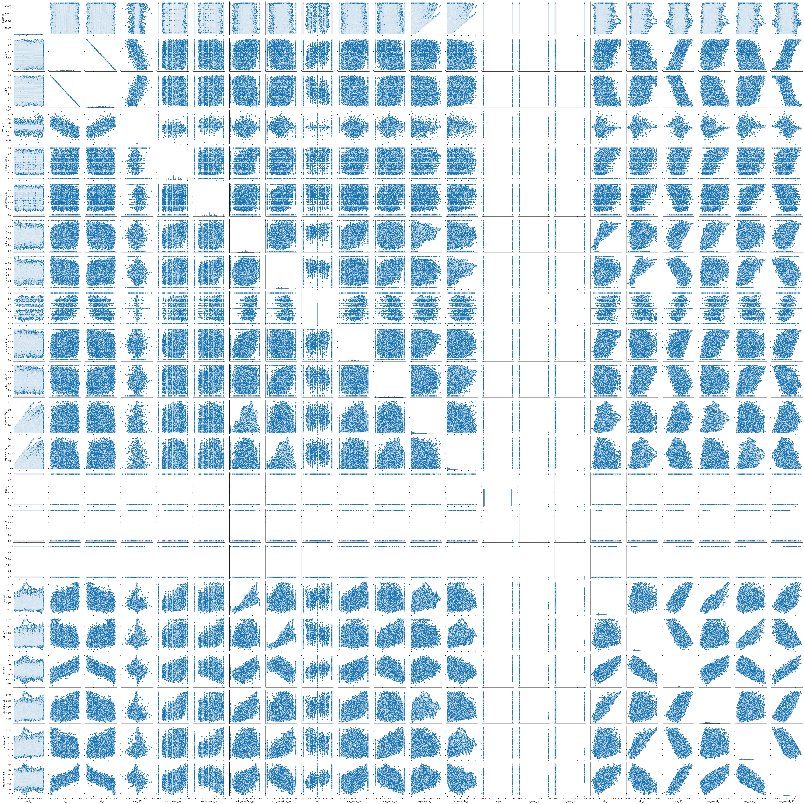
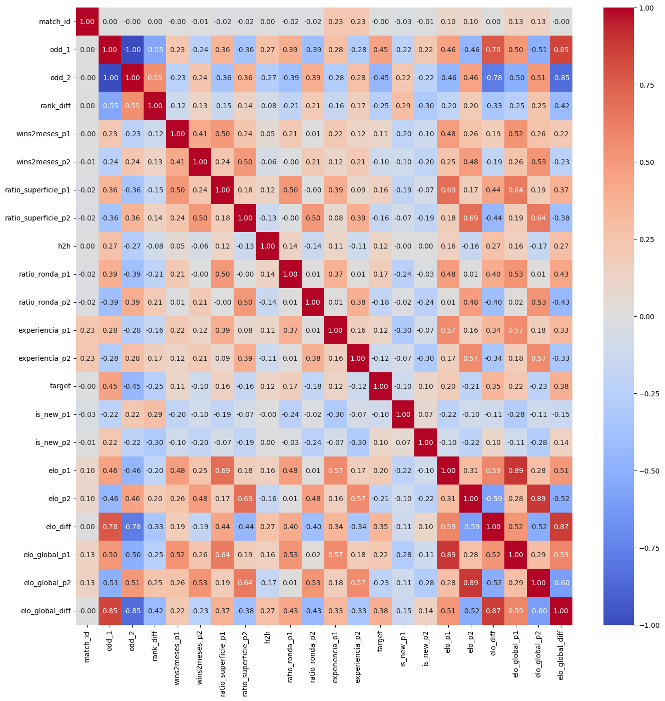
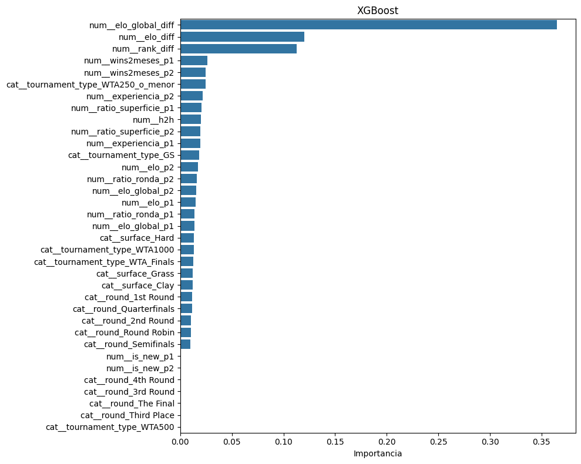
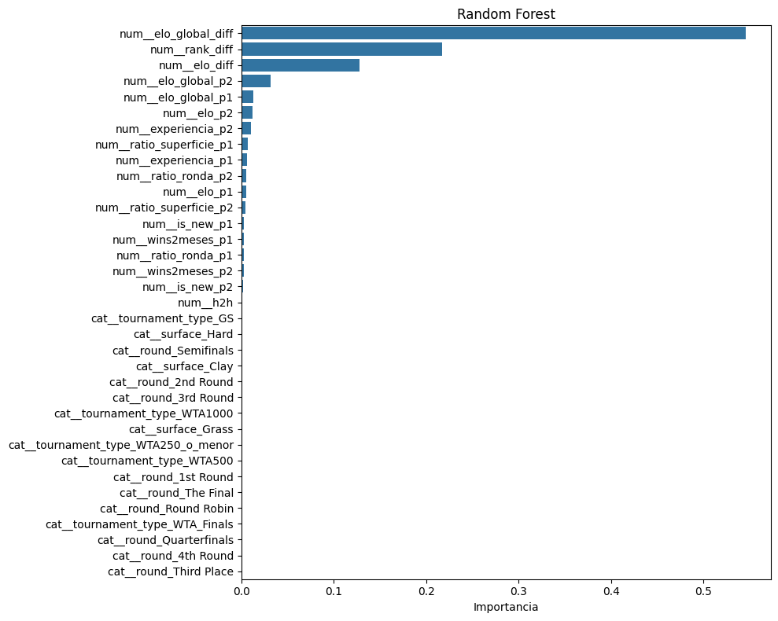

# Notas preliminares

Dataset base: resultados de partidos WTA desde 2007 hasta ahora
Entrenar modelo partido a partido (quien gana y con qué porcentaje)
Validar simulando el último grand slam y los dos torneos previos de tierra por ejemplo?
Simular el próximo Roland Garros

Tengo datos desde 2007 hasta 2026 (actualizados diariamente)
Entrenar con todos los datos desde 2007
Ponderar más los últimos 3-5 años?


```python
# Ejemplo simple de peso temporal. Por si hay que aplicar a alguna feature
import numpy as np

años_atras = 2024 - año_partido
peso = np.exp(-0.1 * años_atras)  # decae exponencialmente
```

Para cada partido del cuadro → predice probabilidad A gana B
→ avanza el ganador (o haz 10.000 sorteos ponderados)
→ cuenta cuántas veces gana cada jugadora el torneo

La simulación de Monte Carlo suena intimidante pero con el modelo ya entrenado es sorprendentemente sencilla — básicamente un bucle que repite el torneo miles de veces usando las probabilidades que predice tu modelo en cada partido.

Montecarlo


Simulación del cuadro, llamo al predictor en cada partido, cargo la predicción obtenida

Clasificador  →  predict_proba()  →  probabilidad  →  dado cargado  →  ganadora
  (entrena)        (infiere)          [0.73, 0.27]     random()         Swiatek

┌─────────────────────────────────────────┐
│           SIMULACIÓN MONTE CARLO        │  ← repite 10.000 veces
│                                         │
│   Cuartos → Semis → Final               │
│   para cada partido llama a...          │
│                                         │
│   ┌─────────────────────────────────┐   │
│   │         MODELO ML               │   │  ← entrenado con datos históricos
│   │  input: jugadora A vs B         │   │
│   │  output: probabilidad 0..1      │   │
│   └─────────────────────────────────┘   │
│                                         │
└─────────────────────────────────────────┘
         ↓ resultado final
   {"Swiatek": 38%, "Sabalenka": 22%, ...}

1. PREPARAR DATASET
   wta.csv → calcular features → df_modelo (guardar como CSV)

2. ENTRENAR
   df_modelo[2007:2023] → train → Random Forest / XGBoost
   df_modelo[2024:2025] → test  → accuracy + comparar con odds

3. SIMULAR ROLAND GARROS
   cuadro Australian Open 2025 (adaptado)
   + ranking WTA actual
   + forma_reciente calculada con fecha de hoy
   → Monte Carlo 10.000 veces
   → probabilidades por jugadora

4. (OPCIONAL) STREAMLIT
   Input: dos jugadoras + superficie
   Output: probabilidades + simulación torneo

Fase 1 — entrenamiento: aprende de 44.000 partidos históricos. Esto pasa una vez.
Fase 2 — inferencia: dado un cuadro real, preguntas al modelo miles de veces. Esto pasa cuando quieres predecir.

Cuotas de apuestas: (ej: 1.33 vs 3.00)
Es un predictor genial pero claro, no voy a tenerlo antes de los partidos en el simulador de Roland Garros.
Solo existen cuando el partido ya está anunciado y las casas las publican
Conversor de cuota a porcentaje: 1/cuota. 1/1.33 = 75%
Creo que lo quitaré del entrenamiento y de alguna forma puedo usarlo como medida de cuanto de bueno es mi predictor vs casas de apuestas

Valoraré si incluir estadísticas adicionales. Por el momento buscar cómo inferir datos adicionales de los datos que hay.
Estado de forma:
% partidos ganados en los últimos 2-3 meses?
% sets ganados en el último 2-3 meses?

Histórico:
Head to head histórico
Win rate de cada jugadora en esa superficie concreta
Win rate en esa ronda concreta (hay jugadoras que rinden mejor en finales)
Ratio Puntos Totales Ganados/Perdidos 

Tendría que buscar:
% Primer Servicio
% Puntos con 2do Servicio
% Juegos Ganados al Saque: Solidez del servicio. 
% Puntos de Break Points) Convertir oportunidades de quiebre y salvar las propias es crucial para ganar partidos ajustados.
Errores No Forzados vs. Golpes Ganadores:  

Simulador de partido. Solo actual? Entiendo que es mejor. No tiene sentido simular partidos pasados

Simulador de torneo. Cosas a tener en cuenta:
- Sacar ranking

# Metricas


```python
#Accuracy y AUC-ROC
# es más correcto conceptualmente usar AUC-ROC para optimizar los modelos
#  porque el objetivo del modelo es generar probabilidades para la simulación,
#  no clasificar con un umbral fijo

from sklearn.metrics import roc_auc_score

# AUC de tu modelo
y_proba_modelo = xgb_best.predict_proba(X_test)[:, 1]
auc_modelo = roc_auc_score(y_test, y_proba_modelo)

# AUC de las casas — usas sus probabilidades directamente
prob_casas = df.loc[df_test['match_id'], 'odd_1'].values
mask = ~np.isnan(prob_casas)

auc_casas = roc_auc_score(y_test[mask], prob_casas[mask])

print(f'AUC modelo: {auc_modelo:.4f}')
print(f'AUC casas:  {auc_casas:.4f}')
```

# Otras features

- Variación del ranking (si viene en tendencia positiva o negativa. coger otro margen de tiempo para que capte algo diferente del winrate2meses)
- Inactividad: Días de descanso desde último partido (limitar a maximo - un año igual)
- Capar más la diferencia de ranking? rank_diff_clipped = min(max(rank_diff, -50), 50)
- Ponderación por años (dar menos peso a los más antiguos)
- ELO! 

El sistema de coeficiente Elo en el tenis es un método estadístico diseñado para medir la habilidad relativa de los jugadores, ajustando su puntuación tras cada partido en función del resultado y la fuerza del oponente. A diferencia del ranking oficial ATP/WTA, que se basa en la acumulación de puntos por rondas alcanzadas en 52 semanas, el Elo es dinámico y evalúa la calidad de cada victoria individual  
La idea es simple: cada jugadora tiene una puntuación numérica que sube cuando gana y baja cuando pierde, pero la cantidad que sube o baja depende de la dificultad del rival:

Se puede mejorar el modelo incluyendo  perfiles de la jugadora? 

Resumen del pipeline completo  

- Calcular medias por jugadora (seleccionando bien qué stats usar)
- Generar dataset jugadora → medias
- Escalar con StandardScaler
- KMeans — prueba con k=3 o k=4, usa el método del codo para decidir
- Merge al dataset principal por nombre de jugadora
- Añadir cluster como feature categórica para p1 y p2
# WTA Match Predictor — EDA y Feature Engineering
Pipeline completo: carga, limpieza, clasificación de torneos, cálculo de features derivadas y generación del dataset de entrenamiento.

## 1. Imports y carga de datos


```python
import pandas as pd
import numpy as np
import os
from ydata_profiling import ProfileReport
```

    c:\Users\NaiaJon\AppData\Local\Programs\Python\Python311\Lib\site-packages\tqdm\auto.py:21: TqdmWarning: IProgress not found. Please update jupyter and ipywidgets. See https://ipywidgets.readthedocs.io/en/stable/user_install.html
      from .autonotebook import tqdm as notebook_tqdm
    C:\Users\NaiaJon\AppData\Local\Temp\ipykernel_22896\1618932038.py:4: DeprecationWarning: 
        `import ydata_profiling` is deprecated and will not receive more updates. 
        Please install fg-data-profiling via `pip install fg-data-profiling` and use `import data_profiling` instead.
        
      from ydata_profiling import ProfileReport
    


```python
#!pip install kagglehub
```

    Collecting kagglehub
      Downloading kagglehub-1.0.1-py3-none-any.whl.metadata (40 kB)
         ---------------------------------------- 0.0/40.1 kB ? eta -:--:--
         ------------------- ------------------ 20.5/40.1 kB 217.9 kB/s eta 0:00:01
         -------------------------------------- 40.1/40.1 kB 317.6 kB/s eta 0:00:00
    Collecting kagglesdk<1.0,>=0.1.22 (from kagglehub)
      Downloading kagglesdk-0.1.23-py3-none-any.whl.metadata (13 kB)
    Requirement already satisfied: packaging in c:\users\naiajon\appdata\roaming\python\python311\site-packages (from kagglehub) (26.0)
    Requirement already satisfied: pyyaml in c:\users\naiajon\appdata\local\programs\python\python311\lib\site-packages (from kagglehub) (6.0.3)
    Requirement already satisfied: requests in c:\users\naiajon\appdata\local\programs\python\python311\lib\site-packages (from kagglehub) (2.32.5)
    Requirement already satisfied: tqdm in c:\users\naiajon\appdata\local\programs\python\python311\lib\site-packages (from kagglehub) (4.67.3)
    Requirement already satisfied: protobuf in c:\users\naiajon\appdata\local\programs\python\python311\lib\site-packages (from kagglesdk<1.0,>=0.1.22->kagglehub) (7.34.1)
    Requirement already satisfied: charset_normalizer<4,>=2 in c:\users\naiajon\appdata\local\programs\python\python311\lib\site-packages (from requests->kagglehub) (3.4.6)
    Requirement already satisfied: idna<4,>=2.5 in c:\users\naiajon\appdata\local\programs\python\python311\lib\site-packages (from requests->kagglehub) (3.11)
    Requirement already satisfied: urllib3<3,>=1.21.1 in c:\users\naiajon\appdata\local\programs\python\python311\lib\site-packages (from requests->kagglehub) (2.6.3)
    Requirement already satisfied: certifi>=2017.4.17 in c:\users\naiajon\appdata\local\programs\python\python311\lib\site-packages (from requests->kagglehub) (2026.2.25)
    Requirement already satisfied: colorama in c:\users\naiajon\appdata\roaming\python\python311\site-packages (from tqdm->kagglehub) (0.4.6)
    Downloading kagglehub-1.0.1-py3-none-any.whl (70 kB)
       ---------------------------------------- 0.0/70.6 kB ? eta -:--:--
       ---------------------------------------- 70.6/70.6 kB 1.9 MB/s eta 0:00:00
    Downloading kagglesdk-0.1.23-py3-none-any.whl (217 kB)
       ---------------------------------------- 0.0/217.8 kB ? eta -:--:--
       ---------------------------------------  215.0/217.8 kB 4.4 MB/s eta 0:00:01
       ---------------------------------------- 217.8/217.8 kB 3.3 MB/s eta 0:00:00
    Installing collected packages: kagglesdk, kagglehub
    Successfully installed kagglehub-1.0.1 kagglesdk-0.1.23
    

    
    [notice] A new release of pip is available: 24.0 -> 26.1
    [notice] To update, run: python.exe -m pip install --upgrade pip
    


```python
# Descarga de Kaggle actualizado
import kagglehub

# Download latest version
path = kagglehub.dataset_download("dissfya/wta-tennis-2007-2023-daily-update")

print("Path to dataset files:", path)
```

    Downloading to C:\Users\NaiaJon\.cache\kagglehub\datasets\dissfya\wta-tennis-2007-2023-daily-update\1062.archive...
    

    100%|██████████| 1.03M/1.03M [00:00<00:00, 2.34MB/s]

    Extracting files...
    Path to dataset files: C:\Users\NaiaJon\.cache\kagglehub\datasets\dissfya\wta-tennis-2007-2023-daily-update\versions\1062
    

    
    


```python
# Cuidado con las rutas al copiarlo al gihub
file_path = os.path.join(path, "wta.csv")
wta = pd.read_csv(file_path, low_memory=False)
print(f'Partidos cargados: {len(wta)}')
wta.tail()
```

    Partidos cargados: 44446
    


<div>
<style scoped>
    .dataframe tbody tr th:only-of-type {
        vertical-align: middle;
    }

    .dataframe tbody tr th {
        vertical-align: top;
    }

    .dataframe thead th {
        text-align: right;
    }
</style>
<table border="1" class="dataframe">
  <thead>
    <tr style="text-align: right;">
      <th></th>
      <th>Tournament</th>
      <th>Date</th>
      <th>Court</th>
      <th>Surface</th>
      <th>Round</th>
      <th>Best of</th>
      <th>Player_1</th>
      <th>Player_2</th>
      <th>Winner</th>
      <th>Rank_1</th>
      <th>Rank_2</th>
      <th>Pts_1</th>
      <th>Pts_2</th>
      <th>Odd_1</th>
      <th>Odd_2</th>
      <th>Score</th>
    </tr>
  </thead>
  <tbody>
    <tr>
      <th>44441</th>
      <td>Mutua Madrid Open</td>
      <td>2026-04-29 00:00:00</td>
      <td>Outdoor</td>
      <td>Clay</td>
      <td>Quarterfinals</td>
      <td>3</td>
      <td>Pliskova Ka.</td>
      <td>Potapova A.</td>
      <td>Potapova A.</td>
      <td>197</td>
      <td>56</td>
      <td>375</td>
      <td>1065</td>
      <td>2.5</td>
      <td>1.53</td>
      <td>1-6 7-6 3-6</td>
    </tr>
    <tr>
      <th>44442</th>
      <td>Mutua Madrid Open</td>
      <td>2026-04-29 00:00:00</td>
      <td>Outdoor</td>
      <td>Clay</td>
      <td>Quarterfinals</td>
      <td>3</td>
      <td>Kostyuk M.</td>
      <td>Noskova L.</td>
      <td>Kostyuk M.</td>
      <td>23</td>
      <td>13</td>
      <td>1722</td>
      <td>2849</td>
      <td>1.5</td>
      <td>2.63</td>
      <td>7-6 6-0</td>
    </tr>
    <tr>
      <th>44443</th>
      <td>Mutua Madrid Open</td>
      <td>2026-04-30 00:00:00</td>
      <td>Outdoor</td>
      <td>Clay</td>
      <td>Semifinals</td>
      <td>3</td>
      <td>Baptiste H.</td>
      <td>Andreeva M.</td>
      <td>Andreeva M.</td>
      <td>32</td>
      <td>8</td>
      <td>1392</td>
      <td>3746</td>
      <td>2.63</td>
      <td>1.5</td>
      <td>4-6 6-7</td>
    </tr>
    <tr>
      <th>44444</th>
      <td>Mutua Madrid Open</td>
      <td>2026-04-30 00:00:00</td>
      <td>Outdoor</td>
      <td>Clay</td>
      <td>Semifinals</td>
      <td>3</td>
      <td>Kostyuk M.</td>
      <td>Potapova A.</td>
      <td>Kostyuk M.</td>
      <td>23</td>
      <td>56</td>
      <td>1722</td>
      <td>1065</td>
      <td>1.33</td>
      <td>3.4</td>
      <td>6-2 1-6 6-1</td>
    </tr>
    <tr>
      <th>44445</th>
      <td>Mutua Madrid Open</td>
      <td>2026-05-02 00:00:00</td>
      <td>Outdoor</td>
      <td>Clay</td>
      <td>The Final</td>
      <td>3</td>
      <td>Andreeva M.</td>
      <td>Kostyuk M.</td>
      <td>Kostyuk M.</td>
      <td>8</td>
      <td>23</td>
      <td>3746</td>
      <td>1722</td>
      <td>1.67</td>
      <td>2.2</td>
      <td>3-6 5-7</td>
    </tr>
  </tbody>
</table>
</div>


## 2. Exploración inicial


```python
wta.info()
```

    <class 'pandas.core.frame.DataFrame'>
    RangeIndex: 44446 entries, 0 to 44445
    Data columns (total 16 columns):
     #   Column      Non-Null Count  Dtype 
    ---  ------      --------------  ----- 
     0   Tournament  44446 non-null  object
     1   Date        44446 non-null  object
     2   Court       44446 non-null  object
     3   Surface     44446 non-null  object
     4   Round       44446 non-null  object
     5   Best of     44446 non-null  int64 
     6   Player_1    44446 non-null  object
     7   Player_2    44446 non-null  object
     8   Winner      44446 non-null  object
     9   Rank_1      44446 non-null  int64 
     10  Rank_2      44446 non-null  int64 
     11  Pts_1       44446 non-null  int64 
     12  Pts_2       44446 non-null  int64 
     13  Odd_1       44446 non-null  object
     14  Odd_2       44446 non-null  object
     15  Score       44446 non-null  object
    dtypes: int64(5), object(11)
    memory usage: 5.4+ MB
    


```python
# Profiling completo — genera wta_report.html
profile = ProfileReport(wta, title='WTA Profiling Report')
profile.to_file('wta_report.html')
```

## 3. Limpieza y transformaciones


```python
# Eliminar columnas no útiles para el modelo
# Court: muy desbalanceado (40k outdoor vs 400 indoor), la superficie ya lo captura
# Best of: en WTA siempre es al mejor de 3 sets
wta = wta.drop(columns=['Court', 'Best of'])
```


```python
# Unificar superficies: Greenset y Carpet tienen muy pocas entradas y son pistas rápidas → Hard
wta['Surface'] = wta['Surface'].replace({'Greenset': 'Hard', 'Carpet': 'Hard'})
print(wta['Surface'].value_counts())
```

    Surface
    Hard     27290
    Clay     12347
    Grass     4809
    Name: count, dtype: int64
    


```python
# Clasificar torneos por categoría usando palabras clave
# Los nombres cambian con patrocinadores pero la ciudad/torneo es estable

def clasificar_torneo(nombre):
    n = nombre.lower()
    
    if any(x in n for x in ['australian open', 'roland garros', 'french open',
                              'wimbledon', 'us open']):
        return 'GS'
    
    if any(x in n for x in ['wta finals', 'wta elite trophy', 'championships',
                              'tournament of champions', 'riyadh finals', 'wta tour championships']):
        return 'WTA_Finals'
    
    if any(x in n for x in ['indian wells', 'miami', 'madrid', 'roma', 'rome',
                              'internazionali', 'canada', 'toronto', 'rogers',
                              'canadian', 'cincinnati', 'beijing', 'china open',
                              'wuhan', 'doha', 'qatar', 'dubai', 'bnp paribas open',
                              'national bank open', 'sony ericsson open',
                              'western & southern financial group', 'shenzhen']):
        return 'WTA1000'
    
    if any(x in n for x in ['abu dhabi', 'abu dabi', 'adelaide', 'berlin', 'bett1open',
                              'eastbourne', 'rothesay', 'bad homburg', 'san jose',
                              'silicon valley', 'guangzhou', 'osaka', 'tokyo',
                              'toray pan pacific', 'seoul', 'strasbourg', 'birmingham',
                              'nottingham', 'brisbane', 'linz', 'merida', 'monterrey',
                              'charleston', 'stuttgart', 'porsche', 'washington',
                              'mubadala', 'guadalajara', 'gdl open akron',
                              'family circle cup', 'aegon', 'kremlin', 'pilot pen',
                              'new haven', 'bank of the west', 'sydney international',
                              'stanford', 'luxembourg', 'belgium', 'diamond games',
                              'fortis', 'san diego', 'zhengzhou', 'german']):
        return 'WTA500'
    
    return 'WTA250_o_menor'

wta['tournament_type'] = wta['Tournament'].map(clasificar_torneo)
print(wta['tournament_type'].value_counts())
```

    tournament_type
    WTA250_o_menor    14363
    WTA1000           10354
    GS                 9455
    WTA500             8343
    WTA_Finals         1931
    Name: count, dtype: int64
    


```python
# Comprobación: torneos sin clasificar
sin_clasificar = wta[wta['tournament_type'] == 'WTA250_o_menor']['Tournament'].nunique()
print(f'Torneos únicos sin clasificar: {sin_clasificar}')
```

    Torneos únicos sin clasificar: 145
    


```python
# Eliminar Tournament (ya tenemos tournament_type) y convertir tipos
wta = wta.drop(columns='Tournament')

wta['Date']  = pd.to_datetime(wta['Date'], errors='coerce')
wta['Odd_1'] = pd.to_numeric(wta['Odd_1'], errors='coerce')
wta['Odd_2'] = pd.to_numeric(wta['Odd_2'], errors='coerce')

print('Nulos tras conversión:')
print(wta[['Date', 'Odd_1', 'Odd_2']].isna().sum())
```

    Nulos tras conversión:
    Date     2
    Odd_1    1
    Odd_2    1
    dtype: int64
    


```python
# Eliminar partidos sin fecha 
wta = wta.dropna(subset=['Date'])
```


```python
# Limpiar odds: valores < 1 son códigos de sin datos (equivalente a -1)
# Los convertimos a NaN — se usarán para comparar con casas pero no para entrenar
wta.loc[wta['Odd_1'] < 1, 'Odd_1'] = None
wta.loc[wta['Odd_2'] < 1, 'Odd_2'] = None
```


```python
# Calcular probabilidades implícitas de las casas de apuestas
# Indican lo que se paga por euro la victoria (2.5, 3.5... etc). Lo paso a probabilidades
# 1/odd y normalizar para que sumen 1 (elimina el margen de la casa: suman un poco más de uno)

wta['prob_1'] = 1 / wta['Odd_1']
wta['prob_2'] = 1 / wta['Odd_2']
total = wta['prob_1'] + wta['prob_2']
wta['prob_1'] = wta['prob_1'] / total
wta['prob_2'] = wta['prob_2'] / total

print(wta['prob_1'].describe())
```

    count    44328.000000
    mean         0.498446
    std          0.214081
    min          0.019231
    25%          0.337349
    50%          0.500000
    75%          0.662651
    max          0.980769
    Name: prob_1, dtype: float64
    


```python
# Convertir tipos de columnas categóricas y de texto
wta['Surface']  = wta['Surface'].astype(str)
wta['Round']    = wta['Round'].astype(str)
wta['Score']    = wta['Score'].astype(str)
wta['Player_1'] = wta['Player_1'].astype(str)
wta['Player_2'] = wta['Player_2'].astype(str)
wta['Winner']   = wta['Winner'].astype(str)
```


```python
# Crear target: 1 si gana Player_1, 2 si gana Player_2
def asignar_target(fila):
    if fila['Winner'] == fila['Player_1']:
        return 1
    else:
        return 0

wta['target'] = wta.apply(asignar_target, axis=1)
print(wta['target'].value_counts())
```

    target
    1    22222
    0    22222
    Name: count, dtype: int64
    


```python
# Guardar wta limpio para uso en app.py y consultas. 
wta.to_csv('wta_limpio.csv', index=False)
print('wta_limpio.csv guardado')
```

    wta_limpio.csv guardado
    


```python
wta = pd.read_csv ('wta_limpio.csv', parse_dates= ['Date'])
```

## 4. Feature Engineering

Calculamos features derivadas para cada partido usando solo información disponible **antes** de ese partido (corte temporal para evitar data leakage).


```python
wta = calcular_elo_superficie(wta)
wta = calcular_elo_global(wta)
```


```python
# Incluye el ELO que necesitaremos en simulación
wta.to_csv('wta_limpio.csv', index=False)
print('wta_limpio.csv guardado')
```

    wta_limpio.csv guardado
    


```python
def forma_reciente(df, jugadora, fecha_limite, meses=2):
    """Win rate de una jugadora en los N meses anteriores a la fecha.
    Devuelve 0 si no tiene partidos (lesión o pausa larga)"""
    fecha_inicio = fecha_limite - pd.DateOffset(months=meses)
    mask = (
        ((df['Player_1'] == jugadora) | (df['Player_2'] == jugadora)) &
        (df['Date'] < fecha_limite) &
        (df['Date'] >= fecha_inicio)
    )
    partidos = df[mask]
    if len(partidos) == 0:
        return 0
    victorias = (partidos['Winner'] == jugadora).sum()
    return victorias/len(partidos)
```


```python
def winrate(df, jugadora, fecha_limite, superficie=None, ronda=None):
    """Win rate histórico de una jugadora, filtrable por superficie y/o ronda.
    Devuelve 0.4 si no tiene historial (ligeramente por debajo de neutro = novata en esa condición)"""
    mask = (
        ((df['Player_1'] == jugadora) | (df['Player_2'] == jugadora)) &
        (df['Date'] < fecha_limite)
    )
    if superficie:
        mask &= (df['Surface'] == superficie)
    if ronda:
        mask &= (df['Round'] == ronda)
    partidos = df[mask]
    if len(partidos) == 0:
        return 0.4
    victorias = (partidos['Winner'] == jugadora).sum()
    return victorias/len(partidos)
```


```python
def headtohead(df, p1, p2, fecha_limite):
    """% de victorias de p1 sobre p2 en enfrentamientos directos previos a la fecha.
    Devuelve 0.5 si nunca se han enfrentado (neutro)"""
    mask = (
        (
            ((df['Player_1'] == p1) & (df['Player_2'] == p2)) |
            ((df['Player_1'] == p2) & (df['Player_2'] == p1))
        ) & (df['Date'] < fecha_limite)
    )
    partidos = df[mask]
    if len(partidos) == 0:
        return 0.5
    victorias_p1 = (partidos['Winner'] == p1).sum()
    return victorias_p1/len(partidos)
```


```python
def experiencia(df, jugadora, fecha_limite):
    """Número total de partidos jugados por la jugadora antes de la fecha"""
    mask = (
        ((df['Player_1'] == jugadora) | (df['Player_2'] == jugadora)) &
        (df['Date'] < fecha_limite)
    )
    return df[mask].shape[0]
```


```python
def inactividad (df, jugadora, fecha_limite):
    """ Días desde su último partido"""
    mask = (
        ((df['Player_1'] == jugadora) | (df['Player_2'] == jugadora)) &
        (df['Date'] < fecha_limite)
    )
    partidos = df[mask].sort_values('Date', ascending=False)
    if len(partidos) == 0:
        return 1000 # sin historial reciente
    ultimo = partidos.iloc[0]['Date']
    dias = (fecha_limite - ultimo).days
    return dias
```


```python
def tendencia_ranking(df, jugadora, fecha_limite, meses=6):
    """Diferencia de ranking entre hace 6 meses y ahora: """
    
    fecha_inicio = fecha_limite - pd.DateOffset(months=meses)
    
    mask = (
        ((df['Player_1'] == jugadora) | (df['Player_2'] == jugadora)) &
        (df['Date'] > fecha_inicio) & 
        (df['Date'] <= fecha_limite)  
    )
    
    partidos = df[mask].sort_values('Date', ascending=True)  
    
    if len(partidos) == 0:
        return 0  # o podrías return None para indicar sin datos
    
    primero = partidos.iloc[0]   
    ultimo = partidos.iloc[-1]   
    
    def get_ranking(partido, jugadora):
        if partido['Player_1'] == jugadora:
            return partido['Rank_1']
        else:
            return partido['Rank_2']
    
    ranking_antes = get_ranking(primero, jugadora)
    ranking_ahora = get_ranking(ultimo, jugadora)
    
    if pd.isna(ranking_antes) or pd.isna(ranking_ahora) or ranking_antes == 0 or ranking_ahora == 0:
        return None
    
    diferencia = ranking_antes - ranking_ahora
    return diferencia
```


```python
def calcular_elo_global(df, k=32, elo_inicial=1500):
    """
    Precalcula ELO global (independiente de superficie) para cada partido.
    El elo_global_p1, elo_global_p2, elo_global_diff al dataframe.
    
    IMPORTANTE: df debe estar ordenado por fecha ascendente antes de llamar esto.
    """
    elo_ratings = {}  # {jugadora: elo}

    def get_elo(jugadora):
        return elo_ratings.get(jugadora, elo_inicial)

    def expected(elo_a, elo_b):
        return 1 / (1 + 10 ** ((elo_b - elo_a) / 400))

    elo_p1_list, elo_p2_list = [], []

    for _, row in df.iterrows():
        p1        = row['Player_1']
        p2        = row['Player_2']
        resultado = row['target']

        elo_p1 = get_elo(p1)
        elo_p2 = get_elo(p2)

        elo_p1_list.append(elo_p1)
        elo_p2_list.append(elo_p2)

        exp_p1 = expected(elo_p1, elo_p2)

        elo_ratings[p1] = elo_p1 + k * (resultado - exp_p1)
        elo_ratings[p2] = elo_p2 + k * ((1 - resultado) - (1 - exp_p1))

    df = df.copy()
    df['elo_global_p1']   = elo_p1_list
    df['elo_global_p2']   = elo_p2_list
    df['elo_global_diff'] = df['elo_global_p1'] - df['elo_global_p2']

    return df
```


```python
def calcular_elo_superficie(df, k=32, elo_inicial=1500):
    """
    Precalcula ELO por superficie para cada partido.
    Añade columnas elo_p1, elo_p2, elo_diff al dataframe.
    
    IMPORTANTE: df debe estar ordenado por fecha ascendente antes de llamar esto.
    El ELO de cada partido = ELO ANTES de jugarlo (sin leakage).
    """
    elo_ratings = {}  # {jugadora: {superficie: elo}}

    def get_elo(jugadora, superficie):
        return elo_ratings.get(jugadora, {}).get(superficie, elo_inicial)

    def update_elo(jugadora, superficie, nuevo_valor):
        if jugadora not in elo_ratings:
            elo_ratings[jugadora] = {}
        elo_ratings[jugadora][superficie] = nuevo_valor

    def expected(elo_a, elo_b):
        return 1 / (1 + 10 ** ((elo_b - elo_a) / 400))

    elo_p1_list, elo_p2_list = [], []

    for _, row in df.iterrows():
        p1         = row['Player_1']
        p2         = row['Player_2']
        superficie = row['Surface']
        resultado  = row['target']  # 1 = gana p1, 0 = gana p2

        elo_p1 = get_elo(p1, superficie)
        elo_p2 = get_elo(p2, superficie)

        # Guardamos ANTES de actualizar → sin leakage
        elo_p1_list.append(elo_p1)
        elo_p2_list.append(elo_p2)

        # Actualización
        exp_p1 = expected(elo_p1, elo_p2)
        exp_p2 = 1 - exp_p1

        update_elo(p1, superficie, elo_p1 + k * (resultado - exp_p1))
        update_elo(p2, superficie, elo_p2 + k * ((1 - resultado) - exp_p2))

    df = df.copy()
    df['elo_p1']  = elo_p1_list
    df['elo_p2']  = elo_p2_list
    df['elo_diff'] = df['elo_p1'] - df['elo_p2']

    return df


```


```python
# En el flujo final lo quitaríamos porque iría en la función generar_features
#wta = calcular_elo_superficie(wta)
#wta = calcular_elo_global(wta)
```


```python
#historico_partidos = pd.read_csv ('historico_partidos.csv', parse_dates= ['date'])
```


```python
# Merge por match_id (que es el índice original de wta)
# historico_partidos = historico_partidos.merge(
#     wta[['elo_p1', 'elo_p2', 'elo_diff',
#          'elo_global_p1', 'elo_global_p2', 'elo_global_diff']].rename_axis('match_id').reset_index(),
#     on='match_id',
#     how='left'
# )


```


```python
historico_partidos.tail()
```


<div>
<style scoped>
    .dataframe tbody tr th:only-of-type {
        vertical-align: middle;
    }

    .dataframe tbody tr th {
        vertical-align: top;
    }

    .dataframe thead th {
        text-align: right;
    }
</style>
<table border="1" class="dataframe">
  <thead>
    <tr style="text-align: right;">
      <th></th>
      <th>match_id</th>
      <th>date</th>
      <th>odd_1</th>
      <th>odd_2</th>
      <th>surface</th>
      <th>round</th>
      <th>tournament_type</th>
      <th>rank_diff</th>
      <th>wins2meses_p1</th>
      <th>wins2meses_p2</th>
      <th>...</th>
      <th>experiencia_p2</th>
      <th>target</th>
      <th>is_new_p1</th>
      <th>is_new_p2</th>
      <th>elo_p1</th>
      <th>elo_p2</th>
      <th>elo_diff</th>
      <th>elo_global_p1</th>
      <th>elo_global_p2</th>
      <th>elo_global_diff</th>
    </tr>
  </thead>
  <tbody>
    <tr>
      <th>42041</th>
      <td>44439</td>
      <td>2026-04-29</td>
      <td>0.379653</td>
      <td>0.620347</td>
      <td>Clay</td>
      <td>Quarterfinals</td>
      <td>WTA1000</td>
      <td>141.0</td>
      <td>0.857143</td>
      <td>0.800000</td>
      <td>...</td>
      <td>268</td>
      <td>0</td>
      <td>0</td>
      <td>0</td>
      <td>1679.197340</td>
      <td>1745.745804</td>
      <td>-66.548464</td>
      <td>1726.747695</td>
      <td>1783.622488</td>
      <td>-56.874793</td>
    </tr>
    <tr>
      <th>42042</th>
      <td>44440</td>
      <td>2026-04-29</td>
      <td>0.636804</td>
      <td>0.363196</td>
      <td>Clay</td>
      <td>Quarterfinals</td>
      <td>WTA1000</td>
      <td>10.0</td>
      <td>0.833333</td>
      <td>0.727273</td>
      <td>...</td>
      <td>163</td>
      <td>1</td>
      <td>0</td>
      <td>0</td>
      <td>1715.277499</td>
      <td>1595.556868</td>
      <td>119.720632</td>
      <td>1889.971589</td>
      <td>1818.420717</td>
      <td>71.550872</td>
    </tr>
    <tr>
      <th>42043</th>
      <td>44441</td>
      <td>2026-04-30</td>
      <td>0.363196</td>
      <td>0.636804</td>
      <td>Clay</td>
      <td>Semifinals</td>
      <td>WTA1000</td>
      <td>24.0</td>
      <td>0.714286</td>
      <td>0.823529</td>
      <td>...</td>
      <td>155</td>
      <td>0</td>
      <td>0</td>
      <td>0</td>
      <td>1631.501843</td>
      <td>1836.954165</td>
      <td>-205.452323</td>
      <td>1768.212330</td>
      <td>1926.385894</td>
      <td>-158.173565</td>
    </tr>
    <tr>
      <th>42044</th>
      <td>44442</td>
      <td>2026-04-30</td>
      <td>0.718816</td>
      <td>0.281184</td>
      <td>Clay</td>
      <td>Semifinals</td>
      <td>WTA1000</td>
      <td>-33.0</td>
      <td>0.846154</td>
      <td>0.818182</td>
      <td>...</td>
      <td>269</td>
      <td>1</td>
      <td>0</td>
      <td>0</td>
      <td>1725.972486</td>
      <td>1758.718071</td>
      <td>-32.745585</td>
      <td>1902.722355</td>
      <td>1797.026455</td>
      <td>105.695900</td>
    </tr>
    <tr>
      <th>42045</th>
      <td>44443</td>
      <td>2026-05-02</td>
      <td>0.568475</td>
      <td>0.431525</td>
      <td>Clay</td>
      <td>The Final</td>
      <td>WTA1000</td>
      <td>-15.0</td>
      <td>0.833333</td>
      <td>0.857143</td>
      <td>...</td>
      <td>243</td>
      <td>0</td>
      <td>0</td>
      <td>0</td>
      <td>1844.460435</td>
      <td>1743.476026</td>
      <td>100.984408</td>
      <td>1935.566483</td>
      <td>1913.999679</td>
      <td>21.566804</td>
    </tr>
  </tbody>
</table>
<p>5 rows × 26 columns</p>
</div>


```python
# Comprobación de las funciones antes de ejecutar el bucle completo
jugadora = 'Badosa P.'
fecha_limite = pd.to_datetime('2026-01-01')
print(f"Experiencia: {experiencia(wta, jugadora, fecha_limite)} partidos")
print(f"H2H vs {jugadora}: {headtohead(wta, jugadora, 'Sabalenka A.', fecha_limite):.2%}")
print(f"Win rate Clay: {winrate(wta, jugadora, fecha_limite, superficie='Clay'):.2%}")
print(f"Forma reciente: {forma_reciente(wta, jugadora, fecha_limite):.2%}")
# Revisar!
print(f'Tendencia ranking: {tendencia_ranking(wta, jugadora, fecha_limite):}')
print(f'Días inactiva: {inactividad (wta, jugadora, fecha_limite):}')

```

    Experiencia: 225 partidos
    H2H vs Badosa P.: 28.57%
    Win rate Clay: 70.67%
    Forma reciente: 0.00%
    Tendencia ranking: 0
    Días inactiva: 97
    

### Construcción del dataset de features

⚠️ Este bucle tarda ~30 minutos. El resultado se guarda en CSV para no tener que repetirlo.


```python
# Reset index para usar como match_id
wta = wta.reset_index()

features = []
for i, partido in wta.iterrows():
    p1    = partido['Player_1']
    p2    = partido['Player_2']
    fecha = partido['Date']
    
    row = {
        # Identificador y metadata
        'match_id': i,
        'date':     partido['Date'],
        'odd_1':    partido['prob_1'],
        'odd_2':    partido['prob_2'],

        # Features del partido
        'surface':         partido['Surface'],
        'round':           partido['Round'],
        'tournament_type': partido['tournament_type'],

        # Features calculadas (solo info anterior al partido)
        'rank_diff':           float(partido['Rank_1']) - float(partido['Rank_2']),
        'wins2meses_p1':       forma_reciente(wta, p1, fecha),
        'wins2meses_p2':       forma_reciente(wta, p2, fecha),
        'ratio_superficie_p1': winrate(wta, p1, fecha, superficie=partido['Surface']),
        'ratio_superficie_p2': winrate(wta, p2, fecha, superficie=partido['Surface']),
        'h2h':                 headtohead(wta, p1, p2, fecha),
        'ratio_ronda_p1':      winrate(wta, p1, fecha, ronda=partido['Round']),
        'ratio_ronda_p2':      winrate(wta, p2, fecha, ronda=partido['Round']),
        'experiencia_p1':      experiencia(wta, p1, fecha),
        'experiencia_p2':      experiencia(wta, p2, fecha),
        # Añadido 
        # 'inactividad_p1':      inactividad(wta, p1, fecha),
        # 'inactividad_p2':      inactividad(wta, p2, fecha),
        'elo_p1':          partido['elo_p1'],
        'elo_p2':          partido['elo_p2'],
        'elo_diff':        partido['elo_diff'],
        'elo_global_p1':   partido['elo_global_p1'],
        'elo_global_p2':   partido['elo_global_p2'],
        'elo_global_diff': partido['elo_global_diff'],

        # Target
        'target': partido['target']
    }
    features.append(row)

historico_partidos = pd.DataFrame(features)

# Feature de inexperiencia
historico_partidos['is_new_p1'] = (historico_partidos['experiencia_p1'] < 10).astype(int)
historico_partidos['is_new_p2'] = (historico_partidos['experiencia_p2'] < 10).astype(int)

print(f'Dataset construido: {len(historico_partidos)} partidos')
print(historico_partidos.info())
```

    Dataset construido: 44444 partidos
    <class 'pandas.core.frame.DataFrame'>
    RangeIndex: 44444 entries, 0 to 44443
    Data columns (total 20 columns):
     #   Column               Non-Null Count  Dtype         
    ---  ------               --------------  -----         
     0   match_id             44444 non-null  int64         
     1   date                 44444 non-null  datetime64[ns]
     2   odd_1                44328 non-null  float64       
     3   odd_2                44328 non-null  float64       
     4   surface              44444 non-null  object        
     5   round                44444 non-null  object        
     6   tournament_type      44444 non-null  object        
     7   rank_diff            44444 non-null  float64       
     8   wins2meses_p1        44444 non-null  float64       
     9   wins2meses_p2        44444 non-null  float64       
     10  ratio_superficie_p1  44444 non-null  float64       
     11  ratio_superficie_p2  44444 non-null  float64       
     12  h2h                  44444 non-null  float64       
     13  ratio_ronda_p1       44444 non-null  float64       
     14  ratio_ronda_p2       44444 non-null  float64       
     15  experiencia_p1       44444 non-null  int64         
     16  experiencia_p2       44444 non-null  int64         
     17  target               44444 non-null  int64         
     18  is_new_p1            44444 non-null  int64         
     19  is_new_p2            44444 non-null  int64         
    dtypes: datetime64[ns](1), float64(10), int64(6), object(3)
    memory usage: 6.8+ MB
    None
    

## 5. Limpieza del dataset de features


```python
# Eliminar anteriores a 2007: primer año del dataset, las features derivadas están muy incompletas
# porque no hay historial previo para calcularlas
historico_partidos = historico_partidos[historico_partidos['date'].dt.year > 2007]
print(f'Partidos tras eliminar 2007: {len(historico_partidos)}')
```

    Partidos tras eliminar 2007: 42046
    


```python
# Verificar nulos
print(historico_partidos.isnull().sum())
```

    match_id                0
    date                    0
    odd_1                  88
    odd_2                  88
    surface                 0
    round                   0
    tournament_type         0
    rank_diff               0
    wins2meses_p1           0
    wins2meses_p2           0
    ratio_superficie_p1     0
    ratio_superficie_p2     0
    h2h                     0
    ratio_ronda_p1          0
    ratio_ronda_p2          0
    experiencia_p1          0
    experiencia_p2          0
    target                  0
    is_new_p1               0
    is_new_p2               0
    elo_p1                  0
    elo_p2                  0
    elo_diff                0
    elo_global_p1           0
    elo_global_p2           0
    elo_global_diff         0
    dtype: int64
    


```python
# Guardar — carga posterior con pd.read_csv('historico_partidos.csv', parse_dates=['date'])
historico_partidos.to_csv('historico_partidos.csv', index=False)
print('✓ historico_partidos.csv guardado')
```

    ✓ historico_partidos.csv guardado
    


```python
#hist = pd.read_csv ('historico_partidos.csv', parse_dates= ['date'])
```

# Clustering. Perfiles de jugadoras


```python
import os
print(os.listdir(r'C:\Users\NaiaJon\Documents\Naia\BootcampDataScience\Datos ML\stats'))
```

    ['wta_matches_2007.csv', 'wta_matches_2008.csv', 'wta_matches_2009.csv', 'wta_matches_2010.csv', 'wta_matches_2011.csv', 'wta_matches_2012.csv', 'wta_matches_2013.csv', 'wta_matches_2014.csv', 'wta_matches_2015.csv', 'wta_matches_2016.csv', 'wta_matches_2017.csv', 'wta_matches_2018.csv', 'wta_matches_2019.csv', 'wta_matches_2020.csv', 'wta_matches_2021.csv', 'wta_matches_2022.csv', 'wta_matches_2023.csv', 'wta_matches_2024.csv', 'wta_matches_2025.csv', 'wta_matches_2026.csv']
    


```python
stats_2024 = pd.read_csv(r'C:\Users\NaiaJon\Documents\Naia\BootcampDataScience\Datos ML\wta_matches_2024.csv', low_memory=False)
stats_2024.head()
```


```python
import glob
# Cargar todos los archivos desde 
archivos = glob.glob(r'C:\Users\NaiaJon\Documents\Naia\BootcampDataScience\Datos ML\stats\*.csv')  # ajusta la ruta

```


```python
dfs = []
for f in archivos:
    dfs.append(pd.read_csv(f)) 
df_stats = pd.concat(dfs, ignore_index=True)
print(df_stats.shape)
```

    (51935, 49)
    


```python
df_stats.tail()
```


<div>
<style scoped>
    .dataframe tbody tr th:only-of-type {
        vertical-align: middle;
    }

    .dataframe tbody tr th {
        vertical-align: top;
    }

    .dataframe thead th {
        text-align: right;
    }
</style>
<table border="1" class="dataframe">
  <thead>
    <tr style="text-align: right;">
      <th></th>
      <th>tourney_id</th>
      <th>tourney_name</th>
      <th>surface</th>
      <th>draw_size</th>
      <th>tourney_level</th>
      <th>tourney_date</th>
      <th>match_num</th>
      <th>winner_id</th>
      <th>winner_seed</th>
      <th>winner_entry</th>
      <th>...</th>
      <th>l_1stIn</th>
      <th>l_1stWon</th>
      <th>l_2ndWon</th>
      <th>l_SvGms</th>
      <th>l_bpSaved</th>
      <th>l_bpFaced</th>
      <th>winner_rank</th>
      <th>winner_rank_points</th>
      <th>loser_rank</th>
      <th>loser_rank_points</th>
    </tr>
  </thead>
  <tbody>
    <tr>
      <th>51930</th>
      <td>2026-W-FC-2026-QUA</td>
      <td>BJK Cup Qualifiers</td>
      <td>NaN</td>
      <td>36</td>
      <td>D</td>
      <td>20260410</td>
      <td>118</td>
      <td>259733</td>
      <td>NaN</td>
      <td>NaN</td>
      <td>...</td>
      <td>NaN</td>
      <td>NaN</td>
      <td>NaN</td>
      <td>NaN</td>
      <td>NaN</td>
      <td>NaN</td>
      <td>127.0</td>
      <td>600.0</td>
      <td>128.0</td>
      <td>597.0</td>
    </tr>
    <tr>
      <th>51931</th>
      <td>2026-W-FC-2026-QUA</td>
      <td>BJK Cup Qualifiers</td>
      <td>NaN</td>
      <td>36</td>
      <td>D</td>
      <td>20260410</td>
      <td>119</td>
      <td>220714</td>
      <td>NaN</td>
      <td>NaN</td>
      <td>...</td>
      <td>NaN</td>
      <td>NaN</td>
      <td>NaN</td>
      <td>NaN</td>
      <td>NaN</td>
      <td>NaN</td>
      <td>42.0</td>
      <td>1310.0</td>
      <td>84.0</td>
      <td>863.0</td>
    </tr>
    <tr>
      <th>51932</th>
      <td>2026-W-FC-2026-QUA</td>
      <td>BJK Cup Qualifiers</td>
      <td>NaN</td>
      <td>36</td>
      <td>D</td>
      <td>20260410</td>
      <td>120</td>
      <td>201709</td>
      <td>NaN</td>
      <td>NaN</td>
      <td>...</td>
      <td>NaN</td>
      <td>NaN</td>
      <td>NaN</td>
      <td>NaN</td>
      <td>NaN</td>
      <td>NaN</td>
      <td>74.0</td>
      <td>893.0</td>
      <td>198.0</td>
      <td>365.0</td>
    </tr>
    <tr>
      <th>51933</th>
      <td>2026-W-FC-2026-QUA</td>
      <td>BJK Cup Qualifiers</td>
      <td>NaN</td>
      <td>36</td>
      <td>D</td>
      <td>20260410</td>
      <td>121</td>
      <td>211279</td>
      <td>NaN</td>
      <td>NaN</td>
      <td>...</td>
      <td>NaN</td>
      <td>NaN</td>
      <td>NaN</td>
      <td>NaN</td>
      <td>NaN</td>
      <td>NaN</td>
      <td>173.0</td>
      <td>420.0</td>
      <td>80.0</td>
      <td>880.0</td>
    </tr>
    <tr>
      <th>51934</th>
      <td>2026-W-FC-2026-QUA</td>
      <td>BJK Cup Qualifiers</td>
      <td>NaN</td>
      <td>36</td>
      <td>D</td>
      <td>20260410</td>
      <td>122</td>
      <td>261963</td>
      <td>NaN</td>
      <td>NaN</td>
      <td>...</td>
      <td>NaN</td>
      <td>NaN</td>
      <td>NaN</td>
      <td>NaN</td>
      <td>NaN</td>
      <td>NaN</td>
      <td>275.0</td>
      <td>243.0</td>
      <td>56.0</td>
      <td>1050.0</td>
    </tr>
  </tbody>
</table>
<p>5 rows × 49 columns</p>
</div>


```python
df_stats.columns
```


    Index(['tourney_id', 'tourney_name', 'surface', 'draw_size', 'tourney_level',
           'tourney_date', 'match_num', 'winner_id', 'winner_seed', 'winner_entry',
           'winner_name', 'winner_hand', 'winner_ht', 'winner_ioc', 'winner_age',
           'loser_id', 'loser_seed', 'loser_entry', 'loser_name', 'loser_hand',
           'loser_ht', 'loser_ioc', 'loser_age', 'score', 'best_of', 'round',
           'minutes', 'w_ace', 'w_df', 'w_svpt', 'w_1stIn', 'w_1stWon', 'w_2ndWon',
           'w_SvGms', 'w_bpSaved', 'w_bpFaced', 'l_ace', 'l_df', 'l_svpt',
           'l_1stIn', 'l_1stWon', 'l_2ndWon', 'l_SvGms', 'l_bpSaved', 'l_bpFaced',
           'winner_rank', 'winner_rank_points', 'loser_rank', 'loser_rank_points'],
          dtype='object')


```python
df = df_stats [['winner_name', 'loser_name', 'w_ace', 'w_df', 'w_svpt', 'w_1stIn', 'w_1stWon', 'w_2ndWon',
       'w_SvGms', 'w_bpSaved', 'w_bpFaced', 'l_ace', 'l_df', 'l_svpt',
       'l_1stIn', 'l_1stWon', 'l_2ndWon', 'l_SvGms', 'l_bpSaved', 'l_bpFaced']]
```


```python
df.info()
```

    <class 'pandas.core.frame.DataFrame'>
    RangeIndex: 51935 entries, 0 to 51934
    Data columns (total 18 columns):
     #   Column       Non-Null Count  Dtype  
    ---  ------       --------------  -----  
     0   winner_name  51935 non-null  object 
     1   loser_name   51935 non-null  object 
     2   w_ace        45005 non-null  float64
     3   w_df         44972 non-null  float64
     4   w_svpt       45006 non-null  float64
     5   w_1stIn      45006 non-null  float64
     6   w_1stWon     45006 non-null  float64
     7   w_2ndWon     45006 non-null  float64
     8   w_bpSaved    45002 non-null  float64
     9   w_bpFaced    45002 non-null  float64
     10  l_ace        45000 non-null  float64
     11  l_df         44972 non-null  float64
     12  l_svpt       45006 non-null  float64
     13  l_1stIn      45006 non-null  float64
     14  l_1stWon     45006 non-null  float64
     15  l_2ndWon     45006 non-null  float64
     16  l_bpSaved    45004 non-null  float64
     17  l_bpFaced    45004 non-null  float64
    dtypes: float64(16), object(2)
    memory usage: 7.1+ MB
    


```python
# l_SvGms	Number of service games won by the loser. (Integer)
#w_SvGms     Number of service games won by the winer. (Integer) 
# 27830 non-null  float64. Los voy a quitar
```


```python
df = df.drop (['l_SvGms','w_SvGms'], axis=1)
```


```python
df.info()
```

    <class 'pandas.core.frame.DataFrame'>
    RangeIndex: 51935 entries, 0 to 51934
    Data columns (total 18 columns):
     #   Column       Non-Null Count  Dtype  
    ---  ------       --------------  -----  
     0   winner_name  51935 non-null  object 
     1   loser_name   51935 non-null  object 
     2   w_ace        45005 non-null  float64
     3   w_df         44972 non-null  float64
     4   w_svpt       45006 non-null  float64
     5   w_1stIn      45006 non-null  float64
     6   w_1stWon     45006 non-null  float64
     7   w_2ndWon     45006 non-null  float64
     8   w_bpSaved    45002 non-null  float64
     9   w_bpFaced    45002 non-null  float64
     10  l_ace        45000 non-null  float64
     11  l_df         44972 non-null  float64
     12  l_svpt       45006 non-null  float64
     13  l_1stIn      45006 non-null  float64
     14  l_1stWon     45006 non-null  float64
     15  l_2ndWon     45006 non-null  float64
     16  l_bpSaved    45004 non-null  float64
     17  l_bpFaced    45004 non-null  float64
    dtypes: float64(16), object(2)
    memory usage: 7.1+ MB
    


```python
df.columns
```


    Index(['winner_name', 'loser_name', 'w_ace', 'w_df', 'w_svpt', 'w_1stIn',
           'w_1stWon', 'w_2ndWon', 'w_bpSaved', 'w_bpFaced', 'l_ace', 'l_df',
           'l_svpt', 'l_1stIn', 'l_1stWon', 'l_2ndWon', 'l_bpSaved', 'l_bpFaced'],
          dtype='object')


```python
# Medias de estadísticos de cada jugadora.

# La misma jugadora tiene partidos como winner y como loser
# Separar estadísticas para sumar luego

df_winner = df_stats[['winner_name','w_ace', 'w_df', 'w_svpt', 'w_1stIn',
       'w_1stWon', 'w_2ndWon', 'w_bpSaved', 'w_bpFaced']].rename(columns={
    'winner_name': 'jugadora', 'w_ace': 'ace', 'w_df': 'df', 'w_svpt': 'svpt', 'w_1stIn' : '1stIn',
       'w_1stWon': '1stWon', 'w_2ndWon':'2ndWon', 'w_bpSaved':'bpSaved' , 'w_bpFaced': 'bpFaced'
})

# 2. Extraer stats como perdedora
df_loser = df_stats[['loser_name', 'l_ace', 'l_df', 'l_svpt', 'l_1stIn', 
                     'l_1stWon', 'l_2ndWon', 'l_bpSaved', 'l_bpFaced']].rename(columns={
    'loser_name': 'jugadora', 'l_ace': 'ace', 'l_df': 'df', 'l_svpt': 'svpt', 'l_1stIn' : '1stIn',
       'l_1stWon': '1stWon', 'l_2ndWon':'2ndWon', 'l_bpSaved':'bpSaved' , 'l_bpFaced': 'bpFaced'
})
```


```python
from difflib import get_close_matches
def nombre_stats_a_wta(nombre_completo, candidatos_wta):
    """'Caroline Garcia' → 'Garcia C.'"""
    if pd.isna(nombre_completo):
        return None
    partes = nombre_completo.strip().split(' ')
    inicial = partes[0][0]
    apellido = ' '.join(partes[1:])
    nombre_convertido = f"{apellido} {inicial}."
    
    # Primero buscar exacto
    if nombre_convertido in candidatos_wta:
        return nombre_convertido
    
    # Si no, buscar el más parecido
    matches = get_close_matches(nombre_convertido, candidatos_wta, n=1, cutoff=0.6)
    return matches[0] if matches else None

candidatos_wta = list(set(wta['Player_1'].unique()) | set(wta['Player_2'].unique()))

```


```python
# Agrupamos todos los partidos
df_all = pd.concat([df_winner, df_loser], ignore_index=True)

# Voy a incluir también % de break points 
df_all ['bpsaved_per'] = df_all ['bpSaved'] / df_all ['bpFaced']

# Normalizo nombres al formato de mi otro dataset (Aprox porque... vaya cristo)
df_all['jugadora_wta'] = df_all['jugadora'].apply(lambda x: nombre_stats_a_wta(x, candidatos_wta))

# Me hago un df con las medias de los estadísticos para cada jugadora 
df_cluster = df_all.drop(columns=['jugadora_wta']).groupby('jugadora').mean()

# Vuelvo a añadir nombre_wta mapeado
mapping = df_all[['jugadora', 'jugadora_wta']].drop_duplicates().set_index('jugadora')
df_cluster['nombre_wta'] = mapping['jugadora_wta']

```


```python
df_cluster.info()
```

    <class 'pandas.core.frame.DataFrame'>
    Index: 1999 entries, Abigail Guthrie to Zuzana Ondraskova
    Data columns (total 10 columns):
     #   Column       Non-Null Count  Dtype  
    ---  ------       --------------  -----  
     0   ace          1519 non-null   float64
     1   df           1519 non-null   float64
     2   svpt         1519 non-null   float64
     3   1stIn        1519 non-null   float64
     4   1stWon       1519 non-null   float64
     5   2ndWon       1519 non-null   float64
     6   bpSaved      1519 non-null   float64
     7   bpFaced      1519 non-null   float64
     8   bpsaved_per  1515 non-null   float64
     9   nombre_wta   1852 non-null   object 
    dtypes: float64(9), object(1)
    memory usage: 171.8+ KB
    


```python
# Son exactamente los mismos nulos en todas las columnas. Parece que hay jugadoras sin datos
cols_numericas = ['ace', 'df', 'svpt', '1stIn', '1stWon', '2ndWon', 'bpSaved', 'bpFaced', 'bpsaved_per']

parciales = df_cluster[df_cluster[cols_numericas].isna().any(axis=1) & ~df_cluster[cols_numericas].isna().all(axis=1)]
print(len(parciales))
```

    4
    


```python
## elimina las que tienen todas las columnas numéricas nulas 
df_kmeans = df_cluster.dropna(subset=cols_numericas, how='all')  


```


```python
df_kmeans.info()
```

    <class 'pandas.core.frame.DataFrame'>
    Index: 1519 entries, Abigail Spears to Zuzana Ondraskova
    Data columns (total 10 columns):
     #   Column       Non-Null Count  Dtype  
    ---  ------       --------------  -----  
     0   ace          1519 non-null   float64
     1   df           1519 non-null   float64
     2   svpt         1519 non-null   float64
     3   1stIn        1519 non-null   float64
     4   1stWon       1519 non-null   float64
     5   2ndWon       1519 non-null   float64
     6   bpSaved      1519 non-null   float64
     7   bpFaced      1519 non-null   float64
     8   bpsaved_per  1515 non-null   float64
     9   nombre_wta   1446 non-null   object 
    dtypes: float64(9), object(1)
    memory usage: 130.5+ KB
    


```python
df_kmeans[df_kmeans['bpsaved_per'].isna() & df_kmeans[['ace', 'df', 'svpt', '1stIn', '1stWon', '2ndWon', 
                                                          'bpSaved', 'bpFaced']].notna().all(axis=1)]
```


<div>
<style scoped>
    .dataframe tbody tr th:only-of-type {
        vertical-align: middle;
    }

    .dataframe tbody tr th {
        vertical-align: top;
    }

    .dataframe thead th {
        text-align: right;
    }
</style>
<table border="1" class="dataframe">
  <thead>
    <tr style="text-align: right;">
      <th></th>
      <th>ace</th>
      <th>df</th>
      <th>svpt</th>
      <th>1stIn</th>
      <th>1stWon</th>
      <th>2ndWon</th>
      <th>bpSaved</th>
      <th>bpFaced</th>
      <th>bpsaved_per</th>
      <th>nombre_wta</th>
    </tr>
    <tr>
      <th>jugadora</th>
      <th></th>
      <th></th>
      <th></th>
      <th></th>
      <th></th>
      <th></th>
      <th></th>
      <th></th>
      <th></th>
      <th></th>
    </tr>
  </thead>
  <tbody>
    <tr>
      <th>Ayana Rengiil</th>
      <td>1.0</td>
      <td>2.0</td>
      <td>35.0</td>
      <td>26.0</td>
      <td>22.0</td>
      <td>4.0</td>
      <td>0.0</td>
      <td>0.0</td>
      <td>NaN</td>
      <td>Rezai A.</td>
    </tr>
    <tr>
      <th>Matilde Jorge</th>
      <td>0.0</td>
      <td>1.0</td>
      <td>12.0</td>
      <td>8.0</td>
      <td>6.0</td>
      <td>2.0</td>
      <td>0.0</td>
      <td>0.0</td>
      <td>NaN</td>
      <td>Georges M.</td>
    </tr>
    <tr>
      <th>Savini Jayasuriya</th>
      <td>0.0</td>
      <td>1.0</td>
      <td>30.0</td>
      <td>12.0</td>
      <td>8.0</td>
      <td>16.0</td>
      <td>0.0</td>
      <td>0.0</td>
      <td>NaN</td>
      <td>None</td>
    </tr>
    <tr>
      <th>Tamachan Momkoonthod</th>
      <td>5.0</td>
      <td>1.0</td>
      <td>26.0</td>
      <td>17.0</td>
      <td>17.0</td>
      <td>7.0</td>
      <td>0.0</td>
      <td>0.0</td>
      <td>NaN</td>
      <td>None</td>
    </tr>
  </tbody>
</table>
</div>


```python
# Ningun Break point en contra. Voy a imputar 1. Es lo más parecido a haberlos salvado todos
df_kmeans['bpsaved_per'] = df_kmeans['bpsaved_per'].fillna(1.0)
```

    C:\Users\NaiaJon\AppData\Local\Temp\ipykernel_22896\3587167442.py:2: SettingWithCopyWarning: 
    A value is trying to be set on a copy of a slice from a DataFrame.
    Try using .loc[row_indexer,col_indexer] = value instead
    
    See the caveats in the documentation: https://pandas.pydata.org/pandas-docs/stable/user_guide/indexing.html#returning-a-view-versus-a-copy
      df_kmeans['bpsaved_per'] = df_kmeans['bpsaved_per'].fillna(1.0)
    


```python

from sklearn.cluster import KMeans
from sklearn.preprocessing import StandardScaler
import matplotlib.pyplot as plt

scaler = StandardScaler()

X = df_kmeans[cols_numericas]
X_scaled = scaler.fit_transform(X)

# Aplicamos el método del codo para ver en cuantos clusters tiene sentido dividir. Por lógica deberían
# ser 3 o como mucho 4
inertias = []
k_range = range(2, 10)

for k in k_range:
    kmeans = KMeans(n_clusters=k, n_init=10, random_state=42)
    kmeans.fit(X_scaled)
    inertias.append(kmeans.inertia_)

plt.plot(k_range, inertias, marker='o')
plt.xlabel('Número de clusters (k)')
plt.ylabel('Inercia')
plt.title('Método del codo')
plt.show()
```


    

    


```python
# No se ve claramente el punto de inflexion. Probamos con el silhouette score a ver...
```


```python
from sklearn.metrics import silhouette_score
import matplotlib.pyplot as plt

silhouette_scores = []
k_range = range(2, 10)

for k in k_range:
    kmeans = KMeans(n_clusters=k, random_state=42)
    labels = kmeans.fit_predict(X_scaled)
    score = silhouette_score(X_scaled, labels)
    silhouette_scores.append(score)

plt.figure(figsize=(8, 5))
plt.plot(k_range, silhouette_scores, marker='o')
plt.title('Coeficiente de silueta')
plt.xlabel('Número de clusters (k)')
plt.ylabel('Silhouette score')
plt.grid(True)
plt.show()
```


    

    


```python
# Parece que el máximo está en K=2. No parece que con estos datos haya una clusterización fiable
```


```python
from sklearn.decomposition import PCA
import matplotlib.pyplot as plt

kmeans_2 = KMeans(n_clusters=2, random_state=42)
labels = kmeans_2.fit_predict(X_scaled)

pca = PCA(n_components=2)
X_pca = pca.fit_transform(X_scaled)

plt.figure(figsize=(8, 6))
for cluster in [0, 1]:
    mask = labels == cluster
    plt.scatter(X_pca[mask, 0], X_pca[mask, 1], label=f'Cluster {cluster}', alpha=0.7)

plt.title('Clusters de saque (PCA)')
plt.xlabel(f'PC1 ({pca.explained_variance_ratio_[0]*100:.1f}%)')
plt.ylabel(f'PC2 ({pca.explained_variance_ratio_[1]*100:.1f}%)')
plt.legend()
plt.grid(True)
plt.show()

print(f"Varianza explicada total: {sum(pca.explained_variance_ratio_)*100:.1f}%")
```


    

    


    Varianza explicada total: 66.2%
    

 PC1 (el eje horizontal, 46.8%) es el que realmente separa los dos clusters: el Cluster 1 (naranja) se agrupa a la izquierda y el Cluster 0 (azul) a la derecha, lo que indica que PC1 está capturando la diferencia principal entre los dos perfiles de saque. PC2 (vertical, 19.4%) apenas discrimina entre grupos, ambos se mezclan verticalmente. Hay una zona central con mucho solapamiento, lo cual es consistente con los scores de silueta moderados que obteníamos. Los clusters existen, pero no son grupos nítidos y bien separados, sino más bien dos extremos de un continuo. No aporta nada como feature


```python
# Explicación:
# w_ace	Number of aces by the winner (Integer)
# w_df	Number of double faults by the winner. (Integer)
# l_1stIn	Number of first serves in by the loser. (Integer)
# l_1stWon	Number of first serves won by the loser. (Integer)
# l_2ndWon	Number of second serves won by the loser. (Integer)
# l_SvGms	Number of service games won by the loser. (Integer)
# l_bpSaved	Number of break points saved by the loser. (Integer)
# l_bpFaced	Number of break points faced by the loser. (Integer)
```


```python

```


```python
stats_2024.head()
```


<div>
<style scoped>
    .dataframe tbody tr th:only-of-type {
        vertical-align: middle;
    }

    .dataframe tbody tr th {
        vertical-align: top;
    }

    .dataframe thead th {
        text-align: right;
    }
</style>
<table border="1" class="dataframe">
  <thead>
    <tr style="text-align: right;">
      <th></th>
      <th>tourney_id</th>
      <th>tourney_name</th>
      <th>surface</th>
      <th>draw_size</th>
      <th>tourney_level</th>
      <th>tourney_date</th>
      <th>match_num</th>
      <th>winner_id</th>
      <th>winner_seed</th>
      <th>winner_entry</th>
      <th>...</th>
      <th>l_1stIn</th>
      <th>l_1stWon</th>
      <th>l_2ndWon</th>
      <th>l_SvGms</th>
      <th>l_bpSaved</th>
      <th>l_bpFaced</th>
      <th>winner_rank</th>
      <th>winner_rank_points</th>
      <th>loser_rank</th>
      <th>loser_rank_points</th>
    </tr>
  </thead>
  <tbody>
    <tr>
      <th>0</th>
      <td>2024-9900</td>
      <td>United Cup</td>
      <td>Hard</td>
      <td>18</td>
      <td>I</td>
      <td>20240101</td>
      <td>299</td>
      <td>216347</td>
      <td>NaN</td>
      <td>NaN</td>
      <td>...</td>
      <td>27.0</td>
      <td>13.0</td>
      <td>7.0</td>
      <td>7.0</td>
      <td>4.0</td>
      <td>8.0</td>
      <td>1.0</td>
      <td>9505.0</td>
      <td>NaN</td>
      <td>NaN</td>
    </tr>
    <tr>
      <th>1</th>
      <td>2024-9900</td>
      <td>United Cup</td>
      <td>Hard</td>
      <td>18</td>
      <td>I</td>
      <td>20240101</td>
      <td>297</td>
      <td>216347</td>
      <td>NaN</td>
      <td>NaN</td>
      <td>...</td>
      <td>47.0</td>
      <td>28.0</td>
      <td>7.0</td>
      <td>12.0</td>
      <td>3.0</td>
      <td>8.0</td>
      <td>1.0</td>
      <td>9505.0</td>
      <td>20.0</td>
      <td>2330.0</td>
    </tr>
    <tr>
      <th>2</th>
      <td>2024-9900</td>
      <td>United Cup</td>
      <td>Hard</td>
      <td>18</td>
      <td>I</td>
      <td>20240101</td>
      <td>295</td>
      <td>201493</td>
      <td>NaN</td>
      <td>NaN</td>
      <td>...</td>
      <td>82.0</td>
      <td>47.0</td>
      <td>10.0</td>
      <td>15.0</td>
      <td>11.0</td>
      <td>19.0</td>
      <td>NaN</td>
      <td>NaN</td>
      <td>292.0</td>
      <td>246.0</td>
    </tr>
    <tr>
      <th>3</th>
      <td>2024-9900</td>
      <td>United Cup</td>
      <td>Hard</td>
      <td>18</td>
      <td>I</td>
      <td>20240101</td>
      <td>293</td>
      <td>216347</td>
      <td>NaN</td>
      <td>NaN</td>
      <td>...</td>
      <td>27.0</td>
      <td>18.0</td>
      <td>6.0</td>
      <td>8.0</td>
      <td>6.0</td>
      <td>11.0</td>
      <td>1.0</td>
      <td>9505.0</td>
      <td>14.0</td>
      <td>2770.0</td>
    </tr>
    <tr>
      <th>4</th>
      <td>2024-9900</td>
      <td>United Cup</td>
      <td>Hard</td>
      <td>18</td>
      <td>I</td>
      <td>20240101</td>
      <td>291</td>
      <td>201614</td>
      <td>NaN</td>
      <td>NaN</td>
      <td>...</td>
      <td>72.0</td>
      <td>51.0</td>
      <td>22.0</td>
      <td>16.0</td>
      <td>3.0</td>
      <td>6.0</td>
      <td>20.0</td>
      <td>2330.0</td>
      <td>544.0</td>
      <td>89.0</td>
    </tr>
  </tbody>
</table>
<p>5 rows × 49 columns</p>
</div>


# Analisis de nuevas variables


```python
import seaborn as sns

sns.pairplot (data=historico_partidos)
```


    <seaborn.axisgrid.PairGrid at 0x23029f4ca90>


    

    


```python
import matplotlib.pyplot as plt
plt.figure (figsize= (16,16))
sns.heatmap(
    historico_partidos.corr(numeric_only=True),
    annot=True,
    fmt='.2f',
    cmap='coolwarm'
)
```


    <Axes: >


    

    


# Features adicionales
Inactividad   
ELO
# WTA Match Predictor — Modelo ML
Entrenamiento, evaluación y guardado del modelo. Requiere `historico_partidos.csv` y `wta_limpio.csv` generados por el notebook de EDA.

## 1. Imports


```python
import pandas as pd
import numpy as np
import pickle
import seaborn as sns
import matplotlib.pyplot as plt

from sklearn.preprocessing import StandardScaler, OneHotEncoder
from sklearn.pipeline import Pipeline
from sklearn.model_selection import GridSearchCV
from sklearn.metrics import accuracy_score, roc_auc_score
from sklearn.compose import ColumnTransformer
from sklearn.ensemble import RandomForestClassifier, GradientBoostingClassifier
from xgboost import XGBClassifier
```

## 2. Carga de datos


```python
df = pd.read_csv('historico_partidos.csv', parse_dates=['date'])
print(f'Partidos cargados: {len(df)}')
print(df.info())
```

    Partidos cargados: 42046
    <class 'pandas.core.frame.DataFrame'>
    RangeIndex: 42046 entries, 0 to 42045
    Data columns (total 26 columns):
     #   Column               Non-Null Count  Dtype         
    ---  ------               --------------  -----         
     0   match_id             42046 non-null  int64         
     1   date                 42046 non-null  datetime64[ns]
     2   odd_1                41958 non-null  float64       
     3   odd_2                41958 non-null  float64       
     4   surface              42046 non-null  object        
     5   round                42046 non-null  object        
     6   tournament_type      42046 non-null  object        
     7   rank_diff            42046 non-null  float64       
     8   wins2meses_p1        42046 non-null  float64       
     9   wins2meses_p2        42046 non-null  float64       
     10  ratio_superficie_p1  42046 non-null  float64       
     11  ratio_superficie_p2  42046 non-null  float64       
     12  h2h                  42046 non-null  float64       
     13  ratio_ronda_p1       42046 non-null  float64       
     14  ratio_ronda_p2       42046 non-null  float64       
     15  experiencia_p1       42046 non-null  int64         
     16  experiencia_p2       42046 non-null  int64         
     17  target               42046 non-null  int64         
     18  is_new_p1            42046 non-null  int64         
     19  is_new_p2            42046 non-null  int64         
     20  elo_p1               42046 non-null  float64       
     21  elo_p2               42046 non-null  float64       
     22  elo_diff             42046 non-null  float64       
     23  elo_global_p1        42046 non-null  float64       
     24  elo_global_p2        42046 non-null  float64       
     25  elo_global_diff      42046 non-null  float64       
    dtypes: datetime64[ns](1), float64(16), int64(6), object(3)
    memory usage: 8.3+ MB
    None
    

## 3. Train / Test split

Split temporal — el test es siempre el período más reciente para simular condiciones reales de predicción.


```python
corte = '2025-01-01'
df_train = df[df['date'] < corte].copy()
df_test  = df[df['date'] >= corte].copy()

print(f'Train: {len(df_train)} partidos ({df_train["date"].min().year}–{df_train["date"].max().year})')
print(f'Test:  {len(df_test)} partidos ({df_test["date"].min().year}–{df_test["date"].max().year})')
# Queda el test en el 8% (ampliar? cómo afecta esto)
```

    Train: 38749 partidos (2008–2024)
    Test:  3297 partidos (2025–2026)
    


```python
df_test.columns
```


    Index(['match_id', 'date', 'odd_1', 'odd_2', 'surface', 'round',
           'tournament_type', 'rank_diff', 'wins2meses_p1', 'wins2meses_p2',
           'ratio_superficie_p1', 'ratio_superficie_p2', 'h2h', 'ratio_ronda_p1',
           'ratio_ronda_p2', 'experiencia_p1', 'experiencia_p2', 'target',
           'is_new_p1', 'is_new_p2', 'elo_p1', 'elo_p2', 'elo_diff',
           'elo_global_p1', 'elo_global_p2', 'elo_global_diff'],
          dtype='object')


## 4. Tratamiento de outliers

Capeamos `rank_diff` usando los percentiles del train — nunca del test para evitar data leakage.


```python
limite_superior = df_train['rank_diff'].quantile(0.90)
limite_inferior  = df_train['rank_diff'].quantile(0.10)
print (limite_inferior, limite_superior)
df_train['rank_diff'] = df_train['rank_diff'].clip(lower=limite_inferior, upper=limite_superior)
df_test['rank_diff']  = df_test['rank_diff'].clip(lower=limite_inferior, upper=limite_superior)

print(f'Límite inferior (p10%):  {limite_inferior}')
print(f'Límite superior (p90%): {limite_superior}')
```

    -90.0 93.0
    Límite inferior (p10%):  -90.0
    Límite superior (p90%): 93.0
    


```python
df_train.columns
```


    Index(['match_id', 'date', 'odd_1', 'odd_2', 'surface', 'round',
           'tournament_type', 'rank_diff', 'wins2meses_p1', 'wins2meses_p2',
           'ratio_superficie_p1', 'ratio_superficie_p2', 'h2h', 'ratio_ronda_p1',
           'ratio_ronda_p2', 'experiencia_p1', 'experiencia_p2', 'target',
           'is_new_p1', 'is_new_p2', 'elo_p1', 'elo_p2', 'elo_diff',
           'elo_global_p1', 'elo_global_p2', 'elo_global_diff'],
          dtype='object')


## 5. Preparar X e y


```python
# Columnas que no entran al modelo. 
cols_excluir = ['match_id', 'date', 'target', 'odd_1', 'odd_2']

X_train = df_train.drop(columns=cols_excluir)
X_test  = df_test.drop(columns=cols_excluir)
y_train = (df_train['target'] == 1).astype(int)
y_test  = (df_test['target'] == 1).astype(int)

print(f'Features: {X_train.columns.tolist()}')
print(f'Shape train: {X_train.shape} | test: {X_test.shape}')
```

    Features: ['surface', 'round', 'tournament_type', 'rank_diff', 'wins2meses_p1', 'wins2meses_p2', 'ratio_superficie_p1', 'ratio_superficie_p2', 'h2h', 'ratio_ronda_p1', 'ratio_ronda_p2', 'experiencia_p1', 'experiencia_p2', 'is_new_p1', 'is_new_p2', 'elo_p1', 'elo_p2', 'elo_diff', 'elo_global_p1', 'elo_global_p2', 'elo_global_diff']
    Shape train: (38749, 21) | test: (3297, 21)
    


```python
# Verificar tipos y nulos
print(X_train.dtypes)
print('\nNulos:')
print(X_train.isnull().sum())
```

    surface                 object
    round                   object
    tournament_type         object
    rank_diff              float64
    wins2meses_p1          float64
    wins2meses_p2          float64
    ratio_superficie_p1    float64
    ratio_superficie_p2    float64
    h2h                    float64
    ratio_ronda_p1         float64
    ratio_ronda_p2         float64
    experiencia_p1           int64
    experiencia_p2           int64
    is_new_p1                int64
    is_new_p2                int64
    elo_p1                 float64
    elo_p2                 float64
    elo_diff               float64
    elo_global_p1          float64
    elo_global_p2          float64
    elo_global_diff        float64
    dtype: object
    
    Nulos:
    surface                0
    round                  0
    tournament_type        0
    rank_diff              0
    wins2meses_p1          0
    wins2meses_p2          0
    ratio_superficie_p1    0
    ratio_superficie_p2    0
    h2h                    0
    ratio_ronda_p1         0
    ratio_ronda_p2         0
    experiencia_p1         0
    experiencia_p2         0
    is_new_p1              0
    is_new_p2              0
    elo_p1                 0
    elo_p2                 0
    elo_diff               0
    elo_global_p1          0
    elo_global_p2          0
    elo_global_diff        0
    dtype: int64
    

## 6. Pipeline y preprocesador


```python
cat_cols = ['surface', 'round','tournament_type']
num_cols = [c for c in X_train.columns if c not in cat_cols]

preprocessor = ColumnTransformer(transformers=[
    ('num', StandardScaler(), num_cols),
    ('cat', OneHotEncoder(handle_unknown='ignore'), cat_cols)
])
```

## 7. Modelos


```python
# ── Random Forest ─────────────────────────────────────────────────────────────
pipe_rf = Pipeline(steps=[
    ('preprocessor', preprocessor),
    ('classifier', RandomForestClassifier(random_state=42))
])

rf_params = {
    'classifier__max_depth': [2, 3, 5],
    'classifier__max_features': ['sqrt', 'log2', 0.3, 0.5], #al quitar una daba mejor. por probar
    'classifier__n_estimators': [100, 200]
}

random_best = GridSearchCV(estimator=pipe_rf, param_grid=rf_params, cv=5, n_jobs=-1)
random_best.fit(X_train, y_train)

print(f'Mejor score RF (CV): {random_best.best_score_:.2%}')
print(f'Mejores parámetros:  {random_best.best_params_}')
```

    Mejor score RF (CV): 66.47%
    Mejores parámetros:  {'classifier__max_depth': 5, 'classifier__max_features': 'sqrt', 'classifier__n_estimators': 100}
    


```python
# ── XGBoost ───────────────────────────────────────────────────────────────────
pipe_xgb = Pipeline(steps=[
    ('preprocessor', preprocessor),
    ('classifier', XGBClassifier(eval_metric='logloss', random_state=42))
])

xgb_params = {
    'classifier__max_depth': [3, 4, 5, 6],
    'classifier__n_estimators': [100, 200],
    'classifier__learning_rate': [0.05, 0.1, 0.2],
    'classifier__subsample': [0.8, 1.0],
    'classifier__colsample_bytree': [0.8, 1.0]
}

xgb_best = GridSearchCV(estimator=pipe_xgb, param_grid=xgb_params, cv=5, n_jobs=-1)
xgb_best.fit(X_train, y_train)

print(f'Mejor score XGB (CV): {xgb_best.best_score_:.2%}')
print(f'Mejores parámetros:   {xgb_best.best_params_}')
```

    Mejor score XGB (CV): 66.61%
    Mejores parámetros:   {'classifier__colsample_bytree': 1.0, 'classifier__learning_rate': 0.05, 'classifier__max_depth': 3, 'classifier__n_estimators': 100, 'classifier__subsample': 0.8}
    


```python
# mismo modelo quitando tournament_type da mejor
```


```python
import pickle
from sklearn.ensemble import VotingClassifier

xgb_modelo = pickle.load(open('gbx_v3.model', 'rb'))
rf_modelo = pickle.load(open('random_v3.model', 'rb'))

voting = VotingClassifier(
    estimators=[
        ('xgb', xgb_modelo),
        ('rf', rf_modelo)
    ],
    voting='soft'
)

voting.fit(X_train, y_train)
```


<style>#sk-container-id-1 {
  /* Definition of color scheme common for light and dark mode */
  --sklearn-color-text: #000;
  --sklearn-color-text-muted: #666;
  --sklearn-color-line: gray;
  /* Definition of color scheme for unfitted estimators */
  --sklearn-color-unfitted-level-0: #fff5e6;
  --sklearn-color-unfitted-level-1: #f6e4d2;
  --sklearn-color-unfitted-level-2: #ffe0b3;
  --sklearn-color-unfitted-level-3: chocolate;
  /* Definition of color scheme for fitted estimators */
  --sklearn-color-fitted-level-0: #f0f8ff;
  --sklearn-color-fitted-level-1: #d4ebff;
  --sklearn-color-fitted-level-2: #b3dbfd;
  --sklearn-color-fitted-level-3: cornflowerblue;
}

#sk-container-id-1.light {
  /* Specific color for light theme */
  --sklearn-color-text-on-default-background: black;
  --sklearn-color-background: white;
  --sklearn-color-border-box: black;
  --sklearn-color-icon: #696969;
}

#sk-container-id-1.dark {
  --sklearn-color-text-on-default-background: white;
  --sklearn-color-background: #111;
  --sklearn-color-border-box: white;
  --sklearn-color-icon: #878787;
}

#sk-container-id-1 {
  color: var(--sklearn-color-text);
}

#sk-container-id-1 pre {
  padding: 0;
}

#sk-container-id-1 input.sk-hidden--visually {
  border: 0;
  clip: rect(1px 1px 1px 1px);
  clip: rect(1px, 1px, 1px, 1px);
  height: 1px;
  margin: -1px;
  overflow: hidden;
  padding: 0;
  position: absolute;
  width: 1px;
}

#sk-container-id-1 div.sk-dashed-wrapped {
  border: 1px dashed var(--sklearn-color-line);
  margin: 0 0.4em 0.5em 0.4em;
  box-sizing: border-box;
  padding-bottom: 0.4em;
  background-color: var(--sklearn-color-background);
}

#sk-container-id-1 div.sk-container {
  /* jupyter's `normalize.less` sets `[hidden] { display: none; }`
     but bootstrap.min.css set `[hidden] { display: none !important; }`
     so we also need the `!important` here to be able to override the
     default hidden behavior on the sphinx rendered scikit-learn.org.
     See: https://github.com/scikit-learn/scikit-learn/issues/21755 */
  display: inline-block !important;
  position: relative;
}

#sk-container-id-1 div.sk-text-repr-fallback {
  display: none;
}

div.sk-parallel-item,
div.sk-serial,
div.sk-item {
  /* draw centered vertical line to link estimators */
  background-image: linear-gradient(var(--sklearn-color-text-on-default-background), var(--sklearn-color-text-on-default-background));
  background-size: 2px 100%;
  background-repeat: no-repeat;
  background-position: center center;
}

/* Parallel-specific style estimator block */

#sk-container-id-1 div.sk-parallel-item::after {
  content: "";
  width: 100%;
  border-bottom: 2px solid var(--sklearn-color-text-on-default-background);
  flex-grow: 1;
}

#sk-container-id-1 div.sk-parallel {
  display: flex;
  align-items: stretch;
  justify-content: center;
  background-color: var(--sklearn-color-background);
  position: relative;
}

#sk-container-id-1 div.sk-parallel-item {
  display: flex;
  flex-direction: column;
}

#sk-container-id-1 div.sk-parallel-item:first-child::after {
  align-self: flex-end;
  width: 50%;
}

#sk-container-id-1 div.sk-parallel-item:last-child::after {
  align-self: flex-start;
  width: 50%;
}

#sk-container-id-1 div.sk-parallel-item:only-child::after {
  width: 0;
}

/* Serial-specific style estimator block */

#sk-container-id-1 div.sk-serial {
  display: flex;
  flex-direction: column;
  align-items: center;
  background-color: var(--sklearn-color-background);
  padding-right: 1em;
  padding-left: 1em;
}


/* Toggleable style: style used for estimator/Pipeline/ColumnTransformer box that is
clickable and can be expanded/collapsed.
- Pipeline and ColumnTransformer use this feature and define the default style
- Estimators will overwrite some part of the style using the `sk-estimator` class
*/

/* Pipeline and ColumnTransformer style (default) */

#sk-container-id-1 div.sk-toggleable {
  /* Default theme specific background. It is overwritten whether we have a
  specific estimator or a Pipeline/ColumnTransformer */
  background-color: var(--sklearn-color-background);
}

/* Toggleable label */
#sk-container-id-1 label.sk-toggleable__label {
  cursor: pointer;
  display: flex;
  width: 100%;
  margin-bottom: 0;
  padding: 0.5em;
  box-sizing: border-box;
  text-align: center;
  align-items: center;
  justify-content: center;
  gap: 0.5em;
}

#sk-container-id-1 label.sk-toggleable__label .caption {
  font-size: 0.6rem;
  font-weight: lighter;
  color: var(--sklearn-color-text-muted);
}

#sk-container-id-1 label.sk-toggleable__label-arrow:before {
  /* Arrow on the left of the label */
  content: "▸";
  float: left;
  margin-right: 0.25em;
  color: var(--sklearn-color-icon);
}

#sk-container-id-1 label.sk-toggleable__label-arrow:hover:before {
  color: var(--sklearn-color-text);
}

/* Toggleable content - dropdown */

#sk-container-id-1 div.sk-toggleable__content {
  display: none;
  text-align: left;
  /* unfitted */
  background-color: var(--sklearn-color-unfitted-level-0);
}

#sk-container-id-1 div.sk-toggleable__content.fitted {
  /* fitted */
  background-color: var(--sklearn-color-fitted-level-0);
}

#sk-container-id-1 div.sk-toggleable__content pre {
  margin: 0.2em;
  border-radius: 0.25em;
  color: var(--sklearn-color-text);
  /* unfitted */
  background-color: var(--sklearn-color-unfitted-level-0);
}

#sk-container-id-1 div.sk-toggleable__content.fitted pre {
  /* unfitted */
  background-color: var(--sklearn-color-fitted-level-0);
}

#sk-container-id-1 input.sk-toggleable__control:checked~div.sk-toggleable__content {
  /* Expand drop-down */
  display: block;
  width: 100%;
  overflow: visible;
}

#sk-container-id-1 input.sk-toggleable__control:checked~label.sk-toggleable__label-arrow:before {
  content: "▾";
}

/* Pipeline/ColumnTransformer-specific style */

#sk-container-id-1 div.sk-label input.sk-toggleable__control:checked~label.sk-toggleable__label {
  color: var(--sklearn-color-text);
  background-color: var(--sklearn-color-unfitted-level-2);
}

#sk-container-id-1 div.sk-label.fitted input.sk-toggleable__control:checked~label.sk-toggleable__label {
  background-color: var(--sklearn-color-fitted-level-2);
}

/* Estimator-specific style */

/* Colorize estimator box */
#sk-container-id-1 div.sk-estimator input.sk-toggleable__control:checked~label.sk-toggleable__label {
  /* unfitted */
  background-color: var(--sklearn-color-unfitted-level-2);
}

#sk-container-id-1 div.sk-estimator.fitted input.sk-toggleable__control:checked~label.sk-toggleable__label {
  /* fitted */
  background-color: var(--sklearn-color-fitted-level-2);
}

#sk-container-id-1 div.sk-label label.sk-toggleable__label,
#sk-container-id-1 div.sk-label label {
  /* The background is the default theme color */
  color: var(--sklearn-color-text-on-default-background);
}

/* On hover, darken the color of the background */
#sk-container-id-1 div.sk-label:hover label.sk-toggleable__label {
  color: var(--sklearn-color-text);
  background-color: var(--sklearn-color-unfitted-level-2);
}

/* Label box, darken color on hover, fitted */
#sk-container-id-1 div.sk-label.fitted:hover label.sk-toggleable__label.fitted {
  color: var(--sklearn-color-text);
  background-color: var(--sklearn-color-fitted-level-2);
}

/* Estimator label */

#sk-container-id-1 div.sk-label label {
  font-family: monospace;
  font-weight: bold;
  line-height: 1.2em;
}

#sk-container-id-1 div.sk-label-container {
  text-align: center;
}

/* Estimator-specific */
#sk-container-id-1 div.sk-estimator {
  font-family: monospace;
  border: 1px dotted var(--sklearn-color-border-box);
  border-radius: 0.25em;
  box-sizing: border-box;
  margin-bottom: 0.5em;
  /* unfitted */
  background-color: var(--sklearn-color-unfitted-level-0);
}

#sk-container-id-1 div.sk-estimator.fitted {
  /* fitted */
  background-color: var(--sklearn-color-fitted-level-0);
}

/* on hover */
#sk-container-id-1 div.sk-estimator:hover {
  /* unfitted */
  background-color: var(--sklearn-color-unfitted-level-2);
}

#sk-container-id-1 div.sk-estimator.fitted:hover {
  /* fitted */
  background-color: var(--sklearn-color-fitted-level-2);
}

/* Specification for estimator info (e.g. "i" and "?") */

/* Common style for "i" and "?" */

.sk-estimator-doc-link,
a:link.sk-estimator-doc-link,
a:visited.sk-estimator-doc-link {
  float: right;
  font-size: smaller;
  line-height: 1em;
  font-family: monospace;
  background-color: var(--sklearn-color-unfitted-level-0);
  border-radius: 1em;
  height: 1em;
  width: 1em;
  text-decoration: none !important;
  margin-left: 0.5em;
  text-align: center;
  /* unfitted */
  border: var(--sklearn-color-unfitted-level-3) 1pt solid;
  color: var(--sklearn-color-unfitted-level-3);
}

.sk-estimator-doc-link.fitted,
a:link.sk-estimator-doc-link.fitted,
a:visited.sk-estimator-doc-link.fitted {
  /* fitted */
  background-color: var(--sklearn-color-fitted-level-0);
  border: var(--sklearn-color-fitted-level-3) 1pt solid;
  color: var(--sklearn-color-fitted-level-3);
}

/* On hover */
div.sk-estimator:hover .sk-estimator-doc-link:hover,
.sk-estimator-doc-link:hover,
div.sk-label-container:hover .sk-estimator-doc-link:hover,
.sk-estimator-doc-link:hover {
  /* unfitted */
  background-color: var(--sklearn-color-unfitted-level-3);
  border: var(--sklearn-color-fitted-level-0) 1pt solid;
  color: var(--sklearn-color-unfitted-level-0);
  text-decoration: none;
}

div.sk-estimator.fitted:hover .sk-estimator-doc-link.fitted:hover,
.sk-estimator-doc-link.fitted:hover,
div.sk-label-container:hover .sk-estimator-doc-link.fitted:hover,
.sk-estimator-doc-link.fitted:hover {
  /* fitted */
  background-color: var(--sklearn-color-fitted-level-3);
  border: var(--sklearn-color-fitted-level-0) 1pt solid;
  color: var(--sklearn-color-fitted-level-0);
  text-decoration: none;
}

/* Span, style for the box shown on hovering the info icon */
.sk-estimator-doc-link span {
  display: none;
  z-index: 9999;
  position: relative;
  font-weight: normal;
  right: .2ex;
  padding: .5ex;
  margin: .5ex;
  width: min-content;
  min-width: 20ex;
  max-width: 50ex;
  color: var(--sklearn-color-text);
  box-shadow: 2pt 2pt 4pt #999;
  /* unfitted */
  background: var(--sklearn-color-unfitted-level-0);
  border: .5pt solid var(--sklearn-color-unfitted-level-3);
}

.sk-estimator-doc-link.fitted span {
  /* fitted */
  background: var(--sklearn-color-fitted-level-0);
  border: var(--sklearn-color-fitted-level-3);
}

.sk-estimator-doc-link:hover span {
  display: block;
}

/* "?"-specific style due to the `<a>` HTML tag */

#sk-container-id-1 a.estimator_doc_link {
  float: right;
  font-size: 1rem;
  line-height: 1em;
  font-family: monospace;
  background-color: var(--sklearn-color-unfitted-level-0);
  border-radius: 1rem;
  height: 1rem;
  width: 1rem;
  text-decoration: none;
  /* unfitted */
  color: var(--sklearn-color-unfitted-level-1);
  border: var(--sklearn-color-unfitted-level-1) 1pt solid;
}

#sk-container-id-1 a.estimator_doc_link.fitted {
  /* fitted */
  background-color: var(--sklearn-color-fitted-level-0);
  border: var(--sklearn-color-fitted-level-1) 1pt solid;
  color: var(--sklearn-color-fitted-level-1);
}

/* On hover */
#sk-container-id-1 a.estimator_doc_link:hover {
  /* unfitted */
  background-color: var(--sklearn-color-unfitted-level-3);
  color: var(--sklearn-color-background);
  text-decoration: none;
}

#sk-container-id-1 a.estimator_doc_link.fitted:hover {
  /* fitted */
  background-color: var(--sklearn-color-fitted-level-3);
}

.estimator-table {
    font-family: monospace;
}

.estimator-table summary {
    padding: .5rem;
    cursor: pointer;
}

.estimator-table summary::marker {
    font-size: 0.7rem;
}

.estimator-table details[open] {
    padding-left: 0.1rem;
    padding-right: 0.1rem;
    padding-bottom: 0.3rem;
}

.estimator-table .parameters-table {
    margin-left: auto !important;
    margin-right: auto !important;
    margin-top: 0;
}

.estimator-table .parameters-table tr:nth-child(odd) {
    background-color: #fff;
}

.estimator-table .parameters-table tr:nth-child(even) {
    background-color: #f6f6f6;
}

.estimator-table .parameters-table tr:hover {
    background-color: #e0e0e0;
}

.estimator-table table td {
    border: 1px solid rgba(106, 105, 104, 0.232);
}

/*
    `table td`is set in notebook with right text-align.
    We need to overwrite it.
*/
.estimator-table table td.param {
    text-align: left;
    position: relative;
    padding: 0;
}

.user-set td {
    color:rgb(255, 94, 0);
    text-align: left !important;
}

.user-set td.value {
    color:rgb(255, 94, 0);
    background-color: transparent;
}

.default td {
    color: black;
    text-align: left !important;
}

.user-set td i,
.default td i {
    color: black;
}

/*
    Styles for parameter documentation links
    We need styling for visited so jupyter doesn't overwrite it
*/
a.param-doc-link,
a.param-doc-link:link,
a.param-doc-link:visited {
    text-decoration: underline dashed;
    text-underline-offset: .3em;
    color: inherit;
    display: block;
    padding: .5em;
}

/* "hack" to make the entire area of the cell containing the link clickable */
a.param-doc-link::before {
    position: absolute;
    content: "";
    inset: 0;
}

.param-doc-description {
    display: none;
    position: absolute;
    z-index: 9999;
    left: 0;
    padding: .5ex;
    margin-left: 1.5em;
    color: var(--sklearn-color-text);
    box-shadow: .3em .3em .4em #999;
    width: max-content;
    text-align: left;
    max-height: 10em;
    overflow-y: auto;

    /* unfitted */
    background: var(--sklearn-color-unfitted-level-0);
    border: thin solid var(--sklearn-color-unfitted-level-3);
}

/* Fitted state for parameter tooltips */
.fitted .param-doc-description {
    /* fitted */
    background: var(--sklearn-color-fitted-level-0);
    border: thin solid var(--sklearn-color-fitted-level-3);
}

.param-doc-link:hover .param-doc-description {
    display: block;
}

.copy-paste-icon {
    background-image: url(data:image/svg+xml;base64,PHN2ZyB4bWxucz0iaHR0cDovL3d3dy53My5vcmcvMjAwMC9zdmciIHZpZXdCb3g9IjAgMCA0NDggNTEyIj48IS0tIUZvbnQgQXdlc29tZSBGcmVlIDYuNy4yIGJ5IEBmb250YXdlc29tZSAtIGh0dHBzOi8vZm9udGF3ZXNvbWUuY29tIExpY2Vuc2UgLSBodHRwczovL2ZvbnRhd2Vzb21lLmNvbS9saWNlbnNlL2ZyZWUgQ29weXJpZ2h0IDIwMjUgRm9udGljb25zLCBJbmMuLS0+PHBhdGggZD0iTTIwOCAwTDMzMi4xIDBjMTIuNyAwIDI0LjkgNS4xIDMzLjkgMTQuMWw2Ny45IDY3LjljOSA5IDE0LjEgMjEuMiAxNC4xIDMzLjlMNDQ4IDMzNmMwIDI2LjUtMjEuNSA0OC00OCA0OGwtMTkyIDBjLTI2LjUgMC00OC0yMS41LTQ4LTQ4bDAtMjg4YzAtMjYuNSAyMS41LTQ4IDQ4LTQ4ek00OCAxMjhsODAgMCAwIDY0LTY0IDAgMCAyNTYgMTkyIDAgMC0zMiA2NCAwIDAgNDhjMCAyNi41LTIxLjUgNDgtNDggNDhMNDggNTEyYy0yNi41IDAtNDgtMjEuNS00OC00OEwwIDE3NmMwLTI2LjUgMjEuNS00OCA0OC00OHoiLz48L3N2Zz4=);
    background-repeat: no-repeat;
    background-size: 14px 14px;
    background-position: 0;
    display: inline-block;
    width: 14px;
    height: 14px;
    cursor: pointer;
}
</style><body><div id="sk-container-id-1" class="sk-top-container"><div class="sk-text-repr-fallback"><pre>VotingClassifier(estimators=[(&#x27;xgb&#x27;,
                              Pipeline(steps=[(&#x27;preprocessor&#x27;,
                                               ColumnTransformer(transformers=[(&#x27;num&#x27;,
                                                                                StandardScaler(),
                                                                                [&#x27;rank_diff&#x27;,
                                                                                 &#x27;wins2meses_p1&#x27;,
                                                                                 &#x27;wins2meses_p2&#x27;,
                                                                                 &#x27;ratio_superficie_p1&#x27;,
                                                                                 &#x27;ratio_superficie_p2&#x27;,
                                                                                 &#x27;h2h&#x27;,
                                                                                 &#x27;ratio_ronda_p1&#x27;,
                                                                                 &#x27;ratio_ronda_p2&#x27;,
                                                                                 &#x27;experiencia_p1&#x27;,
                                                                                 &#x27;experiencia_p2&#x27;,
                                                                                 &#x27;is_new_p1&#x27;,
                                                                                 &#x27;is_new_p2&#x27;,
                                                                                 &#x27;elo_p1&#x27;,
                                                                                 &#x27;elo_p2&#x27;,
                                                                                 &#x27;elo_diff&#x27;,
                                                                                 &#x27;elo_globa...
                                                                                 &#x27;ratio_ronda_p1&#x27;,
                                                                                 &#x27;ratio_ronda_p2&#x27;,
                                                                                 &#x27;experiencia_p1&#x27;,
                                                                                 &#x27;experiencia_p2&#x27;,
                                                                                 &#x27;is_new_p1&#x27;,
                                                                                 &#x27;is_new_p2&#x27;,
                                                                                 &#x27;elo_p1&#x27;,
                                                                                 &#x27;elo_p2&#x27;,
                                                                                 &#x27;elo_diff&#x27;,
                                                                                 &#x27;elo_global_p1&#x27;,
                                                                                 &#x27;elo_global_p2&#x27;,
                                                                                 &#x27;elo_global_diff&#x27;]),
                                                                               (&#x27;cat&#x27;,
                                                                                OneHotEncoder(handle_unknown=&#x27;ignore&#x27;),
                                                                                [&#x27;surface&#x27;,
                                                                                 &#x27;round&#x27;,
                                                                                 &#x27;tournament_type&#x27;])])),
                                              (&#x27;classifier&#x27;,
                                               RandomForestClassifier(max_depth=5,
                                                                      max_features=0.5,
                                                                      random_state=42))]))],
                 voting=&#x27;soft&#x27;)</pre><b>In a Jupyter environment, please rerun this cell to show the HTML representation or trust the notebook. <br />On GitHub, the HTML representation is unable to render, please try loading this page with nbviewer.org.</b></div><div class="sk-container" hidden><div class="sk-item sk-dashed-wrapped"><div class="sk-label-container"><div class="sk-label fitted sk-toggleable"><input class="sk-toggleable__control sk-hidden--visually" id="sk-estimator-id-1" type="checkbox" ><label for="sk-estimator-id-1" class="sk-toggleable__label fitted sk-toggleable__label-arrow"><div><div>VotingClassifier</div></div><div><a class="sk-estimator-doc-link fitted" rel="noreferrer" target="_blank" href="https://scikit-learn.org/1.8/modules/generated/sklearn.ensemble.VotingClassifier.html">?<span>Documentation for VotingClassifier</span></a><span class="sk-estimator-doc-link fitted">i<span>Fitted</span></span></div></label><div class="sk-toggleable__content fitted" data-param-prefix="">
        <div class="estimator-table">
            <details>
                <summary>Parameters</summary>
                <table class="parameters-table">
                  <tbody>

        <tr class="user-set">
            <td><i class="copy-paste-icon"
                 onclick="copyToClipboard('estimators',
                          this.parentElement.nextElementSibling)"
            ></i></td>
            <td class="param">
        <a class="param-doc-link"
            rel="noreferrer" target="_blank" href="https://scikit-learn.org/1.8/modules/generated/sklearn.ensemble.VotingClassifier.html#:~:text=estimators,-list%20of%20%28str%2C%20estimator%29%20tuples">
            estimators
            <span class="param-doc-description">estimators: list of (str, estimator) tuples<br><br>Invoking the ``fit`` method on the ``VotingClassifier`` will fit clones<br>of those original estimators that will be stored in the class attribute<br>``self.estimators_``. An estimator can be set to ``'drop'`` using<br>:meth:`set_params`.<br><br>.. versionchanged:: 0.21<br>    ``'drop'`` is accepted. Using None was deprecated in 0.22 and<br>    support was removed in 0.24.</span>
        </a>
    </td>
            <td class="value">[(&#x27;xgb&#x27;, ...), (&#x27;rf&#x27;, ...)]</td>
        </tr>


        <tr class="user-set">
            <td><i class="copy-paste-icon"
                 onclick="copyToClipboard('voting',
                          this.parentElement.nextElementSibling)"
            ></i></td>
            <td class="param">
        <a class="param-doc-link"
            rel="noreferrer" target="_blank" href="https://scikit-learn.org/1.8/modules/generated/sklearn.ensemble.VotingClassifier.html#:~:text=voting,-%7B%27hard%27%2C%20%27soft%27%7D%2C%20default%3D%27hard%27">
            voting
            <span class="param-doc-description">voting: {'hard', 'soft'}, default='hard'<br><br>If 'hard', uses predicted class labels for majority rule voting.<br>Else if 'soft', predicts the class label based on the argmax of<br>the sums of the predicted probabilities, which is recommended for<br>an ensemble of well-calibrated classifiers.</span>
        </a>
    </td>
            <td class="value">&#x27;soft&#x27;</td>
        </tr>


        <tr class="default">
            <td><i class="copy-paste-icon"
                 onclick="copyToClipboard('weights',
                          this.parentElement.nextElementSibling)"
            ></i></td>
            <td class="param">
        <a class="param-doc-link"
            rel="noreferrer" target="_blank" href="https://scikit-learn.org/1.8/modules/generated/sklearn.ensemble.VotingClassifier.html#:~:text=weights,-array-like%20of%20shape%20%28n_classifiers%2C%29%2C%20default%3DNone">
            weights
            <span class="param-doc-description">weights: array-like of shape (n_classifiers,), default=None<br><br>Sequence of weights (`float` or `int`) to weight the occurrences of<br>predicted class labels (`hard` voting) or class probabilities<br>before averaging (`soft` voting). Uses uniform weights if `None`.</span>
        </a>
    </td>
            <td class="value">None</td>
        </tr>


        <tr class="default">
            <td><i class="copy-paste-icon"
                 onclick="copyToClipboard('n_jobs',
                          this.parentElement.nextElementSibling)"
            ></i></td>
            <td class="param">
        <a class="param-doc-link"
            rel="noreferrer" target="_blank" href="https://scikit-learn.org/1.8/modules/generated/sklearn.ensemble.VotingClassifier.html#:~:text=n_jobs,-int%2C%20default%3DNone">
            n_jobs
            <span class="param-doc-description">n_jobs: int, default=None<br><br>The number of jobs to run in parallel for ``fit``.<br>``None`` means 1 unless in a :obj:`joblib.parallel_backend` context.<br>``-1`` means using all processors. See :term:`Glossary <n_jobs>`<br>for more details.<br><br>.. versionadded:: 0.18</span>
        </a>
    </td>
            <td class="value">None</td>
        </tr>


        <tr class="default">
            <td><i class="copy-paste-icon"
                 onclick="copyToClipboard('flatten_transform',
                          this.parentElement.nextElementSibling)"
            ></i></td>
            <td class="param">
        <a class="param-doc-link"
            rel="noreferrer" target="_blank" href="https://scikit-learn.org/1.8/modules/generated/sklearn.ensemble.VotingClassifier.html#:~:text=flatten_transform,-bool%2C%20default%3DTrue">
            flatten_transform
            <span class="param-doc-description">flatten_transform: bool, default=True<br><br>Affects shape of transform output only when voting='soft'<br>If voting='soft' and flatten_transform=True, transform method returns<br>matrix with shape (n_samples, n_classifiers * n_classes). If<br>flatten_transform=False, it returns<br>(n_classifiers, n_samples, n_classes).</span>
        </a>
    </td>
            <td class="value">True</td>
        </tr>


        <tr class="default">
            <td><i class="copy-paste-icon"
                 onclick="copyToClipboard('verbose',
                          this.parentElement.nextElementSibling)"
            ></i></td>
            <td class="param">
        <a class="param-doc-link"
            rel="noreferrer" target="_blank" href="https://scikit-learn.org/1.8/modules/generated/sklearn.ensemble.VotingClassifier.html#:~:text=verbose,-bool%2C%20default%3DFalse">
            verbose
            <span class="param-doc-description">verbose: bool, default=False<br><br>If True, the time elapsed while fitting will be printed as it<br>is completed.<br><br>.. versionadded:: 0.23</span>
        </a>
    </td>
            <td class="value">False</td>
        </tr>

                  </tbody>
                </table>
            </details>
        </div>
    </div></div></div><div class="sk-parallel"><div class="sk-parallel-item"><div class="sk-item"><div class="sk-label-container"><div class="sk-label fitted sk-toggleable"><label>xgb</label></div></div><div class="sk-serial"><div class="sk-item"><div class="sk-serial"><div class="sk-item sk-dashed-wrapped"><div class="sk-label-container"><div class="sk-label fitted sk-toggleable"><input class="sk-toggleable__control sk-hidden--visually" id="sk-estimator-id-2" type="checkbox" ><label for="sk-estimator-id-2" class="sk-toggleable__label fitted sk-toggleable__label-arrow"><div><div>preprocessor: ColumnTransformer</div></div><div><a class="sk-estimator-doc-link fitted" rel="noreferrer" target="_blank" href="https://scikit-learn.org/1.8/modules/generated/sklearn.compose.ColumnTransformer.html">?<span>Documentation for preprocessor: ColumnTransformer</span></a></div></label><div class="sk-toggleable__content fitted" data-param-prefix="xgb__preprocessor__">
        <div class="estimator-table">
            <details>
                <summary>Parameters</summary>
                <table class="parameters-table">
                  <tbody>

        <tr class="user-set">
            <td><i class="copy-paste-icon"
                 onclick="copyToClipboard('transformers',
                          this.parentElement.nextElementSibling)"
            ></i></td>
            <td class="param">
        <a class="param-doc-link"
            rel="noreferrer" target="_blank" href="https://scikit-learn.org/1.8/modules/generated/sklearn.compose.ColumnTransformer.html#:~:text=transformers,-list%20of%20tuples">
            transformers
            <span class="param-doc-description">transformers: list of tuples<br><br>List of (name, transformer, columns) tuples specifying the<br>transformer objects to be applied to subsets of the data.<br><br>name : str<br>    Like in Pipeline and FeatureUnion, this allows the transformer and<br>    its parameters to be set using ``set_params`` and searched in grid<br>    search.<br>transformer : {'drop', 'passthrough'} or estimator<br>    Estimator must support :term:`fit` and :term:`transform`.<br>    Special-cased strings 'drop' and 'passthrough' are accepted as<br>    well, to indicate to drop the columns or to pass them through<br>    untransformed, respectively.<br>columns :  str, array-like of str, int, array-like of int,                 array-like of bool, slice or callable<br>    Indexes the data on its second axis. Integers are interpreted as<br>    positional columns, while strings can reference DataFrame columns<br>    by name.  A scalar string or int should be used where<br>    ``transformer`` expects X to be a 1d array-like (vector),<br>    otherwise a 2d array will be passed to the transformer.<br>    A callable is passed the input data `X` and can return any of the<br>    above. To select multiple columns by name or dtype, you can use<br>    :obj:`make_column_selector`.</span>
        </a>
    </td>
            <td class="value">[(&#x27;num&#x27;, ...), (&#x27;cat&#x27;, ...)]</td>
        </tr>


        <tr class="default">
            <td><i class="copy-paste-icon"
                 onclick="copyToClipboard('remainder',
                          this.parentElement.nextElementSibling)"
            ></i></td>
            <td class="param">
        <a class="param-doc-link"
            rel="noreferrer" target="_blank" href="https://scikit-learn.org/1.8/modules/generated/sklearn.compose.ColumnTransformer.html#:~:text=remainder,-%7B%27drop%27%2C%20%27passthrough%27%7D%20or%20estimator%2C%20default%3D%27drop%27">
            remainder
            <span class="param-doc-description">remainder: {'drop', 'passthrough'} or estimator, default='drop'<br><br>By default, only the specified columns in `transformers` are<br>transformed and combined in the output, and the non-specified<br>columns are dropped. (default of ``'drop'``).<br>By specifying ``remainder='passthrough'``, all remaining columns that<br>were not specified in `transformers`, but present in the data passed<br>to `fit` will be automatically passed through. This subset of columns<br>is concatenated with the output of the transformers. For dataframes,<br>extra columns not seen during `fit` will be excluded from the output<br>of `transform`.<br>By setting ``remainder`` to be an estimator, the remaining<br>non-specified columns will use the ``remainder`` estimator. The<br>estimator must support :term:`fit` and :term:`transform`.<br>Note that using this feature requires that the DataFrame columns<br>input at :term:`fit` and :term:`transform` have identical order.</span>
        </a>
    </td>
            <td class="value">&#x27;drop&#x27;</td>
        </tr>


        <tr class="default">
            <td><i class="copy-paste-icon"
                 onclick="copyToClipboard('sparse_threshold',
                          this.parentElement.nextElementSibling)"
            ></i></td>
            <td class="param">
        <a class="param-doc-link"
            rel="noreferrer" target="_blank" href="https://scikit-learn.org/1.8/modules/generated/sklearn.compose.ColumnTransformer.html#:~:text=sparse_threshold,-float%2C%20default%3D0.3">
            sparse_threshold
            <span class="param-doc-description">sparse_threshold: float, default=0.3<br><br>If the output of the different transformers contains sparse matrices,<br>these will be stacked as a sparse matrix if the overall density is<br>lower than this value. Use ``sparse_threshold=0`` to always return<br>dense.  When the transformed output consists of all dense data, the<br>stacked result will be dense, and this keyword will be ignored.</span>
        </a>
    </td>
            <td class="value">0.3</td>
        </tr>


        <tr class="default">
            <td><i class="copy-paste-icon"
                 onclick="copyToClipboard('n_jobs',
                          this.parentElement.nextElementSibling)"
            ></i></td>
            <td class="param">
        <a class="param-doc-link"
            rel="noreferrer" target="_blank" href="https://scikit-learn.org/1.8/modules/generated/sklearn.compose.ColumnTransformer.html#:~:text=n_jobs,-int%2C%20default%3DNone">
            n_jobs
            <span class="param-doc-description">n_jobs: int, default=None<br><br>Number of jobs to run in parallel.<br>``None`` means 1 unless in a :obj:`joblib.parallel_backend` context.<br>``-1`` means using all processors. See :term:`Glossary <n_jobs>`<br>for more details.</span>
        </a>
    </td>
            <td class="value">None</td>
        </tr>


        <tr class="default">
            <td><i class="copy-paste-icon"
                 onclick="copyToClipboard('transformer_weights',
                          this.parentElement.nextElementSibling)"
            ></i></td>
            <td class="param">
        <a class="param-doc-link"
            rel="noreferrer" target="_blank" href="https://scikit-learn.org/1.8/modules/generated/sklearn.compose.ColumnTransformer.html#:~:text=transformer_weights,-dict%2C%20default%3DNone">
            transformer_weights
            <span class="param-doc-description">transformer_weights: dict, default=None<br><br>Multiplicative weights for features per transformer. The output of the<br>transformer is multiplied by these weights. Keys are transformer names,<br>values the weights.</span>
        </a>
    </td>
            <td class="value">None</td>
        </tr>


        <tr class="default">
            <td><i class="copy-paste-icon"
                 onclick="copyToClipboard('verbose',
                          this.parentElement.nextElementSibling)"
            ></i></td>
            <td class="param">
        <a class="param-doc-link"
            rel="noreferrer" target="_blank" href="https://scikit-learn.org/1.8/modules/generated/sklearn.compose.ColumnTransformer.html#:~:text=verbose,-bool%2C%20default%3DFalse">
            verbose
            <span class="param-doc-description">verbose: bool, default=False<br><br>If True, the time elapsed while fitting each transformer will be<br>printed as it is completed.</span>
        </a>
    </td>
            <td class="value">False</td>
        </tr>


        <tr class="default">
            <td><i class="copy-paste-icon"
                 onclick="copyToClipboard('verbose_feature_names_out',
                          this.parentElement.nextElementSibling)"
            ></i></td>
            <td class="param">
        <a class="param-doc-link"
            rel="noreferrer" target="_blank" href="https://scikit-learn.org/1.8/modules/generated/sklearn.compose.ColumnTransformer.html#:~:text=verbose_feature_names_out,-bool%2C%20str%20or%20Callable%5B%5Bstr%2C%20str%5D%2C%20str%5D%2C%20default%3DTrue">
            verbose_feature_names_out
            <span class="param-doc-description">verbose_feature_names_out: bool, str or Callable[[str, str], str], default=True<br><br>- If True, :meth:`ColumnTransformer.get_feature_names_out` will prefix<br>  all feature names with the name of the transformer that generated that<br>  feature. It is equivalent to setting<br>  `verbose_feature_names_out="{transformer_name}__{feature_name}"`.<br>- If False, :meth:`ColumnTransformer.get_feature_names_out` will not<br>  prefix any feature names and will error if feature names are not<br>  unique.<br>- If ``Callable[[str, str], str]``,<br>  :meth:`ColumnTransformer.get_feature_names_out` will rename all the features<br>  using the name of the transformer. The first argument of the callable is the<br>  transformer name and the second argument is the feature name. The returned<br>  string will be the new feature name.<br>- If ``str``, it must be a string ready for formatting. The given string will<br>  be formatted using two field names: ``transformer_name`` and ``feature_name``.<br>  e.g. ``"{feature_name}__{transformer_name}"``. See :meth:`str.format` method<br>  from the standard library for more info.<br><br>.. versionadded:: 1.0<br><br>.. versionchanged:: 1.6<br>    `verbose_feature_names_out` can be a callable or a string to be formatted.</span>
        </a>
    </td>
            <td class="value">True</td>
        </tr>


        <tr class="default">
            <td><i class="copy-paste-icon"
                 onclick="copyToClipboard('force_int_remainder_cols',
                          this.parentElement.nextElementSibling)"
            ></i></td>
            <td class="param">
        <a class="param-doc-link"
            rel="noreferrer" target="_blank" href="https://scikit-learn.org/1.8/modules/generated/sklearn.compose.ColumnTransformer.html#:~:text=force_int_remainder_cols,-bool%2C%20default%3DFalse">
            force_int_remainder_cols
            <span class="param-doc-description">force_int_remainder_cols: bool, default=False<br><br>This parameter has no effect.<br><br>.. note::<br>    If you do not access the list of columns for the remainder columns<br>    in the `transformers_` fitted attribute, you do not need to set<br>    this parameter.<br><br>.. versionadded:: 1.5<br><br>.. versionchanged:: 1.7<br>   The default value for `force_int_remainder_cols` will change from<br>   `True` to `False` in version 1.7.<br><br>.. deprecated:: 1.7<br>   `force_int_remainder_cols` is deprecated and will be removed in 1.9.</span>
        </a>
    </td>
            <td class="value">&#x27;deprecated&#x27;</td>
        </tr>

                  </tbody>
                </table>
            </details>
        </div>
    </div></div></div><div class="sk-parallel"><div class="sk-parallel-item"><div class="sk-item"><div class="sk-label-container"><div class="sk-label fitted sk-toggleable"><input class="sk-toggleable__control sk-hidden--visually" id="sk-estimator-id-3" type="checkbox" ><label for="sk-estimator-id-3" class="sk-toggleable__label fitted sk-toggleable__label-arrow"><div><div>num</div></div></label><div class="sk-toggleable__content fitted" data-param-prefix="xgb__preprocessor__num__"><pre>[&#x27;rank_diff&#x27;, &#x27;wins2meses_p1&#x27;, &#x27;wins2meses_p2&#x27;, &#x27;ratio_superficie_p1&#x27;, &#x27;ratio_superficie_p2&#x27;, &#x27;h2h&#x27;, &#x27;ratio_ronda_p1&#x27;, &#x27;ratio_ronda_p2&#x27;, &#x27;experiencia_p1&#x27;, &#x27;experiencia_p2&#x27;, &#x27;is_new_p1&#x27;, &#x27;is_new_p2&#x27;, &#x27;elo_p1&#x27;, &#x27;elo_p2&#x27;, &#x27;elo_diff&#x27;, &#x27;elo_global_p1&#x27;, &#x27;elo_global_p2&#x27;, &#x27;elo_global_diff&#x27;]</pre></div></div></div><div class="sk-serial"><div class="sk-item"><div class="sk-estimator fitted sk-toggleable"><input class="sk-toggleable__control sk-hidden--visually" id="sk-estimator-id-4" type="checkbox" ><label for="sk-estimator-id-4" class="sk-toggleable__label fitted sk-toggleable__label-arrow"><div><div>StandardScaler</div></div><div><a class="sk-estimator-doc-link fitted" rel="noreferrer" target="_blank" href="https://scikit-learn.org/1.8/modules/generated/sklearn.preprocessing.StandardScaler.html">?<span>Documentation for StandardScaler</span></a></div></label><div class="sk-toggleable__content fitted" data-param-prefix="xgb__preprocessor__num__">
        <div class="estimator-table">
            <details>
                <summary>Parameters</summary>
                <table class="parameters-table">
                  <tbody>

        <tr class="default">
            <td><i class="copy-paste-icon"
                 onclick="copyToClipboard('copy',
                          this.parentElement.nextElementSibling)"
            ></i></td>
            <td class="param">
        <a class="param-doc-link"
            rel="noreferrer" target="_blank" href="https://scikit-learn.org/1.8/modules/generated/sklearn.preprocessing.StandardScaler.html#:~:text=copy,-bool%2C%20default%3DTrue">
            copy
            <span class="param-doc-description">copy: bool, default=True<br><br>If False, try to avoid a copy and do inplace scaling instead.<br>This is not guaranteed to always work inplace; e.g. if the data is<br>not a NumPy array or scipy.sparse CSR matrix, a copy may still be<br>returned.</span>
        </a>
    </td>
            <td class="value">True</td>
        </tr>


        <tr class="default">
            <td><i class="copy-paste-icon"
                 onclick="copyToClipboard('with_mean',
                          this.parentElement.nextElementSibling)"
            ></i></td>
            <td class="param">
        <a class="param-doc-link"
            rel="noreferrer" target="_blank" href="https://scikit-learn.org/1.8/modules/generated/sklearn.preprocessing.StandardScaler.html#:~:text=with_mean,-bool%2C%20default%3DTrue">
            with_mean
            <span class="param-doc-description">with_mean: bool, default=True<br><br>If True, center the data before scaling.<br>This does not work (and will raise an exception) when attempted on<br>sparse matrices, because centering them entails building a dense<br>matrix which in common use cases is likely to be too large to fit in<br>memory.</span>
        </a>
    </td>
            <td class="value">True</td>
        </tr>


        <tr class="default">
            <td><i class="copy-paste-icon"
                 onclick="copyToClipboard('with_std',
                          this.parentElement.nextElementSibling)"
            ></i></td>
            <td class="param">
        <a class="param-doc-link"
            rel="noreferrer" target="_blank" href="https://scikit-learn.org/1.8/modules/generated/sklearn.preprocessing.StandardScaler.html#:~:text=with_std,-bool%2C%20default%3DTrue">
            with_std
            <span class="param-doc-description">with_std: bool, default=True<br><br>If True, scale the data to unit variance (or equivalently,<br>unit standard deviation).</span>
        </a>
    </td>
            <td class="value">True</td>
        </tr>

                  </tbody>
                </table>
            </details>
        </div>
    </div></div></div></div></div></div><div class="sk-parallel-item"><div class="sk-item"><div class="sk-label-container"><div class="sk-label fitted sk-toggleable"><input class="sk-toggleable__control sk-hidden--visually" id="sk-estimator-id-5" type="checkbox" ><label for="sk-estimator-id-5" class="sk-toggleable__label fitted sk-toggleable__label-arrow"><div><div>cat</div></div></label><div class="sk-toggleable__content fitted" data-param-prefix="xgb__preprocessor__cat__"><pre>[&#x27;surface&#x27;, &#x27;round&#x27;, &#x27;tournament_type&#x27;]</pre></div></div></div><div class="sk-serial"><div class="sk-item"><div class="sk-estimator fitted sk-toggleable"><input class="sk-toggleable__control sk-hidden--visually" id="sk-estimator-id-6" type="checkbox" ><label for="sk-estimator-id-6" class="sk-toggleable__label fitted sk-toggleable__label-arrow"><div><div>OneHotEncoder</div></div><div><a class="sk-estimator-doc-link fitted" rel="noreferrer" target="_blank" href="https://scikit-learn.org/1.8/modules/generated/sklearn.preprocessing.OneHotEncoder.html">?<span>Documentation for OneHotEncoder</span></a></div></label><div class="sk-toggleable__content fitted" data-param-prefix="xgb__preprocessor__cat__">
        <div class="estimator-table">
            <details>
                <summary>Parameters</summary>
                <table class="parameters-table">
                  <tbody>

        <tr class="default">
            <td><i class="copy-paste-icon"
                 onclick="copyToClipboard('categories',
                          this.parentElement.nextElementSibling)"
            ></i></td>
            <td class="param">
        <a class="param-doc-link"
            rel="noreferrer" target="_blank" href="https://scikit-learn.org/1.8/modules/generated/sklearn.preprocessing.OneHotEncoder.html#:~:text=categories,-%27auto%27%20or%20a%20list%20of%20array-like%2C%20default%3D%27auto%27">
            categories
            <span class="param-doc-description">categories: 'auto' or a list of array-like, default='auto'<br><br>Categories (unique values) per feature:<br><br>- 'auto' : Determine categories automatically from the training data.<br>- list : ``categories[i]`` holds the categories expected in the ith<br>  column. The passed categories should not mix strings and numeric<br>  values within a single feature, and should be sorted in case of<br>  numeric values.<br><br>The used categories can be found in the ``categories_`` attribute.<br><br>.. versionadded:: 0.20</span>
        </a>
    </td>
            <td class="value">&#x27;auto&#x27;</td>
        </tr>


        <tr class="default">
            <td><i class="copy-paste-icon"
                 onclick="copyToClipboard('drop',
                          this.parentElement.nextElementSibling)"
            ></i></td>
            <td class="param">
        <a class="param-doc-link"
            rel="noreferrer" target="_blank" href="https://scikit-learn.org/1.8/modules/generated/sklearn.preprocessing.OneHotEncoder.html#:~:text=drop,-%7B%27first%27%2C%20%27if_binary%27%7D%20or%20an%20array-like%20of%20shape%20%28n_features%2C%29%2C%20%20%20%20%20%20%20%20%20%20%20%20%20default%3DNone">
            drop
            <span class="param-doc-description">drop: {'first', 'if_binary'} or an array-like of shape (n_features,),             default=None<br><br>Specifies a methodology to use to drop one of the categories per<br>feature. This is useful in situations where perfectly collinear<br>features cause problems, such as when feeding the resulting data<br>into an unregularized linear regression model.<br><br>However, dropping one category breaks the symmetry of the original<br>representation and can therefore induce a bias in downstream models,<br>for instance for penalized linear classification or regression models.<br><br>- None : retain all features (the default).<br>- 'first' : drop the first category in each feature. If only one<br>  category is present, the feature will be dropped entirely.<br>- 'if_binary' : drop the first category in each feature with two<br>  categories. Features with 1 or more than 2 categories are<br>  left intact.<br>- array : ``drop[i]`` is the category in feature ``X[:, i]`` that<br>  should be dropped.<br><br>When `max_categories` or `min_frequency` is configured to group<br>infrequent categories, the dropping behavior is handled after the<br>grouping.<br><br>.. versionadded:: 0.21<br>   The parameter `drop` was added in 0.21.<br><br>.. versionchanged:: 0.23<br>   The option `drop='if_binary'` was added in 0.23.<br><br>.. versionchanged:: 1.1<br>    Support for dropping infrequent categories.</span>
        </a>
    </td>
            <td class="value">None</td>
        </tr>


        <tr class="default">
            <td><i class="copy-paste-icon"
                 onclick="copyToClipboard('sparse_output',
                          this.parentElement.nextElementSibling)"
            ></i></td>
            <td class="param">
        <a class="param-doc-link"
            rel="noreferrer" target="_blank" href="https://scikit-learn.org/1.8/modules/generated/sklearn.preprocessing.OneHotEncoder.html#:~:text=sparse_output,-bool%2C%20default%3DTrue">
            sparse_output
            <span class="param-doc-description">sparse_output: bool, default=True<br><br>When ``True``, it returns a :class:`scipy.sparse.csr_matrix`,<br>i.e. a sparse matrix in "Compressed Sparse Row" (CSR) format.<br><br>.. versionadded:: 1.2<br>   `sparse` was renamed to `sparse_output`</span>
        </a>
    </td>
            <td class="value">True</td>
        </tr>


        <tr class="default">
            <td><i class="copy-paste-icon"
                 onclick="copyToClipboard('dtype',
                          this.parentElement.nextElementSibling)"
            ></i></td>
            <td class="param">
        <a class="param-doc-link"
            rel="noreferrer" target="_blank" href="https://scikit-learn.org/1.8/modules/generated/sklearn.preprocessing.OneHotEncoder.html#:~:text=dtype,-number%20type%2C%20default%3Dnp.float64">
            dtype
            <span class="param-doc-description">dtype: number type, default=np.float64<br><br>Desired dtype of output.</span>
        </a>
    </td>
            <td class="value">&lt;class &#x27;numpy.float64&#x27;&gt;</td>
        </tr>


        <tr class="user-set">
            <td><i class="copy-paste-icon"
                 onclick="copyToClipboard('handle_unknown',
                          this.parentElement.nextElementSibling)"
            ></i></td>
            <td class="param">
        <a class="param-doc-link"
            rel="noreferrer" target="_blank" href="https://scikit-learn.org/1.8/modules/generated/sklearn.preprocessing.OneHotEncoder.html#:~:text=handle_unknown,-%7B%27error%27%2C%20%27ignore%27%2C%20%27infrequent_if_exist%27%2C%20%27warn%27%7D%2C%20%20%20%20%20%20%20%20%20%20%20%20%20%20%20%20%20%20%20%20%20%20default%3D%27error%27">
            handle_unknown
            <span class="param-doc-description">handle_unknown: {'error', 'ignore', 'infrequent_if_exist', 'warn'},                      default='error'<br><br>Specifies the way unknown categories are handled during :meth:`transform`.<br><br>- 'error' : Raise an error if an unknown category is present during transform.<br>- 'ignore' : When an unknown category is encountered during<br>  transform, the resulting one-hot encoded columns for this feature<br>  will be all zeros. In the inverse transform, an unknown category<br>  will be denoted as None.<br>- 'infrequent_if_exist' : When an unknown category is encountered<br>  during transform, the resulting one-hot encoded columns for this<br>  feature will map to the infrequent category if it exists. The<br>  infrequent category will be mapped to the last position in the<br>  encoding. During inverse transform, an unknown category will be<br>  mapped to the category denoted `'infrequent'` if it exists. If the<br>  `'infrequent'` category does not exist, then :meth:`transform` and<br>  :meth:`inverse_transform` will handle an unknown category as with<br>  `handle_unknown='ignore'`. Infrequent categories exist based on<br>  `min_frequency` and `max_categories`. Read more in the<br>  :ref:`User Guide <encoder_infrequent_categories>`.<br>- 'warn' : When an unknown category is encountered during transform<br>  a warning is issued, and the encoding then proceeds as described for<br>  `handle_unknown="infrequent_if_exist"`.<br><br>.. versionchanged:: 1.1<br>    `'infrequent_if_exist'` was added to automatically handle unknown<br>    categories and infrequent categories.<br><br>.. versionadded:: 1.6<br>   The option `"warn"` was added in 1.6.</span>
        </a>
    </td>
            <td class="value">&#x27;ignore&#x27;</td>
        </tr>


        <tr class="default">
            <td><i class="copy-paste-icon"
                 onclick="copyToClipboard('min_frequency',
                          this.parentElement.nextElementSibling)"
            ></i></td>
            <td class="param">
        <a class="param-doc-link"
            rel="noreferrer" target="_blank" href="https://scikit-learn.org/1.8/modules/generated/sklearn.preprocessing.OneHotEncoder.html#:~:text=min_frequency,-int%20or%20float%2C%20default%3DNone">
            min_frequency
            <span class="param-doc-description">min_frequency: int or float, default=None<br><br>Specifies the minimum frequency below which a category will be<br>considered infrequent.<br><br>- If `int`, categories with a smaller cardinality will be considered<br>  infrequent.<br><br>- If `float`, categories with a smaller cardinality than<br>  `min_frequency * n_samples`  will be considered infrequent.<br><br>.. versionadded:: 1.1<br>    Read more in the :ref:`User Guide <encoder_infrequent_categories>`.</span>
        </a>
    </td>
            <td class="value">None</td>
        </tr>


        <tr class="default">
            <td><i class="copy-paste-icon"
                 onclick="copyToClipboard('max_categories',
                          this.parentElement.nextElementSibling)"
            ></i></td>
            <td class="param">
        <a class="param-doc-link"
            rel="noreferrer" target="_blank" href="https://scikit-learn.org/1.8/modules/generated/sklearn.preprocessing.OneHotEncoder.html#:~:text=max_categories,-int%2C%20default%3DNone">
            max_categories
            <span class="param-doc-description">max_categories: int, default=None<br><br>Specifies an upper limit to the number of output features for each input<br>feature when considering infrequent categories. If there are infrequent<br>categories, `max_categories` includes the category representing the<br>infrequent categories along with the frequent categories. If `None`,<br>there is no limit to the number of output features.<br><br>.. versionadded:: 1.1<br>    Read more in the :ref:`User Guide <encoder_infrequent_categories>`.</span>
        </a>
    </td>
            <td class="value">None</td>
        </tr>


        <tr class="default">
            <td><i class="copy-paste-icon"
                 onclick="copyToClipboard('feature_name_combiner',
                          this.parentElement.nextElementSibling)"
            ></i></td>
            <td class="param">
        <a class="param-doc-link"
            rel="noreferrer" target="_blank" href="https://scikit-learn.org/1.8/modules/generated/sklearn.preprocessing.OneHotEncoder.html#:~:text=feature_name_combiner,-%22concat%22%20or%20callable%2C%20default%3D%22concat%22">
            feature_name_combiner
            <span class="param-doc-description">feature_name_combiner: "concat" or callable, default="concat"<br><br>Callable with signature `def callable(input_feature, category)` that returns a<br>string. This is used to create feature names to be returned by<br>:meth:`get_feature_names_out`.<br><br>`"concat"` concatenates encoded feature name and category with<br>`feature + "_" + str(category)`.E.g. feature X with values 1, 6, 7 create<br>feature names `X_1, X_6, X_7`.<br><br>.. versionadded:: 1.3</span>
        </a>
    </td>
            <td class="value">&#x27;concat&#x27;</td>
        </tr>

                  </tbody>
                </table>
            </details>
        </div>
    </div></div></div></div></div></div></div></div><div class="sk-item"><div class="sk-estimator fitted sk-toggleable"><input class="sk-toggleable__control sk-hidden--visually" id="sk-estimator-id-7" type="checkbox" ><label for="sk-estimator-id-7" class="sk-toggleable__label fitted sk-toggleable__label-arrow"><div><div>XGBClassifier</div></div><div><a class="sk-estimator-doc-link fitted" rel="noreferrer" target="_blank" href="https://xgboost.readthedocs.io/en/release_3.2.0/python/python_api.html#xgboost.XGBClassifier">?<span>Documentation for XGBClassifier</span></a></div></label><div class="sk-toggleable__content fitted" data-param-prefix="xgb__classifier__">
        <div class="estimator-table">
            <details>
                <summary>Parameters</summary>
                <table class="parameters-table">
                  <tbody>

        <tr class="default">
            <td><i class="copy-paste-icon"
                 onclick="copyToClipboard('objective',
                          this.parentElement.nextElementSibling)"
            ></i></td>
            <td class="param">
        <a class="param-doc-link"
            rel="noreferrer" target="_blank" href="https://xgboost.readthedocs.io/en/release_3.2.0/python/python_api.html#xgboost.XGBClassifier#:~:text=objective,-typing.Union%5Bstr%2C%20xgboost.sklearn._SklObjWProto%2C%20typing.Callable%5B%5Btyping.Any%2C%20typing.Any%5D%2C%20typing.Tuple%5Bnumpy.ndarray%2C%20numpy.ndarray%5D%5D%2C%20NoneType%5D">
            objective
            <span class="param-doc-description">objective: typing.Union[str, xgboost.sklearn._SklObjWProto, typing.Callable[[typing.Any, typing.Any], typing.Tuple[numpy.ndarray, numpy.ndarray]], NoneType]<br><br>Specify the learning task and the corresponding learning objective or a custom<br>objective function to be used.<br><br>For custom objective, see :doc:`/tutorials/custom_metric_obj` and<br>:ref:`custom-obj-metric` for more information, along with the end note for<br>function signatures.</span>
        </a>
    </td>
            <td class="value">&#x27;binary:logistic&#x27;</td>
        </tr>


        <tr class="user-set">
            <td><i class="copy-paste-icon"
                 onclick="copyToClipboard('base_score',
                          this.parentElement.nextElementSibling)"
            ></i></td>
            <td class="param">
        <a class="param-doc-link"
            rel="noreferrer" target="_blank" href="https://xgboost.readthedocs.io/en/release_3.2.0/python/python_api.html#xgboost.XGBClassifier#:~:text=base_score,-typing.Union%5Bfloat%2C%20typing.List%5Bfloat%5D%2C%20NoneType%5D">
            base_score
            <span class="param-doc-description">base_score: typing.Union[float, typing.List[float], NoneType]<br><br>The initial prediction score of all instances, global bias.</span>
        </a>
    </td>
            <td class="value">None</td>
        </tr>


        <tr class="user-set">
            <td><i class="copy-paste-icon"
                 onclick="copyToClipboard('booster',
                          this.parentElement.nextElementSibling)"
            ></i></td>
            <td class="param">booster</td>
            <td class="value">None</td>
        </tr>


        <tr class="user-set">
            <td><i class="copy-paste-icon"
                 onclick="copyToClipboard('callbacks',
                          this.parentElement.nextElementSibling)"
            ></i></td>
            <td class="param">
        <a class="param-doc-link"
            rel="noreferrer" target="_blank" href="https://xgboost.readthedocs.io/en/release_3.2.0/python/python_api.html#xgboost.XGBClassifier#:~:text=callbacks,-typing.Optional%5Btyping.List%5Bxgboost.callback.TrainingCallback%5D%5D">
            callbacks
            <span class="param-doc-description">callbacks: typing.Optional[typing.List[xgboost.callback.TrainingCallback]]<br><br>List of callback functions that are applied at end of each iteration.<br>It is possible to use predefined callbacks by using<br>:ref:`Callback API <callback_api>`.<br><br>.. note::<br><br>   States in callback are not preserved during training, which means callback<br>   objects can not be reused for multiple training sessions without<br>   reinitialization or deepcopy.<br><br>.. code-block:: python<br><br>    for params in parameters_grid:<br>        # be sure to (re)initialize the callbacks before each run<br>        callbacks = [xgb.callback.LearningRateScheduler(custom_rates)]<br>        reg = xgboost.XGBRegressor(**params, callbacks=callbacks)<br>        reg.fit(X, y)</span>
        </a>
    </td>
            <td class="value">None</td>
        </tr>


        <tr class="user-set">
            <td><i class="copy-paste-icon"
                 onclick="copyToClipboard('colsample_bylevel',
                          this.parentElement.nextElementSibling)"
            ></i></td>
            <td class="param">
        <a class="param-doc-link"
            rel="noreferrer" target="_blank" href="https://xgboost.readthedocs.io/en/release_3.2.0/python/python_api.html#xgboost.XGBClassifier#:~:text=colsample_bylevel,-typing.Optional%5Bfloat%5D">
            colsample_bylevel
            <span class="param-doc-description">colsample_bylevel: typing.Optional[float]<br><br>Subsample ratio of columns for each level.</span>
        </a>
    </td>
            <td class="value">None</td>
        </tr>


        <tr class="user-set">
            <td><i class="copy-paste-icon"
                 onclick="copyToClipboard('colsample_bynode',
                          this.parentElement.nextElementSibling)"
            ></i></td>
            <td class="param">
        <a class="param-doc-link"
            rel="noreferrer" target="_blank" href="https://xgboost.readthedocs.io/en/release_3.2.0/python/python_api.html#xgboost.XGBClassifier#:~:text=colsample_bynode,-typing.Optional%5Bfloat%5D">
            colsample_bynode
            <span class="param-doc-description">colsample_bynode: typing.Optional[float]<br><br>Subsample ratio of columns for each split.</span>
        </a>
    </td>
            <td class="value">None</td>
        </tr>


        <tr class="user-set">
            <td><i class="copy-paste-icon"
                 onclick="copyToClipboard('colsample_bytree',
                          this.parentElement.nextElementSibling)"
            ></i></td>
            <td class="param">
        <a class="param-doc-link"
            rel="noreferrer" target="_blank" href="https://xgboost.readthedocs.io/en/release_3.2.0/python/python_api.html#xgboost.XGBClassifier#:~:text=colsample_bytree,-typing.Optional%5Bfloat%5D">
            colsample_bytree
            <span class="param-doc-description">colsample_bytree: typing.Optional[float]<br><br>Subsample ratio of columns when constructing each tree.</span>
        </a>
    </td>
            <td class="value">1.0</td>
        </tr>


        <tr class="user-set">
            <td><i class="copy-paste-icon"
                 onclick="copyToClipboard('device',
                          this.parentElement.nextElementSibling)"
            ></i></td>
            <td class="param">
        <a class="param-doc-link"
            rel="noreferrer" target="_blank" href="https://xgboost.readthedocs.io/en/release_3.2.0/python/python_api.html#xgboost.XGBClassifier#:~:text=device,-typing.Optional%5Bstr%5D">
            device
            <span class="param-doc-description">device: typing.Optional[str]<br><br>.. versionadded:: 2.0.0<br><br>Device ordinal, available options are `cpu`, `cuda`, and `gpu`.</span>
        </a>
    </td>
            <td class="value">None</td>
        </tr>


        <tr class="user-set">
            <td><i class="copy-paste-icon"
                 onclick="copyToClipboard('early_stopping_rounds',
                          this.parentElement.nextElementSibling)"
            ></i></td>
            <td class="param">
        <a class="param-doc-link"
            rel="noreferrer" target="_blank" href="https://xgboost.readthedocs.io/en/release_3.2.0/python/python_api.html#xgboost.XGBClassifier#:~:text=early_stopping_rounds,-typing.Optional%5Bint%5D">
            early_stopping_rounds
            <span class="param-doc-description">early_stopping_rounds: typing.Optional[int]<br><br>.. versionadded:: 1.6.0<br><br>- Activates early stopping. Validation metric needs to improve at least once in<br>  every **early_stopping_rounds** round(s) to continue training.  Requires at<br>  least one item in **eval_set** in :py:meth:`fit`.<br><br>- If early stopping occurs, the model will have two additional attributes:<br>  :py:attr:`best_score` and :py:attr:`best_iteration`. These are used by the<br>  :py:meth:`predict` and :py:meth:`apply` methods to determine the optimal<br>  number of trees during inference. If users want to access the full model<br>  (including trees built after early stopping), they can specify the<br>  `iteration_range` in these inference methods. In addition, other utilities<br>  like model plotting can also use the entire model.<br><br>- If you prefer to discard the trees after `best_iteration`, consider using the<br>  callback function :py:class:`xgboost.callback.EarlyStopping`.<br><br>- If there's more than one item in **eval_set**, the last entry will be used for<br>  early stopping.  If there's more than one metric in **eval_metric**, the last<br>  metric will be used for early stopping.</span>
        </a>
    </td>
            <td class="value">None</td>
        </tr>


        <tr class="user-set">
            <td><i class="copy-paste-icon"
                 onclick="copyToClipboard('enable_categorical',
                          this.parentElement.nextElementSibling)"
            ></i></td>
            <td class="param">
        <a class="param-doc-link"
            rel="noreferrer" target="_blank" href="https://xgboost.readthedocs.io/en/release_3.2.0/python/python_api.html#xgboost.XGBClassifier#:~:text=enable_categorical,-bool">
            enable_categorical
            <span class="param-doc-description">enable_categorical: bool<br><br>See the same parameter of :py:class:`DMatrix` for details.</span>
        </a>
    </td>
            <td class="value">False</td>
        </tr>


        <tr class="user-set">
            <td><i class="copy-paste-icon"
                 onclick="copyToClipboard('eval_metric',
                          this.parentElement.nextElementSibling)"
            ></i></td>
            <td class="param">
        <a class="param-doc-link"
            rel="noreferrer" target="_blank" href="https://xgboost.readthedocs.io/en/release_3.2.0/python/python_api.html#xgboost.XGBClassifier#:~:text=eval_metric,-typing.Union%5Bstr%2C%20typing.List%5Btyping.Union%5Bstr%2C%20typing.Callable%5D%5D%2C%20typing.Callable%2C%20NoneType%5D">
            eval_metric
            <span class="param-doc-description">eval_metric: typing.Union[str, typing.List[typing.Union[str, typing.Callable]], typing.Callable, NoneType]<br><br>.. versionadded:: 1.6.0<br><br>Metric used for monitoring the training result and early stopping.  It can be a<br>string or list of strings as names of predefined metric in XGBoost (See<br>:doc:`/parameter`), one of the metrics in :py:mod:`sklearn.metrics`, or any<br>other user defined metric that looks like `sklearn.metrics`.<br><br>If custom objective is also provided, then custom metric should implement the<br>corresponding reverse link function.<br><br>Unlike the `scoring` parameter commonly used in scikit-learn, when a callable<br>object is provided, it's assumed to be a cost function and by default XGBoost<br>will minimize the result during early stopping.<br><br>For advanced usage on Early stopping like directly choosing to maximize instead<br>of minimize, see :py:obj:`xgboost.callback.EarlyStopping`.<br><br>See :doc:`/tutorials/custom_metric_obj` and :ref:`custom-obj-metric` for more<br>information.<br><br>.. code-block:: python<br><br>    from sklearn.datasets import load_diabetes<br>    from sklearn.metrics import mean_absolute_error<br>    X, y = load_diabetes(return_X_y=True)<br>    reg = xgb.XGBRegressor(<br>        tree_method="hist",<br>        eval_metric=mean_absolute_error,<br>    )<br>    reg.fit(X, y, eval_set=[(X, y)])</span>
        </a>
    </td>
            <td class="value">&#x27;logloss&#x27;</td>
        </tr>


        <tr class="user-set">
            <td><i class="copy-paste-icon"
                 onclick="copyToClipboard('feature_types',
                          this.parentElement.nextElementSibling)"
            ></i></td>
            <td class="param">
        <a class="param-doc-link"
            rel="noreferrer" target="_blank" href="https://xgboost.readthedocs.io/en/release_3.2.0/python/python_api.html#xgboost.XGBClassifier#:~:text=feature_types,-typing.Optional%5Btyping.Sequence%5Bstr%5D%5D">
            feature_types
            <span class="param-doc-description">feature_types: typing.Optional[typing.Sequence[str]]<br><br>.. versionadded:: 1.7.0<br><br>Used for specifying feature types without constructing a dataframe. See<br>the :py:class:`DMatrix` for details.</span>
        </a>
    </td>
            <td class="value">None</td>
        </tr>


        <tr class="user-set">
            <td><i class="copy-paste-icon"
                 onclick="copyToClipboard('feature_weights',
                          this.parentElement.nextElementSibling)"
            ></i></td>
            <td class="param">
        <a class="param-doc-link"
            rel="noreferrer" target="_blank" href="https://xgboost.readthedocs.io/en/release_3.2.0/python/python_api.html#xgboost.XGBClassifier#:~:text=feature_weights,-Optional%5BArrayLike%5D">
            feature_weights
            <span class="param-doc-description">feature_weights: Optional[ArrayLike]<br><br>Weight for each feature, defines the probability of each feature being selected<br>when colsample is being used.  All values must be greater than 0, otherwise a<br>`ValueError` is thrown.</span>
        </a>
    </td>
            <td class="value">None</td>
        </tr>


        <tr class="user-set">
            <td><i class="copy-paste-icon"
                 onclick="copyToClipboard('gamma',
                          this.parentElement.nextElementSibling)"
            ></i></td>
            <td class="param">
        <a class="param-doc-link"
            rel="noreferrer" target="_blank" href="https://xgboost.readthedocs.io/en/release_3.2.0/python/python_api.html#xgboost.XGBClassifier#:~:text=gamma,-typing.Optional%5Bfloat%5D">
            gamma
            <span class="param-doc-description">gamma: typing.Optional[float]<br><br>(min_split_loss) Minimum loss reduction required to make a further partition on<br>a leaf node of the tree.</span>
        </a>
    </td>
            <td class="value">None</td>
        </tr>


        <tr class="user-set">
            <td><i class="copy-paste-icon"
                 onclick="copyToClipboard('grow_policy',
                          this.parentElement.nextElementSibling)"
            ></i></td>
            <td class="param">
        <a class="param-doc-link"
            rel="noreferrer" target="_blank" href="https://xgboost.readthedocs.io/en/release_3.2.0/python/python_api.html#xgboost.XGBClassifier#:~:text=grow_policy,-typing.Optional%5Bstr%5D">
            grow_policy
            <span class="param-doc-description">grow_policy: typing.Optional[str]<br><br>Tree growing policy.<br><br>- depthwise: Favors splitting at nodes closest to the node,<br>- lossguide: Favors splitting at nodes with highest loss change.</span>
        </a>
    </td>
            <td class="value">None</td>
        </tr>


        <tr class="user-set">
            <td><i class="copy-paste-icon"
                 onclick="copyToClipboard('importance_type',
                          this.parentElement.nextElementSibling)"
            ></i></td>
            <td class="param">importance_type</td>
            <td class="value">None</td>
        </tr>


        <tr class="user-set">
            <td><i class="copy-paste-icon"
                 onclick="copyToClipboard('interaction_constraints',
                          this.parentElement.nextElementSibling)"
            ></i></td>
            <td class="param">
        <a class="param-doc-link"
            rel="noreferrer" target="_blank" href="https://xgboost.readthedocs.io/en/release_3.2.0/python/python_api.html#xgboost.XGBClassifier#:~:text=interaction_constraints,-typing.Union%5Bstr%2C%20typing.List%5Btyping.Tuple%5Bstr%5D%5D%2C%20NoneType%5D">
            interaction_constraints
            <span class="param-doc-description">interaction_constraints: typing.Union[str, typing.List[typing.Tuple[str]], NoneType]<br><br>Constraints for interaction representing permitted interactions.  The<br>constraints must be specified in the form of a nested list, e.g. ``[[0, 1], [2,<br>3, 4]]``, where each inner list is a group of indices of features that are<br>allowed to interact with each other.  See :doc:`tutorial<br></tutorials/feature_interaction_constraint>` for more information</span>
        </a>
    </td>
            <td class="value">None</td>
        </tr>


        <tr class="user-set">
            <td><i class="copy-paste-icon"
                 onclick="copyToClipboard('learning_rate',
                          this.parentElement.nextElementSibling)"
            ></i></td>
            <td class="param">
        <a class="param-doc-link"
            rel="noreferrer" target="_blank" href="https://xgboost.readthedocs.io/en/release_3.2.0/python/python_api.html#xgboost.XGBClassifier#:~:text=learning_rate,-typing.Optional%5Bfloat%5D">
            learning_rate
            <span class="param-doc-description">learning_rate: typing.Optional[float]<br><br>Boosting learning rate (xgb's "eta")</span>
        </a>
    </td>
            <td class="value">0.05</td>
        </tr>


        <tr class="user-set">
            <td><i class="copy-paste-icon"
                 onclick="copyToClipboard('max_bin',
                          this.parentElement.nextElementSibling)"
            ></i></td>
            <td class="param">
        <a class="param-doc-link"
            rel="noreferrer" target="_blank" href="https://xgboost.readthedocs.io/en/release_3.2.0/python/python_api.html#xgboost.XGBClassifier#:~:text=max_bin,-typing.Optional%5Bint%5D">
            max_bin
            <span class="param-doc-description">max_bin: typing.Optional[int]<br><br>If using histogram-based algorithm, maximum number of bins per feature</span>
        </a>
    </td>
            <td class="value">None</td>
        </tr>


        <tr class="user-set">
            <td><i class="copy-paste-icon"
                 onclick="copyToClipboard('max_cat_threshold',
                          this.parentElement.nextElementSibling)"
            ></i></td>
            <td class="param">
        <a class="param-doc-link"
            rel="noreferrer" target="_blank" href="https://xgboost.readthedocs.io/en/release_3.2.0/python/python_api.html#xgboost.XGBClassifier#:~:text=max_cat_threshold,-typing.Optional%5Bint%5D">
            max_cat_threshold
            <span class="param-doc-description">max_cat_threshold: typing.Optional[int]<br><br>.. versionadded:: 1.7.0<br><br>.. note:: This parameter is experimental<br><br>Maximum number of categories considered for each split. Used only by<br>partition-based splits for preventing over-fitting. Also, `enable_categorical`<br>needs to be set to have categorical feature support. See :doc:`Categorical Data<br></tutorials/categorical>` and :ref:`cat-param` for details.</span>
        </a>
    </td>
            <td class="value">None</td>
        </tr>


        <tr class="user-set">
            <td><i class="copy-paste-icon"
                 onclick="copyToClipboard('max_cat_to_onehot',
                          this.parentElement.nextElementSibling)"
            ></i></td>
            <td class="param">
        <a class="param-doc-link"
            rel="noreferrer" target="_blank" href="https://xgboost.readthedocs.io/en/release_3.2.0/python/python_api.html#xgboost.XGBClassifier#:~:text=max_cat_to_onehot,-Optional%5Bint%5D">
            max_cat_to_onehot
            <span class="param-doc-description">max_cat_to_onehot: Optional[int]<br><br>.. versionadded:: 1.6.0<br><br>.. note:: This parameter is experimental<br><br>A threshold for deciding whether XGBoost should use one-hot encoding based split<br>for categorical data.  When number of categories is lesser than the threshold<br>then one-hot encoding is chosen, otherwise the categories will be partitioned<br>into children nodes. Also, `enable_categorical` needs to be set to have<br>categorical feature support. See :doc:`Categorical Data<br></tutorials/categorical>` and :ref:`cat-param` for details.</span>
        </a>
    </td>
            <td class="value">None</td>
        </tr>


        <tr class="user-set">
            <td><i class="copy-paste-icon"
                 onclick="copyToClipboard('max_delta_step',
                          this.parentElement.nextElementSibling)"
            ></i></td>
            <td class="param">
        <a class="param-doc-link"
            rel="noreferrer" target="_blank" href="https://xgboost.readthedocs.io/en/release_3.2.0/python/python_api.html#xgboost.XGBClassifier#:~:text=max_delta_step,-typing.Optional%5Bfloat%5D">
            max_delta_step
            <span class="param-doc-description">max_delta_step: typing.Optional[float]<br><br>Maximum delta step we allow each tree's weight estimation to be.</span>
        </a>
    </td>
            <td class="value">None</td>
        </tr>


        <tr class="user-set">
            <td><i class="copy-paste-icon"
                 onclick="copyToClipboard('max_depth',
                          this.parentElement.nextElementSibling)"
            ></i></td>
            <td class="param">
        <a class="param-doc-link"
            rel="noreferrer" target="_blank" href="https://xgboost.readthedocs.io/en/release_3.2.0/python/python_api.html#xgboost.XGBClassifier#:~:text=max_depth,-%20typing.Optional%5Bint%5D">
            max_depth
            <span class="param-doc-description">max_depth:  typing.Optional[int]<br><br>Maximum tree depth for base learners.</span>
        </a>
    </td>
            <td class="value">3</td>
        </tr>


        <tr class="user-set">
            <td><i class="copy-paste-icon"
                 onclick="copyToClipboard('max_leaves',
                          this.parentElement.nextElementSibling)"
            ></i></td>
            <td class="param">
        <a class="param-doc-link"
            rel="noreferrer" target="_blank" href="https://xgboost.readthedocs.io/en/release_3.2.0/python/python_api.html#xgboost.XGBClassifier#:~:text=max_leaves,-typing.Optional%5Bint%5D">
            max_leaves
            <span class="param-doc-description">max_leaves: typing.Optional[int]<br><br>Maximum number of leaves; 0 indicates no limit.</span>
        </a>
    </td>
            <td class="value">None</td>
        </tr>


        <tr class="user-set">
            <td><i class="copy-paste-icon"
                 onclick="copyToClipboard('min_child_weight',
                          this.parentElement.nextElementSibling)"
            ></i></td>
            <td class="param">
        <a class="param-doc-link"
            rel="noreferrer" target="_blank" href="https://xgboost.readthedocs.io/en/release_3.2.0/python/python_api.html#xgboost.XGBClassifier#:~:text=min_child_weight,-typing.Optional%5Bfloat%5D">
            min_child_weight
            <span class="param-doc-description">min_child_weight: typing.Optional[float]<br><br>Minimum sum of instance weight(hessian) needed in a child.</span>
        </a>
    </td>
            <td class="value">None</td>
        </tr>


        <tr class="user-set">
            <td><i class="copy-paste-icon"
                 onclick="copyToClipboard('missing',
                          this.parentElement.nextElementSibling)"
            ></i></td>
            <td class="param">
        <a class="param-doc-link"
            rel="noreferrer" target="_blank" href="https://xgboost.readthedocs.io/en/release_3.2.0/python/python_api.html#xgboost.XGBClassifier#:~:text=missing,-float">
            missing
            <span class="param-doc-description">missing: float<br><br>Value in the data which needs to be present as a missing value. Default to<br>:py:data:`numpy.nan`.</span>
        </a>
    </td>
            <td class="value">nan</td>
        </tr>


        <tr class="user-set">
            <td><i class="copy-paste-icon"
                 onclick="copyToClipboard('monotone_constraints',
                          this.parentElement.nextElementSibling)"
            ></i></td>
            <td class="param">
        <a class="param-doc-link"
            rel="noreferrer" target="_blank" href="https://xgboost.readthedocs.io/en/release_3.2.0/python/python_api.html#xgboost.XGBClassifier#:~:text=monotone_constraints,-typing.Union%5Btyping.Dict%5Bstr%2C%20int%5D%2C%20str%2C%20NoneType%5D">
            monotone_constraints
            <span class="param-doc-description">monotone_constraints: typing.Union[typing.Dict[str, int], str, NoneType]<br><br>Constraint of variable monotonicity.  See :doc:`tutorial </tutorials/monotonic>`<br>for more information.</span>
        </a>
    </td>
            <td class="value">None</td>
        </tr>


        <tr class="user-set">
            <td><i class="copy-paste-icon"
                 onclick="copyToClipboard('multi_strategy',
                          this.parentElement.nextElementSibling)"
            ></i></td>
            <td class="param">
        <a class="param-doc-link"
            rel="noreferrer" target="_blank" href="https://xgboost.readthedocs.io/en/release_3.2.0/python/python_api.html#xgboost.XGBClassifier#:~:text=multi_strategy,-typing.Optional%5Bstr%5D">
            multi_strategy
            <span class="param-doc-description">multi_strategy: typing.Optional[str]<br><br>.. versionadded:: 2.0.0<br><br>.. note:: This parameter is working-in-progress.<br><br>The strategy used for training multi-target models, including multi-target<br>regression and multi-class classification. See :doc:`/tutorials/multioutput` for<br>more information.<br><br>- ``one_output_per_tree``: One model for each target.<br>- ``multi_output_tree``:  Use multi-target trees.</span>
        </a>
    </td>
            <td class="value">None</td>
        </tr>


        <tr class="user-set">
            <td><i class="copy-paste-icon"
                 onclick="copyToClipboard('n_estimators',
                          this.parentElement.nextElementSibling)"
            ></i></td>
            <td class="param">
        <a class="param-doc-link"
            rel="noreferrer" target="_blank" href="https://xgboost.readthedocs.io/en/release_3.2.0/python/python_api.html#xgboost.XGBClassifier#:~:text=n_estimators,-Optional%5Bint%5D">
            n_estimators
            <span class="param-doc-description">n_estimators: Optional[int]<br><br>Number of boosting rounds.</span>
        </a>
    </td>
            <td class="value">200</td>
        </tr>


        <tr class="user-set">
            <td><i class="copy-paste-icon"
                 onclick="copyToClipboard('n_jobs',
                          this.parentElement.nextElementSibling)"
            ></i></td>
            <td class="param">
        <a class="param-doc-link"
            rel="noreferrer" target="_blank" href="https://xgboost.readthedocs.io/en/release_3.2.0/python/python_api.html#xgboost.XGBClassifier#:~:text=n_jobs,-typing.Optional%5Bint%5D">
            n_jobs
            <span class="param-doc-description">n_jobs: typing.Optional[int]<br><br>Number of parallel threads used to run xgboost.  When used with other<br>Scikit-Learn algorithms like grid search, you may choose which algorithm to<br>parallelize and balance the threads.  Creating thread contention will<br>significantly slow down both algorithms.</span>
        </a>
    </td>
            <td class="value">None</td>
        </tr>


        <tr class="user-set">
            <td><i class="copy-paste-icon"
                 onclick="copyToClipboard('num_parallel_tree',
                          this.parentElement.nextElementSibling)"
            ></i></td>
            <td class="param">num_parallel_tree</td>
            <td class="value">None</td>
        </tr>


        <tr class="user-set">
            <td><i class="copy-paste-icon"
                 onclick="copyToClipboard('random_state',
                          this.parentElement.nextElementSibling)"
            ></i></td>
            <td class="param">
        <a class="param-doc-link"
            rel="noreferrer" target="_blank" href="https://xgboost.readthedocs.io/en/release_3.2.0/python/python_api.html#xgboost.XGBClassifier#:~:text=random_state,-typing.Union%5Bnumpy.random.mtrand.RandomState%2C%20numpy.random._generator.Generator%2C%20int%2C%20NoneType%5D">
            random_state
            <span class="param-doc-description">random_state: typing.Union[numpy.random.mtrand.RandomState, numpy.random._generator.Generator, int, NoneType]<br><br>Random number seed.<br><br>.. note::<br><br>   Using gblinear booster with shotgun updater is nondeterministic as<br>   it uses Hogwild algorithm.</span>
        </a>
    </td>
            <td class="value">42</td>
        </tr>


        <tr class="user-set">
            <td><i class="copy-paste-icon"
                 onclick="copyToClipboard('reg_alpha',
                          this.parentElement.nextElementSibling)"
            ></i></td>
            <td class="param">
        <a class="param-doc-link"
            rel="noreferrer" target="_blank" href="https://xgboost.readthedocs.io/en/release_3.2.0/python/python_api.html#xgboost.XGBClassifier#:~:text=reg_alpha,-typing.Optional%5Bfloat%5D">
            reg_alpha
            <span class="param-doc-description">reg_alpha: typing.Optional[float]<br><br>L1 regularization term on weights (xgb's alpha).</span>
        </a>
    </td>
            <td class="value">None</td>
        </tr>


        <tr class="user-set">
            <td><i class="copy-paste-icon"
                 onclick="copyToClipboard('reg_lambda',
                          this.parentElement.nextElementSibling)"
            ></i></td>
            <td class="param">
        <a class="param-doc-link"
            rel="noreferrer" target="_blank" href="https://xgboost.readthedocs.io/en/release_3.2.0/python/python_api.html#xgboost.XGBClassifier#:~:text=reg_lambda,-typing.Optional%5Bfloat%5D">
            reg_lambda
            <span class="param-doc-description">reg_lambda: typing.Optional[float]<br><br>L2 regularization term on weights (xgb's lambda).</span>
        </a>
    </td>
            <td class="value">None</td>
        </tr>


        <tr class="user-set">
            <td><i class="copy-paste-icon"
                 onclick="copyToClipboard('sampling_method',
                          this.parentElement.nextElementSibling)"
            ></i></td>
            <td class="param">
        <a class="param-doc-link"
            rel="noreferrer" target="_blank" href="https://xgboost.readthedocs.io/en/release_3.2.0/python/python_api.html#xgboost.XGBClassifier#:~:text=sampling_method,-typing.Optional%5Bstr%5D">
            sampling_method
            <span class="param-doc-description">sampling_method: typing.Optional[str]<br><br>Sampling method. Used only by the GPU version of ``hist`` tree method.<br><br>- ``uniform``: Select random training instances uniformly.<br>- ``gradient_based``: Select random training instances with higher probability<br>    when the gradient and hessian are larger. (cf. CatBoost)</span>
        </a>
    </td>
            <td class="value">None</td>
        </tr>


        <tr class="user-set">
            <td><i class="copy-paste-icon"
                 onclick="copyToClipboard('scale_pos_weight',
                          this.parentElement.nextElementSibling)"
            ></i></td>
            <td class="param">
        <a class="param-doc-link"
            rel="noreferrer" target="_blank" href="https://xgboost.readthedocs.io/en/release_3.2.0/python/python_api.html#xgboost.XGBClassifier#:~:text=scale_pos_weight,-typing.Optional%5Bfloat%5D">
            scale_pos_weight
            <span class="param-doc-description">scale_pos_weight: typing.Optional[float]<br><br>Balancing of positive and negative weights.</span>
        </a>
    </td>
            <td class="value">None</td>
        </tr>


        <tr class="user-set">
            <td><i class="copy-paste-icon"
                 onclick="copyToClipboard('subsample',
                          this.parentElement.nextElementSibling)"
            ></i></td>
            <td class="param">
        <a class="param-doc-link"
            rel="noreferrer" target="_blank" href="https://xgboost.readthedocs.io/en/release_3.2.0/python/python_api.html#xgboost.XGBClassifier#:~:text=subsample,-typing.Optional%5Bfloat%5D">
            subsample
            <span class="param-doc-description">subsample: typing.Optional[float]<br><br>Subsample ratio of the training instance.</span>
        </a>
    </td>
            <td class="value">0.8</td>
        </tr>


        <tr class="user-set">
            <td><i class="copy-paste-icon"
                 onclick="copyToClipboard('tree_method',
                          this.parentElement.nextElementSibling)"
            ></i></td>
            <td class="param">
        <a class="param-doc-link"
            rel="noreferrer" target="_blank" href="https://xgboost.readthedocs.io/en/release_3.2.0/python/python_api.html#xgboost.XGBClassifier#:~:text=tree_method,-typing.Optional%5Bstr%5D">
            tree_method
            <span class="param-doc-description">tree_method: typing.Optional[str]<br><br>Specify which tree method to use.  Default to auto.  If this parameter is set to<br>default, XGBoost will choose the most conservative option available.  It's<br>recommended to study this option from the parameters document :doc:`tree method<br></treemethod>`</span>
        </a>
    </td>
            <td class="value">None</td>
        </tr>


        <tr class="user-set">
            <td><i class="copy-paste-icon"
                 onclick="copyToClipboard('validate_parameters',
                          this.parentElement.nextElementSibling)"
            ></i></td>
            <td class="param">
        <a class="param-doc-link"
            rel="noreferrer" target="_blank" href="https://xgboost.readthedocs.io/en/release_3.2.0/python/python_api.html#xgboost.XGBClassifier#:~:text=validate_parameters,-typing.Optional%5Bbool%5D">
            validate_parameters
            <span class="param-doc-description">validate_parameters: typing.Optional[bool]<br><br>Give warnings for unknown parameter.</span>
        </a>
    </td>
            <td class="value">None</td>
        </tr>


        <tr class="user-set">
            <td><i class="copy-paste-icon"
                 onclick="copyToClipboard('verbosity',
                          this.parentElement.nextElementSibling)"
            ></i></td>
            <td class="param">
        <a class="param-doc-link"
            rel="noreferrer" target="_blank" href="https://xgboost.readthedocs.io/en/release_3.2.0/python/python_api.html#xgboost.XGBClassifier#:~:text=verbosity,-typing.Optional%5Bint%5D">
            verbosity
            <span class="param-doc-description">verbosity: typing.Optional[int]<br><br>The degree of verbosity. Valid values are 0 (silent) - 3 (debug).</span>
        </a>
    </td>
            <td class="value">None</td>
        </tr>

                  </tbody>
                </table>
            </details>
        </div>
    </div></div></div></div></div></div></div></div><div class="sk-parallel-item"><div class="sk-item"><div class="sk-label-container"><div class="sk-label fitted sk-toggleable"><label>rf</label></div></div><div class="sk-serial"><div class="sk-item"><div class="sk-serial"><div class="sk-item sk-dashed-wrapped"><div class="sk-label-container"><div class="sk-label fitted sk-toggleable"><input class="sk-toggleable__control sk-hidden--visually" id="sk-estimator-id-8" type="checkbox" ><label for="sk-estimator-id-8" class="sk-toggleable__label fitted sk-toggleable__label-arrow"><div><div>preprocessor: ColumnTransformer</div></div><div><a class="sk-estimator-doc-link fitted" rel="noreferrer" target="_blank" href="https://scikit-learn.org/1.8/modules/generated/sklearn.compose.ColumnTransformer.html">?<span>Documentation for preprocessor: ColumnTransformer</span></a></div></label><div class="sk-toggleable__content fitted" data-param-prefix="rf__preprocessor__">
        <div class="estimator-table">
            <details>
                <summary>Parameters</summary>
                <table class="parameters-table">
                  <tbody>

        <tr class="user-set">
            <td><i class="copy-paste-icon"
                 onclick="copyToClipboard('transformers',
                          this.parentElement.nextElementSibling)"
            ></i></td>
            <td class="param">
        <a class="param-doc-link"
            rel="noreferrer" target="_blank" href="https://scikit-learn.org/1.8/modules/generated/sklearn.compose.ColumnTransformer.html#:~:text=transformers,-list%20of%20tuples">
            transformers
            <span class="param-doc-description">transformers: list of tuples<br><br>List of (name, transformer, columns) tuples specifying the<br>transformer objects to be applied to subsets of the data.<br><br>name : str<br>    Like in Pipeline and FeatureUnion, this allows the transformer and<br>    its parameters to be set using ``set_params`` and searched in grid<br>    search.<br>transformer : {'drop', 'passthrough'} or estimator<br>    Estimator must support :term:`fit` and :term:`transform`.<br>    Special-cased strings 'drop' and 'passthrough' are accepted as<br>    well, to indicate to drop the columns or to pass them through<br>    untransformed, respectively.<br>columns :  str, array-like of str, int, array-like of int,                 array-like of bool, slice or callable<br>    Indexes the data on its second axis. Integers are interpreted as<br>    positional columns, while strings can reference DataFrame columns<br>    by name.  A scalar string or int should be used where<br>    ``transformer`` expects X to be a 1d array-like (vector),<br>    otherwise a 2d array will be passed to the transformer.<br>    A callable is passed the input data `X` and can return any of the<br>    above. To select multiple columns by name or dtype, you can use<br>    :obj:`make_column_selector`.</span>
        </a>
    </td>
            <td class="value">[(&#x27;num&#x27;, ...), (&#x27;cat&#x27;, ...)]</td>
        </tr>


        <tr class="default">
            <td><i class="copy-paste-icon"
                 onclick="copyToClipboard('remainder',
                          this.parentElement.nextElementSibling)"
            ></i></td>
            <td class="param">
        <a class="param-doc-link"
            rel="noreferrer" target="_blank" href="https://scikit-learn.org/1.8/modules/generated/sklearn.compose.ColumnTransformer.html#:~:text=remainder,-%7B%27drop%27%2C%20%27passthrough%27%7D%20or%20estimator%2C%20default%3D%27drop%27">
            remainder
            <span class="param-doc-description">remainder: {'drop', 'passthrough'} or estimator, default='drop'<br><br>By default, only the specified columns in `transformers` are<br>transformed and combined in the output, and the non-specified<br>columns are dropped. (default of ``'drop'``).<br>By specifying ``remainder='passthrough'``, all remaining columns that<br>were not specified in `transformers`, but present in the data passed<br>to `fit` will be automatically passed through. This subset of columns<br>is concatenated with the output of the transformers. For dataframes,<br>extra columns not seen during `fit` will be excluded from the output<br>of `transform`.<br>By setting ``remainder`` to be an estimator, the remaining<br>non-specified columns will use the ``remainder`` estimator. The<br>estimator must support :term:`fit` and :term:`transform`.<br>Note that using this feature requires that the DataFrame columns<br>input at :term:`fit` and :term:`transform` have identical order.</span>
        </a>
    </td>
            <td class="value">&#x27;drop&#x27;</td>
        </tr>


        <tr class="default">
            <td><i class="copy-paste-icon"
                 onclick="copyToClipboard('sparse_threshold',
                          this.parentElement.nextElementSibling)"
            ></i></td>
            <td class="param">
        <a class="param-doc-link"
            rel="noreferrer" target="_blank" href="https://scikit-learn.org/1.8/modules/generated/sklearn.compose.ColumnTransformer.html#:~:text=sparse_threshold,-float%2C%20default%3D0.3">
            sparse_threshold
            <span class="param-doc-description">sparse_threshold: float, default=0.3<br><br>If the output of the different transformers contains sparse matrices,<br>these will be stacked as a sparse matrix if the overall density is<br>lower than this value. Use ``sparse_threshold=0`` to always return<br>dense.  When the transformed output consists of all dense data, the<br>stacked result will be dense, and this keyword will be ignored.</span>
        </a>
    </td>
            <td class="value">0.3</td>
        </tr>


        <tr class="default">
            <td><i class="copy-paste-icon"
                 onclick="copyToClipboard('n_jobs',
                          this.parentElement.nextElementSibling)"
            ></i></td>
            <td class="param">
        <a class="param-doc-link"
            rel="noreferrer" target="_blank" href="https://scikit-learn.org/1.8/modules/generated/sklearn.compose.ColumnTransformer.html#:~:text=n_jobs,-int%2C%20default%3DNone">
            n_jobs
            <span class="param-doc-description">n_jobs: int, default=None<br><br>Number of jobs to run in parallel.<br>``None`` means 1 unless in a :obj:`joblib.parallel_backend` context.<br>``-1`` means using all processors. See :term:`Glossary <n_jobs>`<br>for more details.</span>
        </a>
    </td>
            <td class="value">None</td>
        </tr>


        <tr class="default">
            <td><i class="copy-paste-icon"
                 onclick="copyToClipboard('transformer_weights',
                          this.parentElement.nextElementSibling)"
            ></i></td>
            <td class="param">
        <a class="param-doc-link"
            rel="noreferrer" target="_blank" href="https://scikit-learn.org/1.8/modules/generated/sklearn.compose.ColumnTransformer.html#:~:text=transformer_weights,-dict%2C%20default%3DNone">
            transformer_weights
            <span class="param-doc-description">transformer_weights: dict, default=None<br><br>Multiplicative weights for features per transformer. The output of the<br>transformer is multiplied by these weights. Keys are transformer names,<br>values the weights.</span>
        </a>
    </td>
            <td class="value">None</td>
        </tr>


        <tr class="default">
            <td><i class="copy-paste-icon"
                 onclick="copyToClipboard('verbose',
                          this.parentElement.nextElementSibling)"
            ></i></td>
            <td class="param">
        <a class="param-doc-link"
            rel="noreferrer" target="_blank" href="https://scikit-learn.org/1.8/modules/generated/sklearn.compose.ColumnTransformer.html#:~:text=verbose,-bool%2C%20default%3DFalse">
            verbose
            <span class="param-doc-description">verbose: bool, default=False<br><br>If True, the time elapsed while fitting each transformer will be<br>printed as it is completed.</span>
        </a>
    </td>
            <td class="value">False</td>
        </tr>


        <tr class="default">
            <td><i class="copy-paste-icon"
                 onclick="copyToClipboard('verbose_feature_names_out',
                          this.parentElement.nextElementSibling)"
            ></i></td>
            <td class="param">
        <a class="param-doc-link"
            rel="noreferrer" target="_blank" href="https://scikit-learn.org/1.8/modules/generated/sklearn.compose.ColumnTransformer.html#:~:text=verbose_feature_names_out,-bool%2C%20str%20or%20Callable%5B%5Bstr%2C%20str%5D%2C%20str%5D%2C%20default%3DTrue">
            verbose_feature_names_out
            <span class="param-doc-description">verbose_feature_names_out: bool, str or Callable[[str, str], str], default=True<br><br>- If True, :meth:`ColumnTransformer.get_feature_names_out` will prefix<br>  all feature names with the name of the transformer that generated that<br>  feature. It is equivalent to setting<br>  `verbose_feature_names_out="{transformer_name}__{feature_name}"`.<br>- If False, :meth:`ColumnTransformer.get_feature_names_out` will not<br>  prefix any feature names and will error if feature names are not<br>  unique.<br>- If ``Callable[[str, str], str]``,<br>  :meth:`ColumnTransformer.get_feature_names_out` will rename all the features<br>  using the name of the transformer. The first argument of the callable is the<br>  transformer name and the second argument is the feature name. The returned<br>  string will be the new feature name.<br>- If ``str``, it must be a string ready for formatting. The given string will<br>  be formatted using two field names: ``transformer_name`` and ``feature_name``.<br>  e.g. ``"{feature_name}__{transformer_name}"``. See :meth:`str.format` method<br>  from the standard library for more info.<br><br>.. versionadded:: 1.0<br><br>.. versionchanged:: 1.6<br>    `verbose_feature_names_out` can be a callable or a string to be formatted.</span>
        </a>
    </td>
            <td class="value">True</td>
        </tr>


        <tr class="default">
            <td><i class="copy-paste-icon"
                 onclick="copyToClipboard('force_int_remainder_cols',
                          this.parentElement.nextElementSibling)"
            ></i></td>
            <td class="param">
        <a class="param-doc-link"
            rel="noreferrer" target="_blank" href="https://scikit-learn.org/1.8/modules/generated/sklearn.compose.ColumnTransformer.html#:~:text=force_int_remainder_cols,-bool%2C%20default%3DFalse">
            force_int_remainder_cols
            <span class="param-doc-description">force_int_remainder_cols: bool, default=False<br><br>This parameter has no effect.<br><br>.. note::<br>    If you do not access the list of columns for the remainder columns<br>    in the `transformers_` fitted attribute, you do not need to set<br>    this parameter.<br><br>.. versionadded:: 1.5<br><br>.. versionchanged:: 1.7<br>   The default value for `force_int_remainder_cols` will change from<br>   `True` to `False` in version 1.7.<br><br>.. deprecated:: 1.7<br>   `force_int_remainder_cols` is deprecated and will be removed in 1.9.</span>
        </a>
    </td>
            <td class="value">&#x27;deprecated&#x27;</td>
        </tr>

                  </tbody>
                </table>
            </details>
        </div>
    </div></div></div><div class="sk-parallel"><div class="sk-parallel-item"><div class="sk-item"><div class="sk-label-container"><div class="sk-label fitted sk-toggleable"><input class="sk-toggleable__control sk-hidden--visually" id="sk-estimator-id-9" type="checkbox" ><label for="sk-estimator-id-9" class="sk-toggleable__label fitted sk-toggleable__label-arrow"><div><div>num</div></div></label><div class="sk-toggleable__content fitted" data-param-prefix="rf__preprocessor__num__"><pre>[&#x27;rank_diff&#x27;, &#x27;wins2meses_p1&#x27;, &#x27;wins2meses_p2&#x27;, &#x27;ratio_superficie_p1&#x27;, &#x27;ratio_superficie_p2&#x27;, &#x27;h2h&#x27;, &#x27;ratio_ronda_p1&#x27;, &#x27;ratio_ronda_p2&#x27;, &#x27;experiencia_p1&#x27;, &#x27;experiencia_p2&#x27;, &#x27;is_new_p1&#x27;, &#x27;is_new_p2&#x27;, &#x27;elo_p1&#x27;, &#x27;elo_p2&#x27;, &#x27;elo_diff&#x27;, &#x27;elo_global_p1&#x27;, &#x27;elo_global_p2&#x27;, &#x27;elo_global_diff&#x27;]</pre></div></div></div><div class="sk-serial"><div class="sk-item"><div class="sk-estimator fitted sk-toggleable"><input class="sk-toggleable__control sk-hidden--visually" id="sk-estimator-id-10" type="checkbox" ><label for="sk-estimator-id-10" class="sk-toggleable__label fitted sk-toggleable__label-arrow"><div><div>StandardScaler</div></div><div><a class="sk-estimator-doc-link fitted" rel="noreferrer" target="_blank" href="https://scikit-learn.org/1.8/modules/generated/sklearn.preprocessing.StandardScaler.html">?<span>Documentation for StandardScaler</span></a></div></label><div class="sk-toggleable__content fitted" data-param-prefix="rf__preprocessor__num__">
        <div class="estimator-table">
            <details>
                <summary>Parameters</summary>
                <table class="parameters-table">
                  <tbody>

        <tr class="default">
            <td><i class="copy-paste-icon"
                 onclick="copyToClipboard('copy',
                          this.parentElement.nextElementSibling)"
            ></i></td>
            <td class="param">
        <a class="param-doc-link"
            rel="noreferrer" target="_blank" href="https://scikit-learn.org/1.8/modules/generated/sklearn.preprocessing.StandardScaler.html#:~:text=copy,-bool%2C%20default%3DTrue">
            copy
            <span class="param-doc-description">copy: bool, default=True<br><br>If False, try to avoid a copy and do inplace scaling instead.<br>This is not guaranteed to always work inplace; e.g. if the data is<br>not a NumPy array or scipy.sparse CSR matrix, a copy may still be<br>returned.</span>
        </a>
    </td>
            <td class="value">True</td>
        </tr>


        <tr class="default">
            <td><i class="copy-paste-icon"
                 onclick="copyToClipboard('with_mean',
                          this.parentElement.nextElementSibling)"
            ></i></td>
            <td class="param">
        <a class="param-doc-link"
            rel="noreferrer" target="_blank" href="https://scikit-learn.org/1.8/modules/generated/sklearn.preprocessing.StandardScaler.html#:~:text=with_mean,-bool%2C%20default%3DTrue">
            with_mean
            <span class="param-doc-description">with_mean: bool, default=True<br><br>If True, center the data before scaling.<br>This does not work (and will raise an exception) when attempted on<br>sparse matrices, because centering them entails building a dense<br>matrix which in common use cases is likely to be too large to fit in<br>memory.</span>
        </a>
    </td>
            <td class="value">True</td>
        </tr>


        <tr class="default">
            <td><i class="copy-paste-icon"
                 onclick="copyToClipboard('with_std',
                          this.parentElement.nextElementSibling)"
            ></i></td>
            <td class="param">
        <a class="param-doc-link"
            rel="noreferrer" target="_blank" href="https://scikit-learn.org/1.8/modules/generated/sklearn.preprocessing.StandardScaler.html#:~:text=with_std,-bool%2C%20default%3DTrue">
            with_std
            <span class="param-doc-description">with_std: bool, default=True<br><br>If True, scale the data to unit variance (or equivalently,<br>unit standard deviation).</span>
        </a>
    </td>
            <td class="value">True</td>
        </tr>

                  </tbody>
                </table>
            </details>
        </div>
    </div></div></div></div></div></div><div class="sk-parallel-item"><div class="sk-item"><div class="sk-label-container"><div class="sk-label fitted sk-toggleable"><input class="sk-toggleable__control sk-hidden--visually" id="sk-estimator-id-11" type="checkbox" ><label for="sk-estimator-id-11" class="sk-toggleable__label fitted sk-toggleable__label-arrow"><div><div>cat</div></div></label><div class="sk-toggleable__content fitted" data-param-prefix="rf__preprocessor__cat__"><pre>[&#x27;surface&#x27;, &#x27;round&#x27;, &#x27;tournament_type&#x27;]</pre></div></div></div><div class="sk-serial"><div class="sk-item"><div class="sk-estimator fitted sk-toggleable"><input class="sk-toggleable__control sk-hidden--visually" id="sk-estimator-id-12" type="checkbox" ><label for="sk-estimator-id-12" class="sk-toggleable__label fitted sk-toggleable__label-arrow"><div><div>OneHotEncoder</div></div><div><a class="sk-estimator-doc-link fitted" rel="noreferrer" target="_blank" href="https://scikit-learn.org/1.8/modules/generated/sklearn.preprocessing.OneHotEncoder.html">?<span>Documentation for OneHotEncoder</span></a></div></label><div class="sk-toggleable__content fitted" data-param-prefix="rf__preprocessor__cat__">
        <div class="estimator-table">
            <details>
                <summary>Parameters</summary>
                <table class="parameters-table">
                  <tbody>

        <tr class="default">
            <td><i class="copy-paste-icon"
                 onclick="copyToClipboard('categories',
                          this.parentElement.nextElementSibling)"
            ></i></td>
            <td class="param">
        <a class="param-doc-link"
            rel="noreferrer" target="_blank" href="https://scikit-learn.org/1.8/modules/generated/sklearn.preprocessing.OneHotEncoder.html#:~:text=categories,-%27auto%27%20or%20a%20list%20of%20array-like%2C%20default%3D%27auto%27">
            categories
            <span class="param-doc-description">categories: 'auto' or a list of array-like, default='auto'<br><br>Categories (unique values) per feature:<br><br>- 'auto' : Determine categories automatically from the training data.<br>- list : ``categories[i]`` holds the categories expected in the ith<br>  column. The passed categories should not mix strings and numeric<br>  values within a single feature, and should be sorted in case of<br>  numeric values.<br><br>The used categories can be found in the ``categories_`` attribute.<br><br>.. versionadded:: 0.20</span>
        </a>
    </td>
            <td class="value">&#x27;auto&#x27;</td>
        </tr>


        <tr class="default">
            <td><i class="copy-paste-icon"
                 onclick="copyToClipboard('drop',
                          this.parentElement.nextElementSibling)"
            ></i></td>
            <td class="param">
        <a class="param-doc-link"
            rel="noreferrer" target="_blank" href="https://scikit-learn.org/1.8/modules/generated/sklearn.preprocessing.OneHotEncoder.html#:~:text=drop,-%7B%27first%27%2C%20%27if_binary%27%7D%20or%20an%20array-like%20of%20shape%20%28n_features%2C%29%2C%20%20%20%20%20%20%20%20%20%20%20%20%20default%3DNone">
            drop
            <span class="param-doc-description">drop: {'first', 'if_binary'} or an array-like of shape (n_features,),             default=None<br><br>Specifies a methodology to use to drop one of the categories per<br>feature. This is useful in situations where perfectly collinear<br>features cause problems, such as when feeding the resulting data<br>into an unregularized linear regression model.<br><br>However, dropping one category breaks the symmetry of the original<br>representation and can therefore induce a bias in downstream models,<br>for instance for penalized linear classification or regression models.<br><br>- None : retain all features (the default).<br>- 'first' : drop the first category in each feature. If only one<br>  category is present, the feature will be dropped entirely.<br>- 'if_binary' : drop the first category in each feature with two<br>  categories. Features with 1 or more than 2 categories are<br>  left intact.<br>- array : ``drop[i]`` is the category in feature ``X[:, i]`` that<br>  should be dropped.<br><br>When `max_categories` or `min_frequency` is configured to group<br>infrequent categories, the dropping behavior is handled after the<br>grouping.<br><br>.. versionadded:: 0.21<br>   The parameter `drop` was added in 0.21.<br><br>.. versionchanged:: 0.23<br>   The option `drop='if_binary'` was added in 0.23.<br><br>.. versionchanged:: 1.1<br>    Support for dropping infrequent categories.</span>
        </a>
    </td>
            <td class="value">None</td>
        </tr>


        <tr class="default">
            <td><i class="copy-paste-icon"
                 onclick="copyToClipboard('sparse_output',
                          this.parentElement.nextElementSibling)"
            ></i></td>
            <td class="param">
        <a class="param-doc-link"
            rel="noreferrer" target="_blank" href="https://scikit-learn.org/1.8/modules/generated/sklearn.preprocessing.OneHotEncoder.html#:~:text=sparse_output,-bool%2C%20default%3DTrue">
            sparse_output
            <span class="param-doc-description">sparse_output: bool, default=True<br><br>When ``True``, it returns a :class:`scipy.sparse.csr_matrix`,<br>i.e. a sparse matrix in "Compressed Sparse Row" (CSR) format.<br><br>.. versionadded:: 1.2<br>   `sparse` was renamed to `sparse_output`</span>
        </a>
    </td>
            <td class="value">True</td>
        </tr>


        <tr class="default">
            <td><i class="copy-paste-icon"
                 onclick="copyToClipboard('dtype',
                          this.parentElement.nextElementSibling)"
            ></i></td>
            <td class="param">
        <a class="param-doc-link"
            rel="noreferrer" target="_blank" href="https://scikit-learn.org/1.8/modules/generated/sklearn.preprocessing.OneHotEncoder.html#:~:text=dtype,-number%20type%2C%20default%3Dnp.float64">
            dtype
            <span class="param-doc-description">dtype: number type, default=np.float64<br><br>Desired dtype of output.</span>
        </a>
    </td>
            <td class="value">&lt;class &#x27;numpy.float64&#x27;&gt;</td>
        </tr>


        <tr class="user-set">
            <td><i class="copy-paste-icon"
                 onclick="copyToClipboard('handle_unknown',
                          this.parentElement.nextElementSibling)"
            ></i></td>
            <td class="param">
        <a class="param-doc-link"
            rel="noreferrer" target="_blank" href="https://scikit-learn.org/1.8/modules/generated/sklearn.preprocessing.OneHotEncoder.html#:~:text=handle_unknown,-%7B%27error%27%2C%20%27ignore%27%2C%20%27infrequent_if_exist%27%2C%20%27warn%27%7D%2C%20%20%20%20%20%20%20%20%20%20%20%20%20%20%20%20%20%20%20%20%20%20default%3D%27error%27">
            handle_unknown
            <span class="param-doc-description">handle_unknown: {'error', 'ignore', 'infrequent_if_exist', 'warn'},                      default='error'<br><br>Specifies the way unknown categories are handled during :meth:`transform`.<br><br>- 'error' : Raise an error if an unknown category is present during transform.<br>- 'ignore' : When an unknown category is encountered during<br>  transform, the resulting one-hot encoded columns for this feature<br>  will be all zeros. In the inverse transform, an unknown category<br>  will be denoted as None.<br>- 'infrequent_if_exist' : When an unknown category is encountered<br>  during transform, the resulting one-hot encoded columns for this<br>  feature will map to the infrequent category if it exists. The<br>  infrequent category will be mapped to the last position in the<br>  encoding. During inverse transform, an unknown category will be<br>  mapped to the category denoted `'infrequent'` if it exists. If the<br>  `'infrequent'` category does not exist, then :meth:`transform` and<br>  :meth:`inverse_transform` will handle an unknown category as with<br>  `handle_unknown='ignore'`. Infrequent categories exist based on<br>  `min_frequency` and `max_categories`. Read more in the<br>  :ref:`User Guide <encoder_infrequent_categories>`.<br>- 'warn' : When an unknown category is encountered during transform<br>  a warning is issued, and the encoding then proceeds as described for<br>  `handle_unknown="infrequent_if_exist"`.<br><br>.. versionchanged:: 1.1<br>    `'infrequent_if_exist'` was added to automatically handle unknown<br>    categories and infrequent categories.<br><br>.. versionadded:: 1.6<br>   The option `"warn"` was added in 1.6.</span>
        </a>
    </td>
            <td class="value">&#x27;ignore&#x27;</td>
        </tr>


        <tr class="default">
            <td><i class="copy-paste-icon"
                 onclick="copyToClipboard('min_frequency',
                          this.parentElement.nextElementSibling)"
            ></i></td>
            <td class="param">
        <a class="param-doc-link"
            rel="noreferrer" target="_blank" href="https://scikit-learn.org/1.8/modules/generated/sklearn.preprocessing.OneHotEncoder.html#:~:text=min_frequency,-int%20or%20float%2C%20default%3DNone">
            min_frequency
            <span class="param-doc-description">min_frequency: int or float, default=None<br><br>Specifies the minimum frequency below which a category will be<br>considered infrequent.<br><br>- If `int`, categories with a smaller cardinality will be considered<br>  infrequent.<br><br>- If `float`, categories with a smaller cardinality than<br>  `min_frequency * n_samples`  will be considered infrequent.<br><br>.. versionadded:: 1.1<br>    Read more in the :ref:`User Guide <encoder_infrequent_categories>`.</span>
        </a>
    </td>
            <td class="value">None</td>
        </tr>


        <tr class="default">
            <td><i class="copy-paste-icon"
                 onclick="copyToClipboard('max_categories',
                          this.parentElement.nextElementSibling)"
            ></i></td>
            <td class="param">
        <a class="param-doc-link"
            rel="noreferrer" target="_blank" href="https://scikit-learn.org/1.8/modules/generated/sklearn.preprocessing.OneHotEncoder.html#:~:text=max_categories,-int%2C%20default%3DNone">
            max_categories
            <span class="param-doc-description">max_categories: int, default=None<br><br>Specifies an upper limit to the number of output features for each input<br>feature when considering infrequent categories. If there are infrequent<br>categories, `max_categories` includes the category representing the<br>infrequent categories along with the frequent categories. If `None`,<br>there is no limit to the number of output features.<br><br>.. versionadded:: 1.1<br>    Read more in the :ref:`User Guide <encoder_infrequent_categories>`.</span>
        </a>
    </td>
            <td class="value">None</td>
        </tr>


        <tr class="default">
            <td><i class="copy-paste-icon"
                 onclick="copyToClipboard('feature_name_combiner',
                          this.parentElement.nextElementSibling)"
            ></i></td>
            <td class="param">
        <a class="param-doc-link"
            rel="noreferrer" target="_blank" href="https://scikit-learn.org/1.8/modules/generated/sklearn.preprocessing.OneHotEncoder.html#:~:text=feature_name_combiner,-%22concat%22%20or%20callable%2C%20default%3D%22concat%22">
            feature_name_combiner
            <span class="param-doc-description">feature_name_combiner: "concat" or callable, default="concat"<br><br>Callable with signature `def callable(input_feature, category)` that returns a<br>string. This is used to create feature names to be returned by<br>:meth:`get_feature_names_out`.<br><br>`"concat"` concatenates encoded feature name and category with<br>`feature + "_" + str(category)`.E.g. feature X with values 1, 6, 7 create<br>feature names `X_1, X_6, X_7`.<br><br>.. versionadded:: 1.3</span>
        </a>
    </td>
            <td class="value">&#x27;concat&#x27;</td>
        </tr>

                  </tbody>
                </table>
            </details>
        </div>
    </div></div></div></div></div></div></div></div><div class="sk-item"><div class="sk-estimator fitted sk-toggleable"><input class="sk-toggleable__control sk-hidden--visually" id="sk-estimator-id-13" type="checkbox" ><label for="sk-estimator-id-13" class="sk-toggleable__label fitted sk-toggleable__label-arrow"><div><div>RandomForestClassifier</div></div><div><a class="sk-estimator-doc-link fitted" rel="noreferrer" target="_blank" href="https://scikit-learn.org/1.8/modules/generated/sklearn.ensemble.RandomForestClassifier.html">?<span>Documentation for RandomForestClassifier</span></a></div></label><div class="sk-toggleable__content fitted" data-param-prefix="rf__classifier__">
        <div class="estimator-table">
            <details>
                <summary>Parameters</summary>
                <table class="parameters-table">
                  <tbody>

        <tr class="default">
            <td><i class="copy-paste-icon"
                 onclick="copyToClipboard('n_estimators',
                          this.parentElement.nextElementSibling)"
            ></i></td>
            <td class="param">
        <a class="param-doc-link"
            rel="noreferrer" target="_blank" href="https://scikit-learn.org/1.8/modules/generated/sklearn.ensemble.RandomForestClassifier.html#:~:text=n_estimators,-int%2C%20default%3D100">
            n_estimators
            <span class="param-doc-description">n_estimators: int, default=100<br><br>The number of trees in the forest.<br><br>.. versionchanged:: 0.22<br>   The default value of ``n_estimators`` changed from 10 to 100<br>   in 0.22.</span>
        </a>
    </td>
            <td class="value">100</td>
        </tr>


        <tr class="default">
            <td><i class="copy-paste-icon"
                 onclick="copyToClipboard('criterion',
                          this.parentElement.nextElementSibling)"
            ></i></td>
            <td class="param">
        <a class="param-doc-link"
            rel="noreferrer" target="_blank" href="https://scikit-learn.org/1.8/modules/generated/sklearn.ensemble.RandomForestClassifier.html#:~:text=criterion,-%7B%22gini%22%2C%20%22entropy%22%2C%20%22log_loss%22%7D%2C%20default%3D%22gini%22">
            criterion
            <span class="param-doc-description">criterion: {"gini", "entropy", "log_loss"}, default="gini"<br><br>The function to measure the quality of a split. Supported criteria are<br>"gini" for the Gini impurity and "log_loss" and "entropy" both for the<br>Shannon information gain, see :ref:`tree_mathematical_formulation`.<br>Note: This parameter is tree-specific.</span>
        </a>
    </td>
            <td class="value">&#x27;gini&#x27;</td>
        </tr>


        <tr class="user-set">
            <td><i class="copy-paste-icon"
                 onclick="copyToClipboard('max_depth',
                          this.parentElement.nextElementSibling)"
            ></i></td>
            <td class="param">
        <a class="param-doc-link"
            rel="noreferrer" target="_blank" href="https://scikit-learn.org/1.8/modules/generated/sklearn.ensemble.RandomForestClassifier.html#:~:text=max_depth,-int%2C%20default%3DNone">
            max_depth
            <span class="param-doc-description">max_depth: int, default=None<br><br>The maximum depth of the tree. If None, then nodes are expanded until<br>all leaves are pure or until all leaves contain less than<br>min_samples_split samples.</span>
        </a>
    </td>
            <td class="value">5</td>
        </tr>


        <tr class="default">
            <td><i class="copy-paste-icon"
                 onclick="copyToClipboard('min_samples_split',
                          this.parentElement.nextElementSibling)"
            ></i></td>
            <td class="param">
        <a class="param-doc-link"
            rel="noreferrer" target="_blank" href="https://scikit-learn.org/1.8/modules/generated/sklearn.ensemble.RandomForestClassifier.html#:~:text=min_samples_split,-int%20or%20float%2C%20default%3D2">
            min_samples_split
            <span class="param-doc-description">min_samples_split: int or float, default=2<br><br>The minimum number of samples required to split an internal node:<br><br>- If int, then consider `min_samples_split` as the minimum number.<br>- If float, then `min_samples_split` is a fraction and<br>  `ceil(min_samples_split * n_samples)` are the minimum<br>  number of samples for each split.<br><br>.. versionchanged:: 0.18<br>   Added float values for fractions.</span>
        </a>
    </td>
            <td class="value">2</td>
        </tr>


        <tr class="default">
            <td><i class="copy-paste-icon"
                 onclick="copyToClipboard('min_samples_leaf',
                          this.parentElement.nextElementSibling)"
            ></i></td>
            <td class="param">
        <a class="param-doc-link"
            rel="noreferrer" target="_blank" href="https://scikit-learn.org/1.8/modules/generated/sklearn.ensemble.RandomForestClassifier.html#:~:text=min_samples_leaf,-int%20or%20float%2C%20default%3D1">
            min_samples_leaf
            <span class="param-doc-description">min_samples_leaf: int or float, default=1<br><br>The minimum number of samples required to be at a leaf node.<br>A split point at any depth will only be considered if it leaves at<br>least ``min_samples_leaf`` training samples in each of the left and<br>right branches.  This may have the effect of smoothing the model,<br>especially in regression.<br><br>- If int, then consider `min_samples_leaf` as the minimum number.<br>- If float, then `min_samples_leaf` is a fraction and<br>  `ceil(min_samples_leaf * n_samples)` are the minimum<br>  number of samples for each node.<br><br>.. versionchanged:: 0.18<br>   Added float values for fractions.</span>
        </a>
    </td>
            <td class="value">1</td>
        </tr>


        <tr class="default">
            <td><i class="copy-paste-icon"
                 onclick="copyToClipboard('min_weight_fraction_leaf',
                          this.parentElement.nextElementSibling)"
            ></i></td>
            <td class="param">
        <a class="param-doc-link"
            rel="noreferrer" target="_blank" href="https://scikit-learn.org/1.8/modules/generated/sklearn.ensemble.RandomForestClassifier.html#:~:text=min_weight_fraction_leaf,-float%2C%20default%3D0.0">
            min_weight_fraction_leaf
            <span class="param-doc-description">min_weight_fraction_leaf: float, default=0.0<br><br>The minimum weighted fraction of the sum total of weights (of all<br>the input samples) required to be at a leaf node. Samples have<br>equal weight when sample_weight is not provided.</span>
        </a>
    </td>
            <td class="value">0.0</td>
        </tr>


        <tr class="user-set">
            <td><i class="copy-paste-icon"
                 onclick="copyToClipboard('max_features',
                          this.parentElement.nextElementSibling)"
            ></i></td>
            <td class="param">
        <a class="param-doc-link"
            rel="noreferrer" target="_blank" href="https://scikit-learn.org/1.8/modules/generated/sklearn.ensemble.RandomForestClassifier.html#:~:text=max_features,-%7B%22sqrt%22%2C%20%22log2%22%2C%20None%7D%2C%20int%20or%20float%2C%20default%3D%22sqrt%22">
            max_features
            <span class="param-doc-description">max_features: {"sqrt", "log2", None}, int or float, default="sqrt"<br><br>The number of features to consider when looking for the best split:<br><br>- If int, then consider `max_features` features at each split.<br>- If float, then `max_features` is a fraction and<br>  `max(1, int(max_features * n_features_in_))` features are considered at each<br>  split.<br>- If "sqrt", then `max_features=sqrt(n_features)`.<br>- If "log2", then `max_features=log2(n_features)`.<br>- If None, then `max_features=n_features`.<br><br>.. versionchanged:: 1.1<br>    The default of `max_features` changed from `"auto"` to `"sqrt"`.<br><br>Note: the search for a split does not stop until at least one<br>valid partition of the node samples is found, even if it requires to<br>effectively inspect more than ``max_features`` features.</span>
        </a>
    </td>
            <td class="value">0.5</td>
        </tr>


        <tr class="default">
            <td><i class="copy-paste-icon"
                 onclick="copyToClipboard('max_leaf_nodes',
                          this.parentElement.nextElementSibling)"
            ></i></td>
            <td class="param">
        <a class="param-doc-link"
            rel="noreferrer" target="_blank" href="https://scikit-learn.org/1.8/modules/generated/sklearn.ensemble.RandomForestClassifier.html#:~:text=max_leaf_nodes,-int%2C%20default%3DNone">
            max_leaf_nodes
            <span class="param-doc-description">max_leaf_nodes: int, default=None<br><br>Grow trees with ``max_leaf_nodes`` in best-first fashion.<br>Best nodes are defined as relative reduction in impurity.<br>If None then unlimited number of leaf nodes.</span>
        </a>
    </td>
            <td class="value">None</td>
        </tr>


        <tr class="default">
            <td><i class="copy-paste-icon"
                 onclick="copyToClipboard('min_impurity_decrease',
                          this.parentElement.nextElementSibling)"
            ></i></td>
            <td class="param">
        <a class="param-doc-link"
            rel="noreferrer" target="_blank" href="https://scikit-learn.org/1.8/modules/generated/sklearn.ensemble.RandomForestClassifier.html#:~:text=min_impurity_decrease,-float%2C%20default%3D0.0">
            min_impurity_decrease
            <span class="param-doc-description">min_impurity_decrease: float, default=0.0<br><br>A node will be split if this split induces a decrease of the impurity<br>greater than or equal to this value.<br><br>The weighted impurity decrease equation is the following::<br><br>    N_t / N * (impurity - N_t_R / N_t * right_impurity<br>                        - N_t_L / N_t * left_impurity)<br><br>where ``N`` is the total number of samples, ``N_t`` is the number of<br>samples at the current node, ``N_t_L`` is the number of samples in the<br>left child, and ``N_t_R`` is the number of samples in the right child.<br><br>``N``, ``N_t``, ``N_t_R`` and ``N_t_L`` all refer to the weighted sum,<br>if ``sample_weight`` is passed.<br><br>.. versionadded:: 0.19</span>
        </a>
    </td>
            <td class="value">0.0</td>
        </tr>


        <tr class="default">
            <td><i class="copy-paste-icon"
                 onclick="copyToClipboard('bootstrap',
                          this.parentElement.nextElementSibling)"
            ></i></td>
            <td class="param">
        <a class="param-doc-link"
            rel="noreferrer" target="_blank" href="https://scikit-learn.org/1.8/modules/generated/sklearn.ensemble.RandomForestClassifier.html#:~:text=bootstrap,-bool%2C%20default%3DTrue">
            bootstrap
            <span class="param-doc-description">bootstrap: bool, default=True<br><br>Whether bootstrap samples are used when building trees. If False, the<br>whole dataset is used to build each tree.</span>
        </a>
    </td>
            <td class="value">True</td>
        </tr>


        <tr class="default">
            <td><i class="copy-paste-icon"
                 onclick="copyToClipboard('oob_score',
                          this.parentElement.nextElementSibling)"
            ></i></td>
            <td class="param">
        <a class="param-doc-link"
            rel="noreferrer" target="_blank" href="https://scikit-learn.org/1.8/modules/generated/sklearn.ensemble.RandomForestClassifier.html#:~:text=oob_score,-bool%20or%20callable%2C%20default%3DFalse">
            oob_score
            <span class="param-doc-description">oob_score: bool or callable, default=False<br><br>Whether to use out-of-bag samples to estimate the generalization score.<br>By default, :func:`~sklearn.metrics.accuracy_score` is used.<br>Provide a callable with signature `metric(y_true, y_pred)` to use a<br>custom metric. Only available if `bootstrap=True`.<br><br>For an illustration of out-of-bag (OOB) error estimation, see the example<br>:ref:`sphx_glr_auto_examples_ensemble_plot_ensemble_oob.py`.</span>
        </a>
    </td>
            <td class="value">False</td>
        </tr>


        <tr class="default">
            <td><i class="copy-paste-icon"
                 onclick="copyToClipboard('n_jobs',
                          this.parentElement.nextElementSibling)"
            ></i></td>
            <td class="param">
        <a class="param-doc-link"
            rel="noreferrer" target="_blank" href="https://scikit-learn.org/1.8/modules/generated/sklearn.ensemble.RandomForestClassifier.html#:~:text=n_jobs,-int%2C%20default%3DNone">
            n_jobs
            <span class="param-doc-description">n_jobs: int, default=None<br><br>The number of jobs to run in parallel. :meth:`fit`, :meth:`predict`,<br>:meth:`decision_path` and :meth:`apply` are all parallelized over the<br>trees. ``None`` means 1 unless in a :obj:`joblib.parallel_backend`<br>context. ``-1`` means using all processors. See :term:`Glossary<br><n_jobs>` for more details.</span>
        </a>
    </td>
            <td class="value">None</td>
        </tr>


        <tr class="user-set">
            <td><i class="copy-paste-icon"
                 onclick="copyToClipboard('random_state',
                          this.parentElement.nextElementSibling)"
            ></i></td>
            <td class="param">
        <a class="param-doc-link"
            rel="noreferrer" target="_blank" href="https://scikit-learn.org/1.8/modules/generated/sklearn.ensemble.RandomForestClassifier.html#:~:text=random_state,-int%2C%20RandomState%20instance%20or%20None%2C%20default%3DNone">
            random_state
            <span class="param-doc-description">random_state: int, RandomState instance or None, default=None<br><br>Controls both the randomness of the bootstrapping of the samples used<br>when building trees (if ``bootstrap=True``) and the sampling of the<br>features to consider when looking for the best split at each node<br>(if ``max_features < n_features``).<br>See :term:`Glossary <random_state>` for details.</span>
        </a>
    </td>
            <td class="value">42</td>
        </tr>


        <tr class="default">
            <td><i class="copy-paste-icon"
                 onclick="copyToClipboard('verbose',
                          this.parentElement.nextElementSibling)"
            ></i></td>
            <td class="param">
        <a class="param-doc-link"
            rel="noreferrer" target="_blank" href="https://scikit-learn.org/1.8/modules/generated/sklearn.ensemble.RandomForestClassifier.html#:~:text=verbose,-int%2C%20default%3D0">
            verbose
            <span class="param-doc-description">verbose: int, default=0<br><br>Controls the verbosity when fitting and predicting.</span>
        </a>
    </td>
            <td class="value">0</td>
        </tr>


        <tr class="default">
            <td><i class="copy-paste-icon"
                 onclick="copyToClipboard('warm_start',
                          this.parentElement.nextElementSibling)"
            ></i></td>
            <td class="param">
        <a class="param-doc-link"
            rel="noreferrer" target="_blank" href="https://scikit-learn.org/1.8/modules/generated/sklearn.ensemble.RandomForestClassifier.html#:~:text=warm_start,-bool%2C%20default%3DFalse">
            warm_start
            <span class="param-doc-description">warm_start: bool, default=False<br><br>When set to ``True``, reuse the solution of the previous call to fit<br>and add more estimators to the ensemble, otherwise, just fit a whole<br>new forest. See :term:`Glossary <warm_start>` and<br>:ref:`tree_ensemble_warm_start` for details.</span>
        </a>
    </td>
            <td class="value">False</td>
        </tr>


        <tr class="default">
            <td><i class="copy-paste-icon"
                 onclick="copyToClipboard('class_weight',
                          this.parentElement.nextElementSibling)"
            ></i></td>
            <td class="param">
        <a class="param-doc-link"
            rel="noreferrer" target="_blank" href="https://scikit-learn.org/1.8/modules/generated/sklearn.ensemble.RandomForestClassifier.html#:~:text=class_weight,-%7B%22balanced%22%2C%20%22balanced_subsample%22%7D%2C%20dict%20or%20list%20of%20dicts%2C%20%20%20%20%20%20%20%20%20%20%20%20%20default%3DNone">
            class_weight
            <span class="param-doc-description">class_weight: {"balanced", "balanced_subsample"}, dict or list of dicts,             default=None<br><br>Weights associated with classes in the form ``{class_label: weight}``.<br>If not given, all classes are supposed to have weight one. For<br>multi-output problems, a list of dicts can be provided in the same<br>order as the columns of y.<br><br>Note that for multioutput (including multilabel) weights should be<br>defined for each class of every column in its own dict. For example,<br>for four-class multilabel classification weights should be<br>[{0: 1, 1: 1}, {0: 1, 1: 5}, {0: 1, 1: 1}, {0: 1, 1: 1}] instead of<br>[{1:1}, {2:5}, {3:1}, {4:1}].<br><br>The "balanced" mode uses the values of y to automatically adjust<br>weights inversely proportional to class frequencies in the input data<br>as ``n_samples / (n_classes * np.bincount(y))``<br><br>The "balanced_subsample" mode is the same as "balanced" except that<br>weights are computed based on the bootstrap sample for every tree<br>grown.<br><br>For multi-output, the weights of each column of y will be multiplied.<br><br>Note that these weights will be multiplied with sample_weight (passed<br>through the fit method) if sample_weight is specified.</span>
        </a>
    </td>
            <td class="value">None</td>
        </tr>


        <tr class="default">
            <td><i class="copy-paste-icon"
                 onclick="copyToClipboard('ccp_alpha',
                          this.parentElement.nextElementSibling)"
            ></i></td>
            <td class="param">
        <a class="param-doc-link"
            rel="noreferrer" target="_blank" href="https://scikit-learn.org/1.8/modules/generated/sklearn.ensemble.RandomForestClassifier.html#:~:text=ccp_alpha,-non-negative%20float%2C%20default%3D0.0">
            ccp_alpha
            <span class="param-doc-description">ccp_alpha: non-negative float, default=0.0<br><br>Complexity parameter used for Minimal Cost-Complexity Pruning. The<br>subtree with the largest cost complexity that is smaller than<br>``ccp_alpha`` will be chosen. By default, no pruning is performed. See<br>:ref:`minimal_cost_complexity_pruning` for details. See<br>:ref:`sphx_glr_auto_examples_tree_plot_cost_complexity_pruning.py`<br>for an example of such pruning.<br><br>.. versionadded:: 0.22</span>
        </a>
    </td>
            <td class="value">0.0</td>
        </tr>


        <tr class="default">
            <td><i class="copy-paste-icon"
                 onclick="copyToClipboard('max_samples',
                          this.parentElement.nextElementSibling)"
            ></i></td>
            <td class="param">
        <a class="param-doc-link"
            rel="noreferrer" target="_blank" href="https://scikit-learn.org/1.8/modules/generated/sklearn.ensemble.RandomForestClassifier.html#:~:text=max_samples,-int%20or%20float%2C%20default%3DNone">
            max_samples
            <span class="param-doc-description">max_samples: int or float, default=None<br><br>If bootstrap is True, the number of samples to draw from X<br>to train each base estimator.<br><br>- If None (default), then draw `X.shape[0]` samples.<br>- If int, then draw `max_samples` samples.<br>- If float, then draw `max(round(n_samples * max_samples), 1)` samples. Thus,<br>  `max_samples` should be in the interval `(0.0, 1.0]`.<br><br>.. versionadded:: 0.22</span>
        </a>
    </td>
            <td class="value">None</td>
        </tr>


        <tr class="default">
            <td><i class="copy-paste-icon"
                 onclick="copyToClipboard('monotonic_cst',
                          this.parentElement.nextElementSibling)"
            ></i></td>
            <td class="param">
        <a class="param-doc-link"
            rel="noreferrer" target="_blank" href="https://scikit-learn.org/1.8/modules/generated/sklearn.ensemble.RandomForestClassifier.html#:~:text=monotonic_cst,-array-like%20of%20int%20of%20shape%20%28n_features%29%2C%20default%3DNone">
            monotonic_cst
            <span class="param-doc-description">monotonic_cst: array-like of int of shape (n_features), default=None<br><br>Indicates the monotonicity constraint to enforce on each feature.<br>  - 1: monotonic increase<br>  - 0: no constraint<br>  - -1: monotonic decrease<br><br>If monotonic_cst is None, no constraints are applied.<br><br>Monotonicity constraints are not supported for:<br>  - multiclass classifications (i.e. when `n_classes > 2`),<br>  - multioutput classifications (i.e. when `n_outputs_ > 1`),<br>  - classifications trained on data with missing values.<br><br>The constraints hold over the probability of the positive class.<br><br>Read more in the :ref:`User Guide <monotonic_cst_gbdt>`.<br><br>.. versionadded:: 1.4</span>
        </a>
    </td>
            <td class="value">None</td>
        </tr>

                  </tbody>
                </table>
            </details>
        </div>
    </div></div></div></div></div></div></div></div></div></div></div></div><script>function copyToClipboard(text, element) {
    // Get the parameter prefix from the closest toggleable content
    const toggleableContent = element.closest('.sk-toggleable__content');
    const paramPrefix = toggleableContent ? toggleableContent.dataset.paramPrefix : '';
    const fullParamName = paramPrefix ? `${paramPrefix}${text}` : text;

    const originalStyle = element.style;
    const computedStyle = window.getComputedStyle(element);
    const originalWidth = computedStyle.width;
    const originalHTML = element.innerHTML.replace('Copied!', '');

    navigator.clipboard.writeText(fullParamName)
        .then(() => {
            element.style.width = originalWidth;
            element.style.color = 'green';
            element.innerHTML = "Copied!";

            setTimeout(() => {
                element.innerHTML = originalHTML;
                element.style = originalStyle;
            }, 2000);
        })
        .catch(err => {
            console.error('Failed to copy:', err);
            element.style.color = 'red';
            element.innerHTML = "Failed!";
            setTimeout(() => {
                element.innerHTML = originalHTML;
                element.style = originalStyle;
            }, 2000);
        });
    return false;
}

document.querySelectorAll('.copy-paste-icon').forEach(function(element) {
    const toggleableContent = element.closest('.sk-toggleable__content');
    const paramPrefix = toggleableContent ? toggleableContent.dataset.paramPrefix : '';
    const paramName = element.parentElement.nextElementSibling
        .textContent.trim().split(' ')[0];
    const fullParamName = paramPrefix ? `${paramPrefix}${paramName}` : paramName;

    element.setAttribute('title', fullParamName);
});


/**
 * Adapted from Skrub
 * https://github.com/skrub-data/skrub/blob/403466d1d5d4dc76a7ef569b3f8228db59a31dc3/skrub/_reporting/_data/templates/report.js#L789
 * @returns "light" or "dark"
 */
function detectTheme(element) {
    const body = document.querySelector('body');

    // Check VSCode theme
    const themeKindAttr = body.getAttribute('data-vscode-theme-kind');
    const themeNameAttr = body.getAttribute('data-vscode-theme-name');

    if (themeKindAttr && themeNameAttr) {
        const themeKind = themeKindAttr.toLowerCase();
        const themeName = themeNameAttr.toLowerCase();

        if (themeKind.includes("dark") || themeName.includes("dark")) {
            return "dark";
        }
        if (themeKind.includes("light") || themeName.includes("light")) {
            return "light";
        }
    }

    // Check Jupyter theme
    if (body.getAttribute('data-jp-theme-light') === 'false') {
        return 'dark';
    } else if (body.getAttribute('data-jp-theme-light') === 'true') {
        return 'light';
    }

    // Guess based on a parent element's color
    const color = window.getComputedStyle(element.parentNode, null).getPropertyValue('color');
    const match = color.match(/^rgb\s*\(\s*(\d+)\s*,\s*(\d+)\s*,\s*(\d+)\s*\)\s*$/i);
    if (match) {
        const [r, g, b] = [
            parseFloat(match[1]),
            parseFloat(match[2]),
            parseFloat(match[3])
        ];

        // https://en.wikipedia.org/wiki/HSL_and_HSV#Lightness
        const luma = 0.299 * r + 0.587 * g + 0.114 * b;

        if (luma > 180) {
            // If the text is very bright we have a dark theme
            return 'dark';
        }
        if (luma < 75) {
            // If the text is very dark we have a light theme
            return 'light';
        }
        // Otherwise fall back to the next heuristic.
    }

    // Fallback to system preference
    return window.matchMedia('(prefers-color-scheme: dark)').matches ? 'dark' : 'light';
}


function forceTheme(elementId) {
    const estimatorElement = document.querySelector(`#${elementId}`);
    if (estimatorElement === null) {
        console.error(`Element with id ${elementId} not found.`);
    } else {
        const theme = detectTheme(estimatorElement);
        estimatorElement.classList.add(theme);
    }
}

forceTheme('sk-container-id-1');</script></body>


## 8. Evaluación y comparativa


```python
# Función de evaluación reutilizable
resultados = pd.DataFrame({
    'modelo':            pd.Series(dtype='str'),
    'parametros':        pd.Series(dtype='str'),
    'accuracy_modelo':   pd.Series(dtype='float'),
    'accuracy_casas':    pd.Series(dtype='float'),
    'accuracy_ranking':  pd.Series(dtype='float'),
    'correlacion_casas': pd.Series(dtype='float')
})

```


```python

def evaluar_modelo(nombre, modelo_fit, X_test, y_test, df_test, df):
    y_pred  = modelo_fit.predict(X_test)
    y_proba = modelo_fit.predict_proba(X_test)[:, 1]

    acc_modelo = accuracy_score(y_test, y_pred)

    # Unir df_test con df para obtener las odds
    df_test_con_odds = df_test[['match_id']].copy()
    df_test_con_odds = df_test_con_odds.merge(df[['match_id', 'odd_1', 'odd_2']], 
                                               on='match_id', how='left')
    
    # Accuracy casas
    prob_1 = df_test_con_odds['odd_1'].values
    prob_2 = df_test_con_odds ['odd_2'].values
    mask   = ~np.isnan(prob_1) & ~np.isnan(prob_2)
    pred_casas = (prob_1[mask] > prob_2[mask]).astype(int)
    acc_casas  = accuracy_score(y_test[mask], pred_casas)

    # Accuracy baseline ranking
    pred_ranking = (df_test['rank_diff'] < 0).astype(int)
    acc_ranking  = accuracy_score(y_test, pred_ranking)

    # AUC modelo
    auc_modelo = roc_auc_score(y_test, y_proba)

    # AUC casas — usas sus probabilidades directamente
    prob_casas = df_test_con_odds['odd_1'].values
    mask = ~np.isnan(prob_casas)
    auc_casas = roc_auc_score(y_test[mask], prob_casas[mask])

    print(f'AUC modelo: {auc_modelo:.4f}')
    print(f'AUC casas:  {auc_casas:.4f}')
    print(f'Acc baseline:  {auc_casas:.4f}') 

    try:
        params = modelo_fit.best_params_
    except:
        params = {}

    nueva_fila = {
        'modelo':            nombre,
        'parametros':        str(params),
        'accuracy_modelo':   round(acc_modelo, 4),
        'accuracy_casas':    round(acc_casas, 4),
        'accuracy_ranking':  round(acc_ranking, 4),
        'AUC_modelo': round(auc_modelo, 4),
        'AUC casas':  round(auc_casas, 4)
    }
    return pd.concat([resultados, pd.DataFrame([nueva_fila])], ignore_index=True)
```


```python
resultados = evaluar_modelo('Voting', voting, X_test, y_test, df_test, df)
```

    AUC modelo: 0.7229
    AUC casas:  0.7570
    Acc baseline:  0.7570
    


```python
resultados
```


<div>
<style scoped>
    .dataframe tbody tr th:only-of-type {
        vertical-align: middle;
    }

    .dataframe tbody tr th {
        vertical-align: top;
    }

    .dataframe thead th {
        text-align: right;
    }
</style>
<table border="1" class="dataframe">
  <thead>
    <tr style="text-align: right;">
      <th></th>
      <th>modelo</th>
      <th>parametros</th>
      <th>accuracy_modelo</th>
      <th>accuracy_casas</th>
      <th>accuracy_ranking</th>
      <th>correlacion_casas</th>
      <th>AUC_modelo</th>
      <th>AUC casas</th>
    </tr>
  </thead>
  <tbody>
    <tr>
      <th>0</th>
      <td>Voting</td>
      <td>{}</td>
      <td>0.663</td>
      <td>0.685</td>
      <td>0.6272</td>
      <td>NaN</td>
      <td>0.7229</td>
      <td>0.757</td>
    </tr>
  </tbody>
</table>
</div>


```python
resultados = evaluar_modelo('Random Forest', random_best, X_test, y_test, df_test, df)
resultados = evaluar_modelo('XGBoost2', xgb_best, X_test, y_test, df_test, df)
resultados
```

    AUC modelo: 0.7190
    AUC casas:  0.7570
    Acc baseline:  0.7570
    AUC modelo: 0.7230
    AUC casas:  0.7570
    Acc baseline:  0.7570
    


<div>
<style scoped>
    .dataframe tbody tr th:only-of-type {
        vertical-align: middle;
    }

    .dataframe tbody tr th {
        vertical-align: top;
    }

    .dataframe thead th {
        text-align: right;
    }
</style>
<table border="1" class="dataframe">
  <thead>
    <tr style="text-align: right;">
      <th></th>
      <th>modelo</th>
      <th>parametros</th>
      <th>accuracy_modelo</th>
      <th>accuracy_casas</th>
      <th>accuracy_ranking</th>
      <th>correlacion_casas</th>
      <th>AUC_modelo</th>
      <th>AUC casas</th>
    </tr>
  </thead>
  <tbody>
    <tr>
      <th>0</th>
      <td>Random Forest</td>
      <td>{'classifier__max_depth': 5, 'classifier__max_...</td>
      <td>0.6524</td>
      <td>0.685</td>
      <td>0.6272</td>
      <td>NaN</td>
      <td>0.719</td>
      <td>0.757</td>
    </tr>
    <tr>
      <th>1</th>
      <td>XGBoost2</td>
      <td>{'classifier__colsample_bytree': 1.0, 'classif...</td>
      <td>0.6573</td>
      <td>0.685</td>
      <td>0.6272</td>
      <td>NaN</td>
      <td>0.723</td>
      <td>0.757</td>
    </tr>
    <tr>
      <th>2</th>
      <td>Random Forest</td>
      <td>{'classifier__max_depth': 5, 'classifier__max_...</td>
      <td>0.6524</td>
      <td>0.685</td>
      <td>0.6272</td>
      <td>NaN</td>
      <td>0.719</td>
      <td>0.757</td>
    </tr>
    <tr>
      <th>3</th>
      <td>XGBoost2</td>
      <td>{'classifier__colsample_bytree': 1.0, 'classif...</td>
      <td>0.6573</td>
      <td>0.685</td>
      <td>0.6272</td>
      <td>NaN</td>
      <td>0.723</td>
      <td>0.757</td>
    </tr>
  </tbody>
</table>
</div>


# Guardar resultados para trazabilidad


```python
# Primeras features. Incluyendo todas
#resultados.to_csv ('resultados_features_v1.csv', index=False)

# QUitando tournament_type Y añadiendo en random forest classifier__max_features': 'sqrt'
#resultados.to_csv ('resultados_features_v2.csv', index=False) # --> el mejor está aquí xgboost

#Con ELO (sin inactividad)* listado abajo
#resultados.to_csv ('resultados_features_v3.csv', index=False)

# He probado quitando elos redundantes y dejando diferencias. No mejoraba. Se me ha olvidado guardar resultados
# Los dos mejores v3 en voting
resultados.to_csv ('resultados_features_v4.csv', index=False)
```


```python
resultados1=pd.read_csv('resultados_features_v1.csv')
resultados2=pd.read_csv('resultados_features_v2.csv')
resultados3=pd.read_csv('resultados_features_v3.csv')
resultados4=pd.read_csv('resultados_features_v4.csv')
```


```python
todos = pd.concat([resultados1,resultados2,resultados3, resultados4])
```


```python
todos
```


<div>
<style scoped>
    .dataframe tbody tr th:only-of-type {
        vertical-align: middle;
    }

    .dataframe tbody tr th {
        vertical-align: top;
    }

    .dataframe thead th {
        text-align: right;
    }
</style>
<table border="1" class="dataframe">
  <thead>
    <tr style="text-align: right;">
      <th></th>
      <th>modelo</th>
      <th>parametros</th>
      <th>accuracy_modelo</th>
      <th>accuracy_casas</th>
      <th>accuracy_ranking</th>
      <th>correlacion_casas</th>
      <th>AUC_modelo</th>
      <th>AUC casas</th>
    </tr>
  </thead>
  <tbody>
    <tr>
      <th>0</th>
      <td>Random Forest</td>
      <td>{'classifier': RandomForestClassifier(), 'clas...</td>
      <td>0.6351</td>
      <td>0.685</td>
      <td>0.6272</td>
      <td>NaN</td>
      <td>0.7043</td>
      <td>0.757</td>
    </tr>
    <tr>
      <th>1</th>
      <td>XGBoost2</td>
      <td>{'classifier__colsample_bytree': 0.8, 'classif...</td>
      <td>0.6482</td>
      <td>0.685</td>
      <td>0.6272</td>
      <td>NaN</td>
      <td>0.7102</td>
      <td>0.757</td>
    </tr>
    <tr>
      <th>0</th>
      <td>Random Forest</td>
      <td>{'classifier__max_depth': 5, 'classifier__max_...</td>
      <td>0.6400</td>
      <td>0.685</td>
      <td>0.6272</td>
      <td>NaN</td>
      <td>0.7041</td>
      <td>0.757</td>
    </tr>
    <tr>
      <th>1</th>
      <td>XGBoost2</td>
      <td>{'classifier__colsample_bytree': 0.8, 'classif...</td>
      <td>0.6494</td>
      <td>0.685</td>
      <td>0.6272</td>
      <td>NaN</td>
      <td>0.7108</td>
      <td>0.757</td>
    </tr>
    <tr>
      <th>0</th>
      <td>Random Forest</td>
      <td>{'classifier__max_depth': 5, 'classifier__max_...</td>
      <td>0.6624</td>
      <td>0.685</td>
      <td>0.6272</td>
      <td>NaN</td>
      <td>0.7227</td>
      <td>0.757</td>
    </tr>
    <tr>
      <th>1</th>
      <td>XGBoost2</td>
      <td>{'classifier__colsample_bytree': 1.0, 'classif...</td>
      <td>0.6621</td>
      <td>0.685</td>
      <td>0.6272</td>
      <td>NaN</td>
      <td>0.7242</td>
      <td>0.757</td>
    </tr>
    <tr>
      <th>0</th>
      <td>Voting</td>
      <td>{}</td>
      <td>0.6630</td>
      <td>0.685</td>
      <td>0.6272</td>
      <td>NaN</td>
      <td>0.7229</td>
      <td>0.757</td>
    </tr>
  </tbody>
</table>
</div>


```python
todos['parametros'].values
```


    array(["{'classifier': RandomForestClassifier(), 'classifier__max_depth': 5, 'classifier__n_estimators': 200}",
           "{'classifier__colsample_bytree': 0.8, 'classifier__learning_rate': 0.05, 'classifier__max_depth': 3, 'classifier__n_estimators': 200, 'classifier__subsample': 0.8}",
           "{'classifier__max_depth': 5, 'classifier__max_features': 'sqrt', 'classifier__n_estimators': 100}",
           "{'classifier__colsample_bytree': 0.8, 'classifier__learning_rate': 0.1, 'classifier__max_depth': 3, 'classifier__n_estimators': 100, 'classifier__subsample': 0.8}",
           "{'classifier__max_depth': 5, 'classifier__max_features': 0.5, 'classifier__n_estimators': 100}",
           "{'classifier__colsample_bytree': 1.0, 'classifier__learning_rate': 0.05, 'classifier__max_depth': 3, 'classifier__n_estimators': 200, 'classifier__subsample': 0.8}",
           '{}'], dtype=object)


## 9. Feature importance


```python
with open ('gbx_v3.model', 'rb') as archivo_entrada:
    modeloML = pickle.load(archivo_entrada)
print(modeloML)
```

    Pipeline(steps=[('preprocessor',
                     ColumnTransformer(transformers=[('num', StandardScaler(),
                                                      ['rank_diff', 'wins2meses_p1',
                                                       'wins2meses_p2',
                                                       'ratio_superficie_p1',
                                                       'ratio_superficie_p2', 'h2h',
                                                       'ratio_ronda_p1',
                                                       'ratio_ronda_p2',
                                                       'experiencia_p1',
                                                       'experiencia_p2',
                                                       'is_new_p1', 'is_new_p2',
                                                       'elo_p1', 'elo_p2',
                                                       'elo_diff', 'elo_global_p1',
                                                       'elo_global_p2',
                                                       'elo_global_di...
                                   feature_types=None, feature_weights=None,
                                   gamma=None, grow_policy=None,
                                   importance_type=None,
                                   interaction_constraints=None, learning_rate=0.05,
                                   max_bin=None, max_cat_threshold=None,
                                   max_cat_to_onehot=None, max_delta_step=None,
                                   max_depth=3, max_leaves=None,
                                   min_child_weight=None, missing=nan,
                                   monotone_constraints=None, multi_strategy=None,
                                   n_estimators=200, n_jobs=None,
                                   num_parallel_tree=None, ...))])
    


```python
with open ('random_v3.model', 'rb') as archivo_entrada:
    modeloML_random = pickle.load(archivo_entrada)
```


```python
fig, ax = plt.subplots(figsize=(10, 8))

classes      = modeloML.named_steps['preprocessor'].get_feature_names_out()
importancias = modeloML.named_steps['classifier'].feature_importances_

df_imp = pd.DataFrame({'feature': classes, 'importancia': importancias})
df_imp = df_imp.sort_values('importancia', ascending=False)

sns.barplot(data=df_imp, x='importancia', y='feature', ax=ax)
ax.set_title('XGBoost')
ax.set_xlabel('Importancia')
ax.set_ylabel('')

plt.tight_layout()
plt.show()
```


    

    


```python
print(df_imp)
```

                                    feature  importancia
    17                 num__elo_global_diff     0.364866
    14                        num__elo_diff     0.120124
    0                        num__rank_diff     0.112655
    1                    num__wins2meses_p1     0.026069
    2                    num__wins2meses_p2     0.024816
    32  cat__tournament_type_WTA250_o_menor     0.024361
    9                   num__experiencia_p2     0.021489
    3              num__ratio_superficie_p1     0.020851
    5                              num__h2h     0.019937
    4              num__ratio_superficie_p2     0.019563
    8                   num__experiencia_p1     0.019488
    30              cat__tournament_type_GS     0.018445
    13                          num__elo_p2     0.017169
    7                   num__ratio_ronda_p2     0.015841
    16                   num__elo_global_p2     0.015298
    12                          num__elo_p1     0.014796
    6                   num__ratio_ronda_p1     0.013893
    15                   num__elo_global_p1     0.013462
    20                    cat__surface_Hard     0.013385
    31         cat__tournament_type_WTA1000     0.013340
    34      cat__tournament_type_WTA_Finals     0.012436
    19                   cat__surface_Grass     0.012243
    18                    cat__surface_Clay     0.012143
    21                 cat__round_1st Round     0.011511
    25             cat__round_Quarterfinals     0.011247
    22                 cat__round_2nd Round     0.010432
    26               cat__round_Round Robin     0.010093
    27                cat__round_Semifinals     0.010047
    10                       num__is_new_p1     0.000000
    11                       num__is_new_p2     0.000000
    24                 cat__round_4th Round     0.000000
    23                 cat__round_3rd Round     0.000000
    28                 cat__round_The Final     0.000000
    29               cat__round_Third Place     0.000000
    33          cat__tournament_type_WTA500     0.000000
    


```python
fig, ax = plt.subplots(figsize=(10, 8))

classes      = modeloML_random.named_steps['preprocessor'].get_feature_names_out()
importancias = modeloML_random.named_steps['classifier'].feature_importances_

df_imp_ran = pd.DataFrame({'feature': classes, 'importancia': importancias})
df_imp_ran = df_imp_ran.sort_values('importancia', ascending=False)

sns.barplot(data=df_imp_ran, x='importancia', y='feature', ax=ax)
ax.set_title('Random Forest')
ax.set_xlabel('Importancia')
ax.set_ylabel('')

plt.tight_layout()
plt.show()
```


    

    


```python
print(df_imp_ran)
```

                                    feature  importancia
    17                 num__elo_global_diff     0.545755
    0                        num__rank_diff     0.217032
    14                        num__elo_diff     0.127921
    16                   num__elo_global_p2     0.031836
    15                   num__elo_global_p1     0.012871
    13                          num__elo_p2     0.012106
    9                   num__experiencia_p2     0.010618
    3              num__ratio_superficie_p1     0.006878
    8                   num__experiencia_p1     0.006481
    7                   num__ratio_ronda_p2     0.005404
    12                          num__elo_p1     0.004914
    4              num__ratio_superficie_p2     0.004279
    10                       num__is_new_p1     0.002785
    1                    num__wins2meses_p1     0.002713
    6                   num__ratio_ronda_p1     0.002421
    2                    num__wins2meses_p2     0.002401
    11                       num__is_new_p2     0.002065
    5                              num__h2h     0.000624
    30              cat__tournament_type_GS     0.000313
    20                    cat__surface_Hard     0.000114
    27                cat__round_Semifinals     0.000094
    18                    cat__surface_Clay     0.000058
    22                 cat__round_2nd Round     0.000057
    23                 cat__round_3rd Round     0.000048
    31         cat__tournament_type_WTA1000     0.000044
    19                   cat__surface_Grass     0.000041
    32  cat__tournament_type_WTA250_o_menor     0.000032
    33          cat__tournament_type_WTA500     0.000026
    21                 cat__round_1st Round     0.000024
    28                 cat__round_The Final     0.000015
    26               cat__round_Round Robin     0.000010
    34      cat__tournament_type_WTA_Finals     0.000010
    25             cat__round_Quarterfinals     0.000008
    24                 cat__round_4th Round     0.000000
    29               cat__round_Third Place     0.000000
    

## 10. Guardar el modelo


```python
# Guardar el mejor modelo (XGBoost) para usar en la app de Streamlit
with open('random_v3.model', 'wb') as f:
    pickle.dump(random_best.best_estimator_, f)

print('Modelo guardado en gbx_red.model')
```

    Modelo guardado en gbx_red.model
    


```python
# 0   match_id             42046 non-null  int64         
#  1   date                 42046 non-null  datetime64[ns]
#  2   odd_1                41958 non-null  float64       
#  3   odd_2                41958 non-null  float64       
#  4   surface              42046 non-null  object        
#  5   round                42046 non-null  object        
#  6   tournament_type      42046 non-null  object        
#  7   rank_diff            42046 non-null  float64       
#  8   wins2meses_p1        42046 non-null  float64       
#  9   wins2meses_p2        42046 non-null  float64       
#  10  ratio_superficie_p1  42046 non-null  float64       
#  11  ratio_superficie_p2  42046 non-null  float64       
#  12  h2h                  42046 non-null  float64       
#  13  ratio_ronda_p1       42046 non-null  float64       
#  14  ratio_ronda_p2       42046 non-null  float64       
#  15  experiencia_p1       42046 non-null  int64         
#  16  experiencia_p2       42046 non-null  int64         
#  17  target               42046 non-null  int64         
#  18  is_new_p1            42046 non-null  int64         
#  19  is_new_p2            42046 non-null  int64         
#  20  elo_p1               42046 non-null  float64       
#  21  elo_p2               42046 non-null  float64       
#  22  elo_diff             42046 non-null  float64       
#  23  elo_global_p1        42046 non-null  float64       
#  24  elo_global_p2        42046 non-null  float64       
#  25  elo_global_diff      42046 non-null  float64       
```
# Simulacion Roland Garros


```python
import random
import pickle
import pandas as pd
```


```python
from features import (forma_reciente, winrate, headtohead, experiencia, 
                      get_ranking, get_elo)
```


```python
# WTA limpio como fuente de consulta para generar los features del partido a simular
wta=pd.read_csv('wta_limpio.csv', parse_dates=['Date'])

```


```python
# Cargar el modelo de ML
with open ('gbx_v3.model', 'rb') as archivo_entrada:
    modeloML = pickle.load(archivo_entrada)
print(modeloML)
```

    Pipeline(steps=[('preprocessor',
                     ColumnTransformer(transformers=[('num', StandardScaler(),
                                                      ['rank_diff', 'wins2meses_p1',
                                                       'wins2meses_p2',
                                                       'ratio_superficie_p1',
                                                       'ratio_superficie_p2', 'h2h',
                                                       'ratio_ronda_p1',
                                                       'ratio_ronda_p2',
                                                       'experiencia_p1',
                                                       'experiencia_p2',
                                                       'is_new_p1', 'is_new_p2',
                                                       'elo_p1', 'elo_p2',
                                                       'elo_diff', 'elo_global_p1',
                                                       'elo_global_p2',
                                                       'elo_global_di...
                                   feature_types=None, feature_weights=None,
                                   gamma=None, grow_policy=None,
                                   importance_type=None,
                                   interaction_constraints=None, learning_rate=0.05,
                                   max_bin=None, max_cat_threshold=None,
                                   max_cat_to_onehot=None, max_delta_step=None,
                                   max_depth=3, max_leaves=None,
                                   min_child_weight=None, missing=nan,
                                   monotone_constraints=None, multi_strategy=None,
                                   n_estimators=200, n_jobs=None,
                                   num_parallel_tree=None, ...))])
    

┌─────────────────────────────────────────┐
│           SIMULACIÓN MONTE CARLO        │  ← repite 10.000 veces
│                                         │
│   Cuartos → Semis → Final               │
│   para cada partido llama a...          │
│                                         │
│   ┌─────────────────────────────────┐   │
│   │         MODELO ML               │   │  ← entrenado con datos históricos
│   │  input: jugadora A vs B         │   │
│   │  output: probabilidad 0..1      │   │
│   └─────────────────────────────────┘   │
│                                         │
└─────────────────────────────────────────┘
         ↓ resultado final
   {"Swiatek": 38%, "Sabalenka": 22%, ...}


```python
# cargar el cuadro generado del archivo de texto
# el archivo contiene código Python válido que crea la variable cuadro
with open("cuadro_python_list.txt", "r", encoding="utf-8") as f:
    exec(f.read())

print(cuadro[:10])
```

    ['Sabalenka A.', 'Siniakova K.', 'Masarova R.', 'Ruzic A.', 'Krueger A.', 'Osorio C.', 'Yastremska D.', 'Bucsa C.', 'Wang X.', 'Townsend T.']
    


```python
# La simulación tarda muchísimo si tiene que calcular cada vez (10.000) todas las features. 
# Como las jugadoras ya las sabemos, calculamos las features antes, las almacenamos y luego llamamos ahí 
# en vez de a las funciones
```


```python
def calculo_features_jugadoras_torneo (df, cuadro):
    fecha = pd.to_datetime('2026-05-05')
    superficie = 'Clay'
    rondas = ['1st Round', '2nd Round', '3rd Round', '4th Round', 
              'Quarterfinals', 'Semifinals', 'The Final']
    
    cache_features = {}
    for jugadora in cuadro:

        # Calcular los valores
        wins2meses_val = forma_reciente(df, jugadora, fecha)
        ratio_superficie_val = winrate(df, jugadora, fecha, superficie=superficie)
        experiencia_val = experiencia(df, jugadora, fecha)
        ranking_val = get_ranking(df, jugadora, fecha)
        elo_global = get_elo (df, jugadora, fecha)
        elo_superficie = get_elo (df,jugadora,fecha,superficie)
        
        # Calcular winrate por ronda
        winrate_por_ronda = {}
        for ronda in rondas:
            winrate_por_ronda[ronda] = winrate(df, jugadora, fecha, ronda=ronda)
    
        cache_features[jugadora] = {
            'wins2meses': wins2meses_val,
            'ratio_superficie': ratio_superficie_val,
            'experiencia': experiencia_val,
            'ranking': ranking_val,
            'winrate_por_ronda': winrate_por_ronda,
            'elo_global':   elo_global,
            'elo_superficie': elo_superficie
        }

    # Y una caché para los h2h entre cada par
    cache_h2h = {}
    for i, p1 in enumerate(cuadro):
        for p2 in cuadro[i+1:]:
            cache_h2h[(p1, p2)] = headtohead(df, p1, p2, fecha)
            cache_h2h[(p2, p1)] = 1 - cache_h2h[(p1, p2)]
    
    return cache_features, cache_h2h

def construir_features_desde_cache (cache_features, cache_h2h, p1, p2, superficie, ronda):
    f1 = cache_features[p1]
    f2 = cache_features[p2]

    row = {
        'surface':             superficie,
        'round':               ronda,
        'rank_diff':           f1['ranking'] - f2['ranking'],
        'wins2meses_p1':       f1['wins2meses'],
        'wins2meses_p2':       f2['wins2meses'],
        'ratio_superficie_p1': f1['ratio_superficie'],
        'ratio_superficie_p2': f2['ratio_superficie'],
        'h2h':                 cache_h2h.get((p1, p2), 0.5),
        'ratio_ronda_p1':      f1['winrate_por_ronda'][ronda],
        'ratio_ronda_p2':      f2['winrate_por_ronda'][ronda],
        'experiencia_p1':      f1['experiencia'],
        'experiencia_p2':      f2['experiencia'],
        'tournament_type':     'GS',
        'elo_p1':          f1['elo_superficie'],
        'elo_p2':          f2['elo_superficie'],
        'elo_diff':        f1['elo_superficie'] - f2['elo_superficie'],
        'elo_global_p1':   f1['elo_global'],
        'elo_global_p2':   f2['elo_global'],
        'elo_global_diff': f1['elo_global'] - f2['elo_global'],
        'is_new_p1': int(f1['experiencia'] < 10),
        'is_new_p2': int(f2['experiencia'] < 10),

    }
    return pd.DataFrame([row])
```


```python
cache_features, cache_h2h = calculo_features_jugadoras_torneo (wta, cuadro)
```


```python
# X = construir_features_desde_cache(cache_features, cache_h2h, cuadro[0], cuadro[1], 'Clay', '1st Round', pd.to_datetime('2026-05-05'))
# print(X.columns.tolist())           # columnas que genera la simulación
# print(modeloML.feature_names_in_)  # columnas que espera el modelo
```

    ['surface', 'round', 'rank_diff', 'wins2meses_p1', 'wins2meses_p2', 'ratio_superficie_p1', 'ratio_superficie_p2', 'h2h', 'ratio_ronda_p1', 'ratio_ronda_p2', 'experiencia_p1', 'experiencia_p2', 'tournament_type', 'elo_p1', 'elo_p2', 'elo_diff', 'elo_global_p1', 'elo_global_p2', 'elo_global_diff', 'is_new_p1', 'is_new_p2']
    ['surface' 'round' 'tournament_type' 'rank_diff' 'wins2meses_p1'
     'wins2meses_p2' 'ratio_superficie_p1' 'ratio_superficie_p2' 'h2h'
     'ratio_ronda_p1' 'ratio_ronda_p2' 'experiencia_p1' 'experiencia_p2'
     'is_new_p1' 'is_new_p2' 'elo_p1' 'elo_p2' 'elo_diff' 'elo_global_p1'
     'elo_global_p2' 'elo_global_diff']
    


```python
# FUNCIONES PARA LA SIMULACIÓN DEL TORNEO

def simular_partido(prob_a):
  # lanzamos un dado cargado
  return random.random() < prob_a

def simular_torneo(cache_features, cache_h2h, cuadro, modelo):
    fecha = pd.to_datetime('2026-05-05')
    superficie = 'Clay'
    rondas = ['1st Round', '2nd Round', '3rd Round', '4th Round', 
              'Quarterfinals', 'Semifinals', 'The Final']
    
    jugadoras = cuadro.copy()
    indice_ronda = 0 

    while len(jugadoras) > 1:
        siguiente_ronda = []
        ronda_actual = rondas[indice_ronda]  # Nombre de la ronda actual
   
        # Emparejar jugadoras
        for i in range(0, len(jugadoras), 2):
            a, b = jugadoras[i], jugadoras[i+1]
            X = construir_features_desde_cache (cache_features, cache_h2h, a, b, superficie, ronda_actual)
            prob_a = modelo.predict_proba(X)[0][1]  # Clase 1: probabilidad de que gane p1(a)
            
            ganadora = a if simular_partido(prob_a) else b
            siguiente_ronda.append(ganadora)
        
        # Actualizar para la siguiente ronda
        jugadoras = siguiente_ronda
        indice_ronda += 1  
        

    return jugadoras[0]
```


```python

# SIMULACIÓN MONTE CARLO
def simulacion_montecarlo(cache_features, cacheh2h, cuadro, modelo, n_simulaciones=10000):

    victorias = {}  # Diccionario vacío
    
    for _ in range(n_simulaciones):
        campeona = simular_torneo(cache_features, cacheh2h, cuadro, modelo)

        if campeona in victorias:
            victorias[campeona] += 1
        else:
            victorias[campeona] = 1
    
    # Calcular probabilidades
    probabilidades = {}
    for jugadora, wins in victorias.items():
        probabilidades[jugadora] = wins / n_simulaciones
    
    return probabilidades, victorias

# # Cuadro ficticio prueba
# def crear_cuadro_top16():
#     return [
#         "Swiatek I.", "Sabalenka A.", "Gauff C.", "Rybakina E.",
#         "Pegula J.", "Vondrousova", "Jabeur O.", "Zheng",
#         "Sakkari M.", "J. Ostapenko", "Badosa P.", "D. Kasatkina",
#         "Keys M.", "Azarenka V.", "Svitolina E.", "Navarro E."
#     ]


```


```python
# Cuadro ficticio prueba
def crear_cuadro_top16():
    return [
        "Swiatek I.", "Sabalenka A.", "Gauff C.", "Rybakina E.",
        "Pegula J.", "Vondrousova", "Jabeur O.", "Zheng",
        "Sakkari M.", "J. Ostapenko", "Badosa P.", "D. Kasatkina",
        "Keys M.", "Azarenka V.", "Svitolina E.", "Navarro E."
    ]
```


```python
cuadro16 = crear_cuadro_top16()
```


```python
import time
inicio = time.time()
probabilidades, victorias = simulacion_montecarlo(cache_features, cache_h2h, cuadro, modeloML, 100)
fin = time.time()
tiempo_100 = fin - inicio

# Mostrar resultados
print("Resultados después de 10,000 simulaciones:")
print("-" * 40)
for jugadora, prob in sorted(probabilidades.items(), key=lambda x: x[1], reverse=True):
    print(f"{jugadora}: {prob:.2%} ({victorias[jugadora]} títulos)")
print(f"Tiempo de simulación: {tiempo_100:.2f} segundos")
```

    Resultados después de 10,000 simulaciones:
    ----------------------------------------
    Swiatek I.: 24.00% (24 títulos)
    Sabalenka A.: 20.00% (20 títulos)
    Gauff C.: 11.00% (11 títulos)
    Rybakina E.: 11.00% (11 títulos)
    Muchova K.: 7.00% (7 títulos)
    Andreeva M.: 6.00% (6 títulos)
    Anisimova A.: 6.00% (6 títulos)
    Pegula J.: 4.00% (4 títulos)
    Svitolina E.: 4.00% (4 títulos)
    Shnaider D.: 1.00% (1 títulos)
    Vondrousova M.: 1.00% (1 títulos)
    Li A.: 1.00% (1 títulos)
    Mboko V.: 1.00% (1 títulos)
    Bencic B.: 1.00% (1 títulos)
    Salkova D.: 1.00% (1 títulos)
    Kudermetova V.: 1.00% (1 títulos)
    Tiempo de simulación: 46.33 segundos
    


```python
jugadora_test = cuadro[75]
print(f"Jugadora: {jugadora_test}")
X_test = construir_features_desde_cache(cache_features, cache_h2h, 'Swiatek I.', jugadora_test, 'Clay', '1st Round')
print(modeloML.predict_proba(X_test))
```

    Jugadora: Valentova T.
    [[0.0856216 0.9143784]]
    


```python
jugadora_test = cuadro[48]
print(f"Jugadora: {jugadora_test}")
X_test = construir_features_desde_cache(cache_features, cache_h2h, 'Swiatek I.', jugadora_test, 'Clay', '1st Round')
print(modeloML.predict_proba(X_test))
```

    Jugadora: Jovic I.
    [[0.1656447 0.8343553]]
    


```python
# ¿La caché tiene datos diferentes para cada jugadora?
print(cache_features['I. Swiatek']['elo_global'])
print(cache_features['T. Valentova']['elo_global'])
print(cache_features['I. Jovic']['elo_global'])
```

    1500
    1500
    1500
    


```python
# ¿Cómo aparece Swiatek en wta?
wta[wta['Player_1'].str.contains('Swiatek')]['Player_1'].unique()
```


    array(['Swiatek I.'], dtype=object)


```python
import numpy as np
# Input completamente aleatorio
X_random = pd.DataFrame([{
    'surface': 'Clay', 'round': '1st Round', 'tournament_type': 'GS',
    'rank_diff': 999, 'wins2meses_p1': 0, 'wins2meses_p2': 0,
    'ratio_superficie_p1': 0, 'ratio_superficie_p2': 0,
    'h2h': 0, 'ratio_ronda_p1': 0, 'ratio_ronda_p2': 0,
    'experiencia_p1': 0, 'experiencia_p2': 0
}])
print(modeloML.predict_proba(X_random))
```

    [[0.680313 0.319687]]
    
